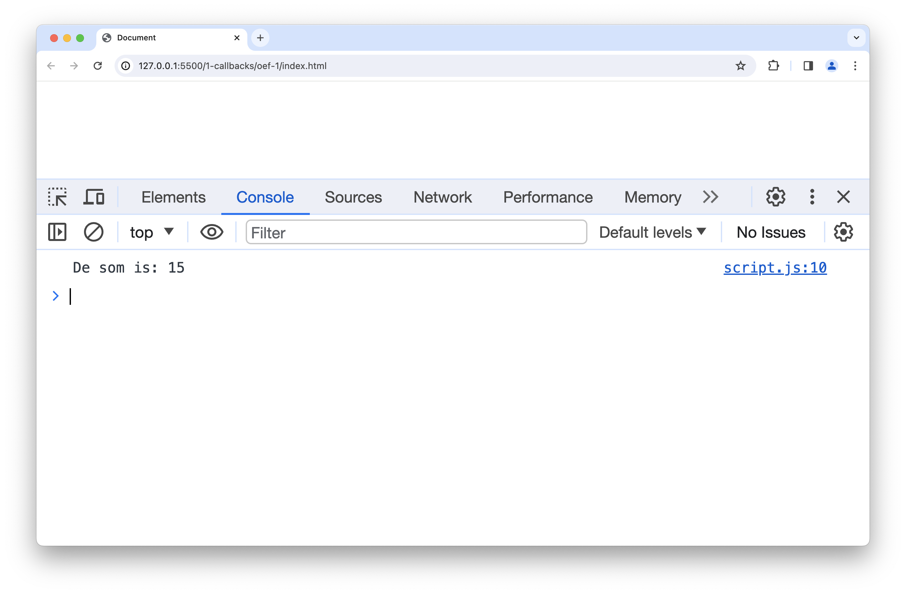
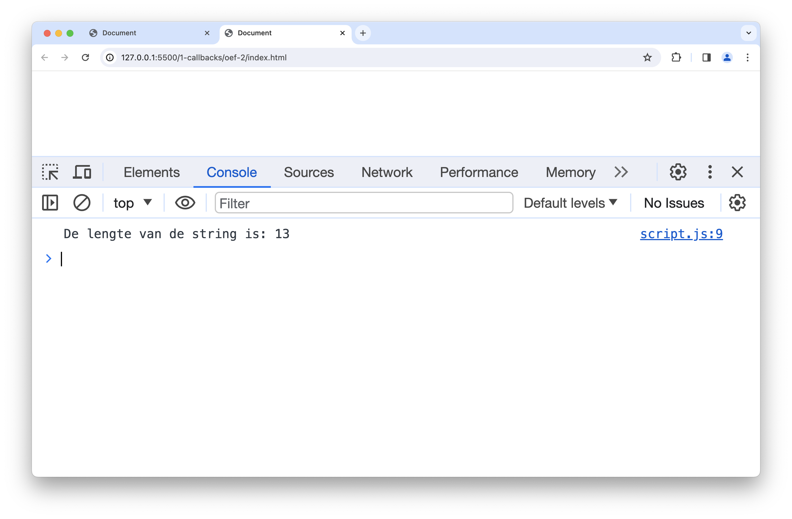
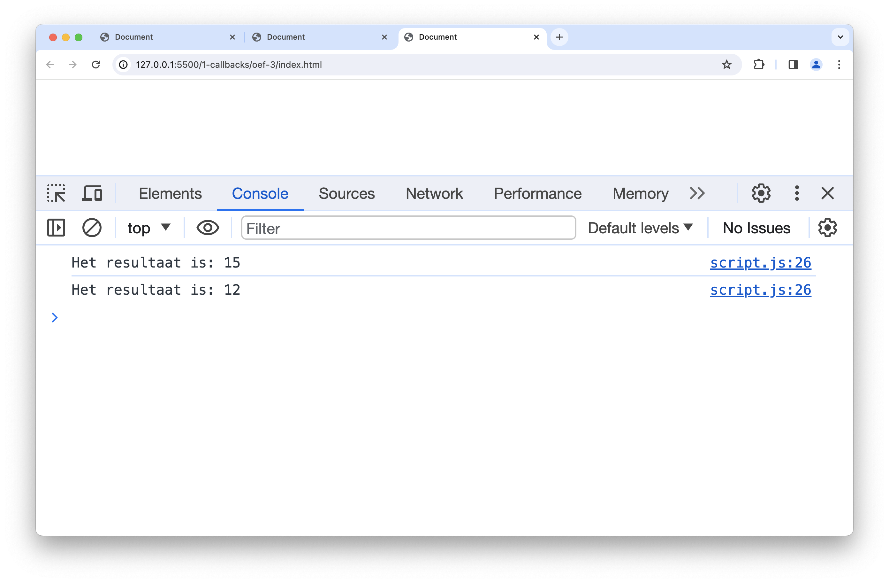
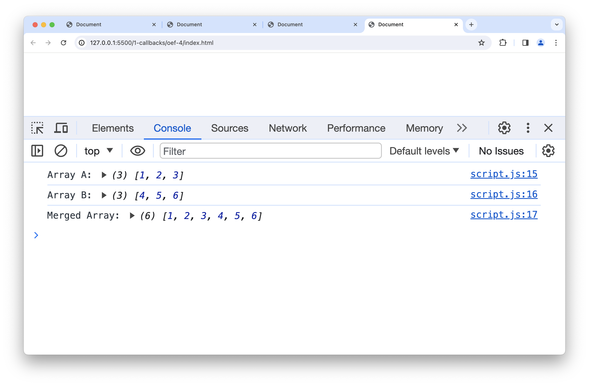
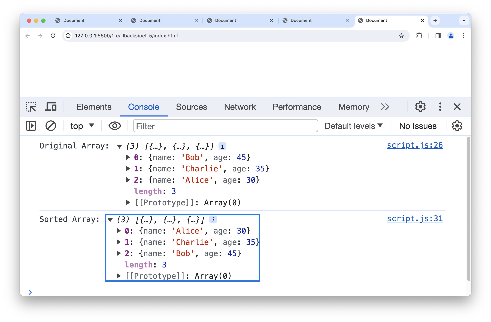
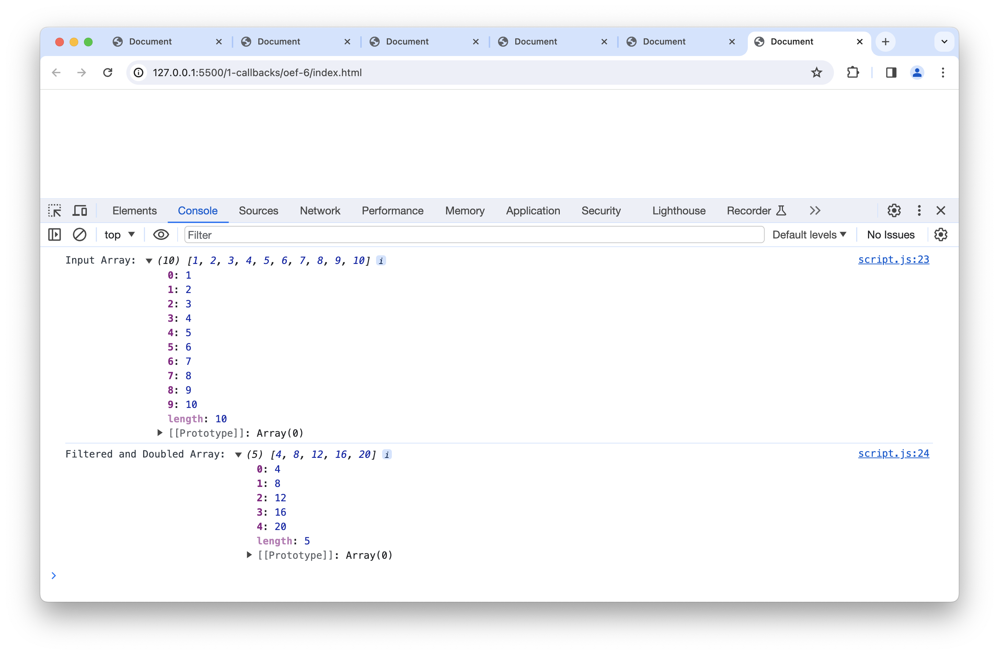

# oefeningen

## oefening 1: bereken de som en het product

**leerdoelen**

* kennismaken met het gebruik van callbacks in JavaScript
* begrijpen hoe functies als callback kunnen worden gebruikt

**functionele analyse**

Schrijf een JavaScript-functie genaamd `calculate` die twee getallen en een callback-functie accepteert. Deze callback-functie moet de som van de twee getallen afdrukken.

**technische analyse:**

1. Schrijf een functie genaamd `calculate` die twee parameters (getallen) en een derde parameter (callback-functie) accepteert.
2. In de functie `calculate`, bereken de som van de twee getallen.
3. Roep de callback-functie aan met de berekende som als argument.
4. Lees het resultaat uit naar de console.

**voorbeeldinteractie**

<figure><figcaption></figcaption></figure>

## oefening 2: string manipulatie

**leerdoelen**

* toepassen van het concept van callbacks bij het manipuleren van strings
* begrijpen hoe functies als argumenten kunnen worden doorgegeven.

**functionele analyse**

Schrijf een JavaScript-functie genaamd `modifyString` die een string en een callback-functie accepteert. De callback-functie moet de lengte van de string afdrukken.

**technische analyse**

1. Schrijf een functie genaamd `modifyString` die een string en een callback-functie accepteert.
2. In de functie `modifyString`, bereken de lengte van de string.
3. Roep de callback-functie aan met de lengte van de string als argument.
4. Lees het resultaat uit in de console.

**voorbeeldinteractie**

<figure><figcaption></figcaption></figure>

## extra oefening: "minstens twee"

* Schrijf een arrow functie `isOdd` die via de returnwaarde aangeeft of een getal oneven is.
* Schrijf een arrow functie `isEven` die via de returnwaarde aangeeft of een getal even is.
* Verzin twee andere functies die op deze manier zeggen of een getal een bepaalde eigenschap heeft.
* Schrijf een functie genaamd `atLeastTwo` die twee argumenten aanvaardt. Het eerste argument is een array van getallen en de tweede argument is een callbackfunctie.
* De functie `atLeastTwo` geeft true terug als en slechts als minstens twee elementen voldoen aan de meegegeven functie.

Bijvoorbeeld:

```
console.log(atLeastTwo([2,3,4,6,8], isOdd));
console.log(atLeastTwo([2,3,4,5,6,8], isOdd));
```

geeft de volgende output:

```
false
true
```

## oefening 3: rekenmachine

**leerdoelen**

* begrijpen hoe functies als returnwaarde kunnen worden gebruikt.
* toepassen van callbacks bij het maken van een eenvoudige rekenmachine.

**functionele analyse**

Schrijf een JavaScript-functie genaamd `createCalculator` die een wiskundige bewerking ('add' of 'multiply') accepteert en een callback-functie retourneert. Deze callback-functie moet de uitkomst van de bewerking afdrukken.

**technische analyse**

1. Schrijf een functie genaamd `createCalculator` die een parameter (bewerking) accepteert.
2. Binnen de functie, gebruik een `if`-statement om te bepalen of de bewerking 'add' of 'multiply' is.
3. Afhankelijk van de bewerking, retourneer een callback-functie die de bijbehorende bewerking uitvoert (optellen of vermenigvuldigen).

**voorbeeldinteractie**

<figure><figcaption></figcaption></figure>

## oefening 4: gebruik van de spread operator

**leerdoelen**

* begrijpen hoe de spread-operator werkt.
* kunnen toepassen van de spread-operator om arrays samen te voegen en te kopiëren.

**functionele analyse**

Schrijf een JavaScript-functie genaamd `mergeArrays` die twee arrays accepteert en een nieuwe array retourneert waarin de elementen van beide arrays zijn samengevoegd. Gebruik de spread-operator om de arrays samen te voegen.

**technische analyse:**

1. Schrijf een functie genaamd `mergeArrays` die twee parameters (arrays) accepteert.
2. Gebruik de spread-operator om beide arrays samen te voegen in een nieuwe array.
3. Retourneer de samengevoegde array.

**voorbeeldinteractie**

<figure><figcaption></figcaption></figure>

## oefening 5: sorteren van objecten

**leerdoelen**

* kennismaken met het sorteren van arrays met objecten op basis van een specifiek attribuut.
* begrijpen hoe de sort-functie werkt met aangepaste vergelijkingsfuncties.

**functionele analyse**

Schrijf een JavaScript-functie genaamd `sortByAttribute` die een array van objecten en een attribuutnaam accepteert. De functie moet de array van objecten sorteren op basis van het opgegeven attribuut.

**technische analyse:**

1. Schrijf een functie genaamd `sortByAttribute` die twee parameters accepteert: de array van objecten en de attribuutnaam om op te sorteren.
2. Gebruik de sort-functie met een aangepaste vergelijkingsfunctie om de array van objecten te sorteren op het opgegeven attribuut.
3. Retourneer de gesorteerde array van objecten.

**voorbeeldinteractie**

<figure><figcaption></figcaption></figure>

## oefening 6: filteren en verdubbelen

**leerdoelen**

* Gebruik van de filter- en map-functies op arrays.
* Combinatie van verschillende array-functies in een enkele operatie.

**functionele analyse**

Schrijf een JavaScript-functie genaamd `filterAndDouble` die een array van getallen accepteert. De functie moet alle even getallen filteren en de overgebleven getallen verdubbelen.

**technische analyse**

1. Schrijf een functie genaamd `filterAndDouble` die een array van getallen accepteert.
2. Gebruik de filter-functie om alleen even getallen te behouden.
3. Gebruik de map-functie om de overgebleven getallen te verdubbelen.
4. Retourneer de resulterende array.

**voorbeeldinteractie**

<figure><figcaption></figcaption></figure>

### Oefening 7: reduce

**leerdoelen**

* Gebruik van de de reduce functie op arrays.

**functionele analyse**

Schrijf een JavaScript-functie genaamd `calculateTotalPrice` die een array van getallen accepteert. De functie moet alle getallen met elkaar optellen.

**technische analyse**

1. Schrijf een functie genaamd `calculateTotalPrice` die een array van getallen accepteert.
2. Gebruik de reduce functie om alle getallen in de array met elkaar op te tellen
3. Retourneer de resulterende array.

<figure><figcaption></figcaption></figure>


