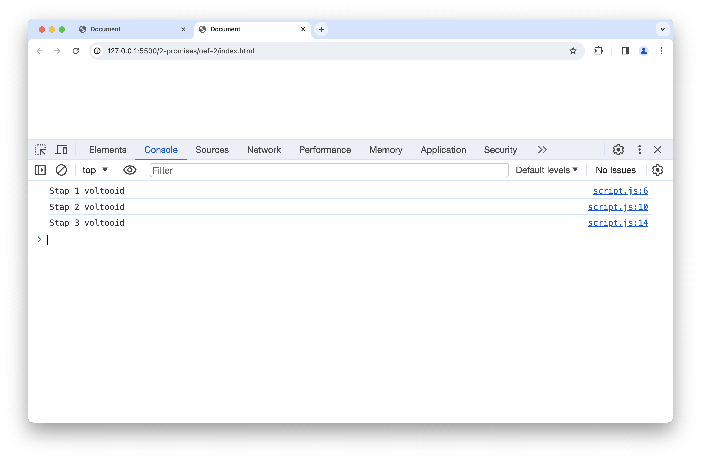
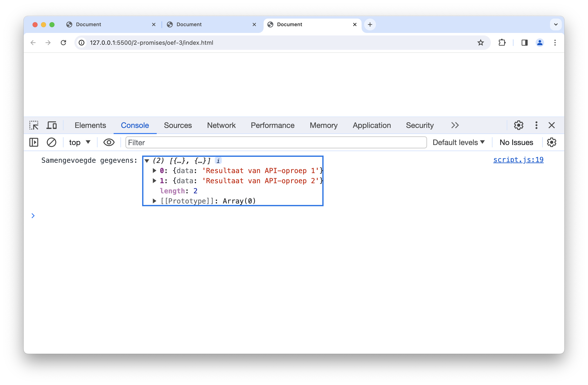
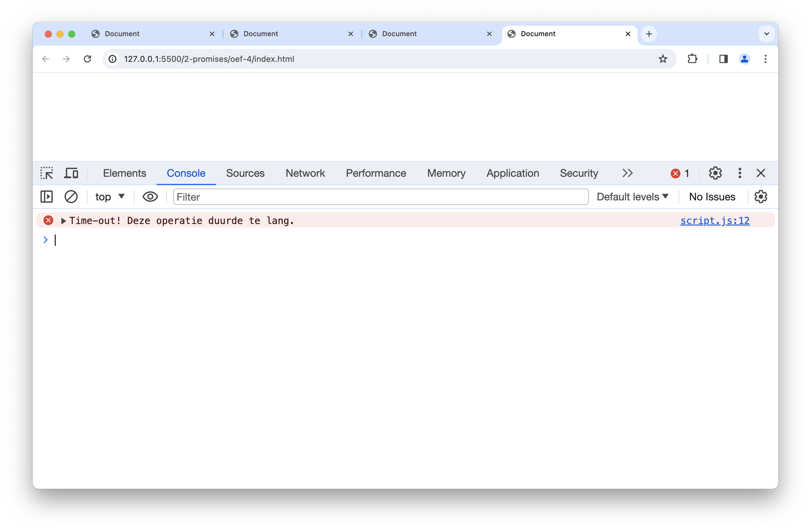
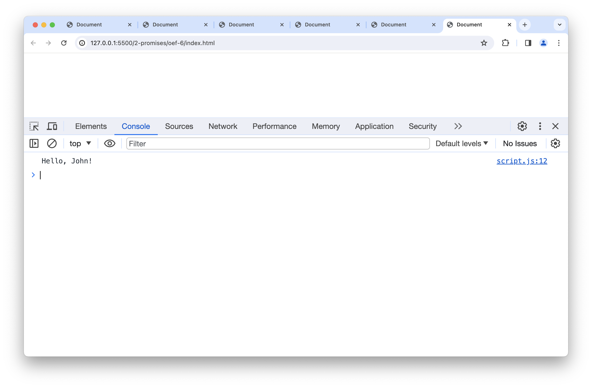
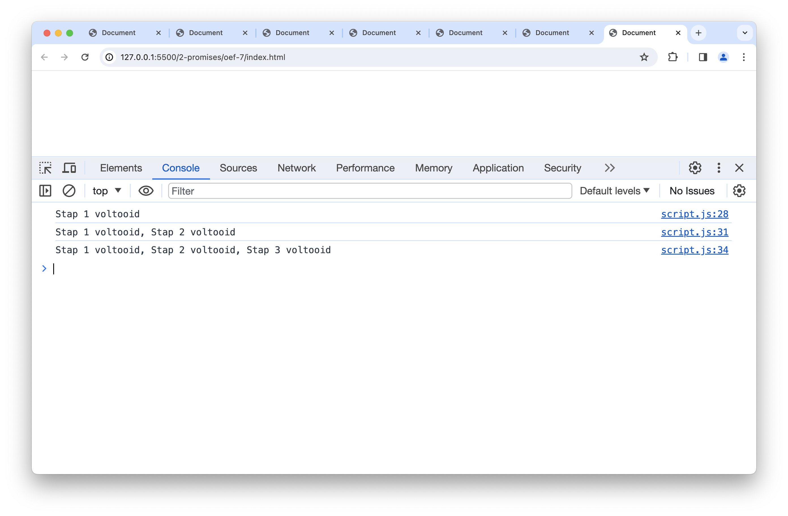
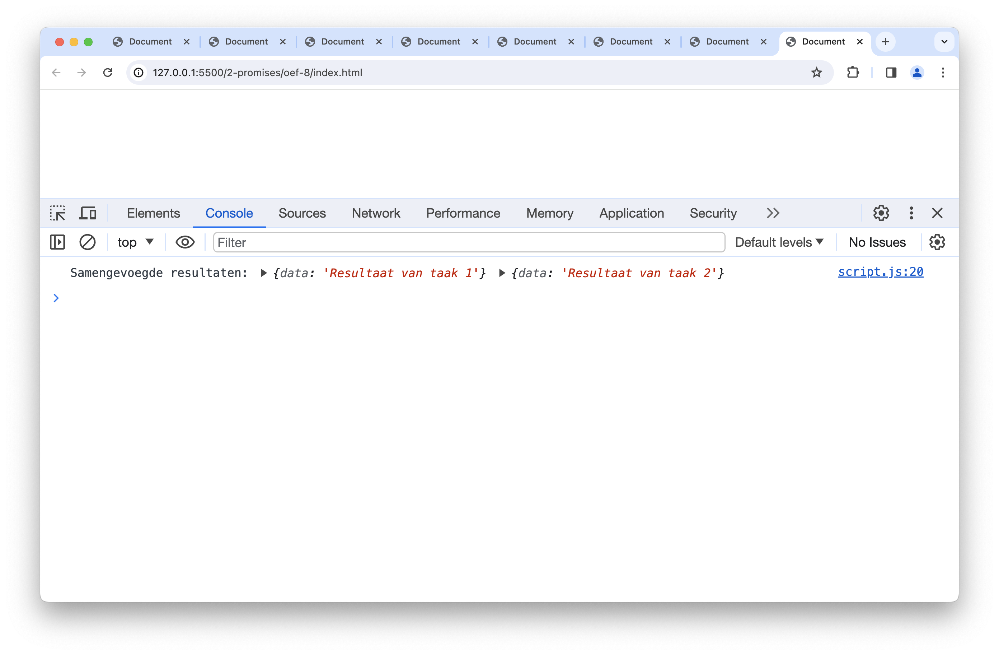
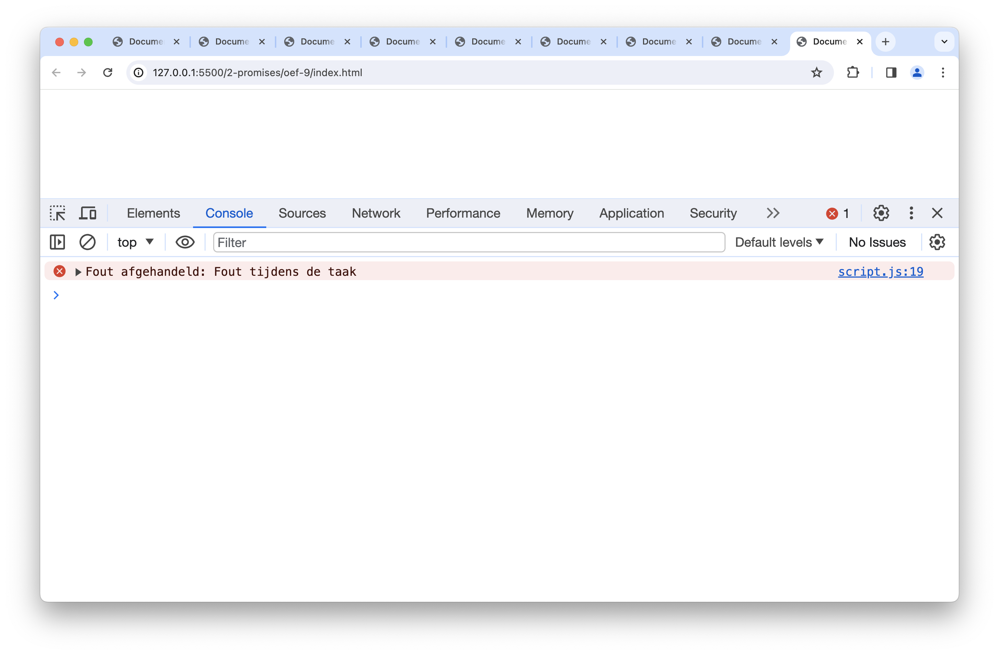


**Opgelet** Deze oefeningen zijn _deprecated_, we verwijzen je graag door naar de oefeningen in de nieuwe [oefeningen sectie](../../oefeningen/LW11/labo20/oefeningen.md)


# oefeningen

## oefening 1: basis promise

**Leerdoelen**

* begrip van asynchrone programmeerconcepten
* een eenvoudige Promise maken en gebruiken

**functionele analyse** Schrijf een functie genaamd `delayedGreeting` die een Promise retourneert. Deze Promise moet na 2 seconden worden opgelost met een begroeting die de opgegeven naam bevat.

**technische analyse**

1. Definieer een functie genaamd `delayedGreeting` die een Promise retourneert.
2. Binnen de Promise-functie, gebruik de `setTimeout`-functie om een vertraging van 2 seconden te creëren.
3. Na de vertraging, los de Promise op met een begroeting die de opgegeven naam bevat.
4. Gebruik de `then`-methode om het resultaat van de Promise af te handelen en de begroeting te loggen.
5. Gebruik de `catch`-methode om eventuele fouten af te handelen en deze in de console te loggen.

**voorbeeldinteractie**

<figure><figcaption></figcaption></figure>

## oefening 2: ketting van promises

**leerdoelen**

* begrip van het creëren van een ketting van promises
* promises op een opeenvolgende manier gebruiken

**functionele analyse** Schrijf een reeks van drie promises die achtereenvolgens worden uitgevoerd. Elke promise moet een ander bericht tonen.

**technische analyse**

1. Maak een functie genaamd `promiseChain` die een ketting van Promises bevat.
2. Elke Promise in de ketting moet een ander bericht retourneren.
3. Gebruik de `then`-methode om de berichten af te handelen en in de console te loggen.
4. Gebruik de `catch`-methode om eventuele fouten af te handelen en deze in de console te loggen.

**voorbeeldinteractie**

<figure><figcaption></figcaption></figure>

## oefening 3: parallelle Promises

**leerdoelen**

* begrip van het gelijktijdig uitvoeren van meerdere Promises
* resultaten van parallelle Promises samenvoegen

**functionele analyse** Schrijf een functie genaamd `simulateAPICalls` die gelijktijdig twee fictieve API-oproepen simuleert en de resultaten samenvoegt.

**technische analyse**

Je definieert als volgt een functie die het gecombineerde resultaat van **twee** API-calls tegelijkertijd teruggeeft.

1. Gebruik de `setTimeout`-functie om een vertraging van elk van 2 seconden en 4 seconden te creëren om twee fictieve API-oproepen te simuleren.
2. Laat elke Promise een object met fictieve gegevens bevatten (bijvoorbeeld `{ data: 'API-resultaat' }`).
3. Gebruik `Promise.all` om beide Promises gelijktijdig uit te voeren en de resultaten samen te voegen.
4. Laat `simulateAPICalls` deze gecombineerde Promise teruggeven.
5. Gebruik de `then`-methode om de samengevoegde gegevens in de console te loggen.
6. Gebruik de `catch`-methode om eventuele fouten af te handelen en deze in de console te loggen.

**voorbeeldinteractie**

<figure><figcaption></figcaption></figure>

## oefening 4: afwijzen van een Promise

**leerdoelen**

* begrip van het afwijzen van Promises
* een Promise afwijzen na een bepaalde vertraging

**functionele analyse** Schrijf een functie genaamd `rejectAfterTimeout` die na 3 seconden een Promise afwijst met een opgegeven foutmelding.

**technische analyse**

1. Definieer een functie genaamd `rejectAfterTimeout` die een Promise retourneert.
2. Gebruik de `setTimeout`-functie om een vertraging van 3 seconden te creëren.
3. Na de vertraging, wijs de Promise af met een opgegeven foutmelding.
4. Gebruik de `then`-methode om het resultaat van de Promise af te handelen (zou niet moeten worden aangeroepen in dit geval).
5. Gebruik de `catch`-methode om de foutmelding in de console te loggen.

**voorbeeldinteractie**

<figure><figcaption></figcaption></figure>

## oefening 5: promisify


Dit is een gevorderde oefening. Je hoeft dit niet uit het hoofd te kunnen.


**leerdoelen**

* begrip van het omzetten van callback-gebaseerde functies naar Promise-gebaseerde functies
* een zelfgemaakte Promise-gebaseerde functie gebruiken

**functionele analyse** Schrijf een functie genaamd `promisify` die een callback-gebaseerde functie omzet in een Promise-gebaseerde functie.

**technische analyse**

1. Definieer een functie genaamd `promisify` die een callback-gebaseerde functie als invoer accepteert.
2. Binnen de `promisify`-functie, retourneer een nieuwe functie die een Promise retourneert.
3. De interne functie moet de callback-gebaseerde functie aanroepen en de Promise oplossen of afwijzen op basis van het resultaat.
4. Gebruik de omgezette Promise-gebaseerde functie om een asynchrone taak uit te voeren.
5. Gebruik de `then`-methode om het resultaat van de Promise af te handelen en in de console te loggen.
6. Gebruik de `catch`-methode om eventuele fouten af te handelen en deze in de console te loggen.

**voorbeeldinteractie**

<figure><figcaption></figcaption></figure>

## oefening 6: basis Promise met async/await

**leerdoelen**

* begrip van asynchrone programmeerconcepten
* een eenvoudige Promise maken en gebruiken
* gebruik van `async/await`

**functionele analyse** Schrijf een functie genaamd `delayedGreeting` die een Promise retourneert. Deze Promise moet na 2 seconden worden opgelost met een begroeting die de opgegeven naam bevat.

**technische analyse**

1. Definieer een functie genaamd `delayedGreeting` die een Promise retourneert.
2. Binnen de Promise-functie, gebruik de `setTimeout`-functie om een vertraging van 2 seconden te creëren.
3. Na de vertraging, los de Promise op met een begroeting die de opgegeven naam bevat.
4. Gebruik `async/await` om de Promise af te handelen in een andere functie genaamd `handleGreeting`.
5. Roep de `handleGreeting`-functie aan en log het resultaat of de foutmelding.

**voorbeeldinteractie**

<figure><figcaption></figcaption></figure>

## oefening 7: async/await met ketting van Promises

**leerdoelen**

* begrip van het gebruik van `async/await` met een ketting van Promises
* asynchrone taken opeenvolgend uitvoeren

**functionele analyse** Schrijf een functie genaamd `asyncChain` die een reeks van drie Promises opeenvolgend uitvoert met behulp van `async/await`. Elke Promise moet een ander bericht retourneren.

**technische analyse**

1. Definieer een functie genaamd `asyncChain`.
2. Gebruik `async/await` om drie opeenvolgende Promises uit te voeren.
3. Elk van de Promises moet een ander bericht retourneren.
4. Log de resultaten van de Promises in de console.

**voorbeeldinteractie**

<figure><figcaption></figcaption></figure>

## oefening 8: parallelle async/await

**leerdoelen**

* begrip van het gebruik van `async/await` met parallelle asynchrone taken
* resultaten van parallelle Promises samen te voegen

**functionele analyse** Schrijf een functie genaamd `asyncParallel` die gelijktijdig twee asynchrone taken uitvoert en de resultaten samenvoegt met behulp van `async/await`.

**technische analyse**

1. Definieer een functie genaamd `asyncParallel`.
2. Gebruik `Promise.all` in combinatie met `async/await` om twee asynchrone taken gelijktijdig uit te voeren.
3. Laat elke asynchrone taak een object met fictieve gegevens retourneren (bijvoorbeeld `{ data: 'Resultaat van taak 1' }`).
4. Log de samengevoegde resultaten in de console.

**voorbeeldinteractie**

<figure><figcaption></figcaption></figure>

## oefening 9: async/await met foutafhandeling

**leerdoelen**

* begrip van het gebruik van `async/await` voor foutafhandeling
* fouten detecteren en afhandelen bij asynchrone taken

**functionele analyse** Schrijf een functie genaamd `asyncWithErrorHandling` die een asynchrone taak uitvoert en fouten afhandelt met behulp van `async/await`.

**technische analyse**

1. Definieer een functie genaamd `asyncWithErrorHandling`.
2. Gebruik `async/await` om een asynchrone taak uit te voeren die een fout kan veroorzaken (bijv. een Promise die wordt afgewezen).
3. Gebruik `try/catch` om de fout af te vangen en log de foutmelding in de console.

**voorbeeldinteractie**

<figure><figcaption></figcaption></figure>
