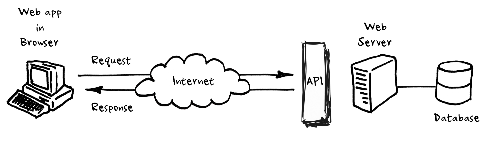

# 4: API's

API is de afkorting voor **Application Programming Interface**, een software-tussenpersoon waarmee twee applicaties met elkaar kunnen communiceren. Je kan een API zien als een medium waarmee de client, dit kan een browser zijn, en de server kunnen communiceren.

Een API is een reeks functies waarmee toepassingen toegang kunnen krijgen tot gegevens en kunnen communiceren met externe softwarecomponenten, besturingssystemen of microservices.

Met een API kan een ontwikkelaar een specifieke "**call**" of "**request**" doen om informatie te verzenden en/of te ontvangen. Deze communicatie wordt gedaan met behulp van een programmeertaal genaamd [**JSON**](https://github.com/barbaralettany/webtech-js/blob/main/asynchroon-programmeren/4-apis/javascript/9-objecten/json.md). Het kan ook worden gebruikt om een gedefinieerde actie uit te voeren, zoals het bijwerken of verwijderen van gegevens.

**een metafoor: geld afhalen bij een bank**

Zie jezelf als een **gebruiker**, een bankbediende als een **API** en een bankmanager als **het systeem** waarmee je wilt communiceren. Voor geld van je rekening af te halen moet je bij het loket met de bankbediende (**API**) zijn. Je zegt: "Ik wil graag €1.000 van deze rekening". De bankbediende (**API**) gaat dan naar achteren, vertelt de bankmanager (**het systeem**) "Mr/Ms.X wilt graag €1.000", de bankmanager (**het systeem**) geeft de bankbediende (**API**) €1.000 die het uiteindelijk doorgeeft aan jou.

## alledaagse voorbeelden van API's

Een API helpt ontwikkelaars snel informatie aan consumenten te leveren en wordt in de wereld van vandaag dagelijks gebruikt. Van online winkelen, browsen in een social media-app of een game spelen op je smartphone. Elke keer dat je een pagina online bezoekt, heb je interactie met een of meerdere API's. Hier zijn enkele voorbeelden uit de praktijk van hoe je omgaat met API's en het misschien niet eens beseft!

**opzoeken van hotels**

Wanneer je naar een reissite gaat, kan deze worden gekoppeld aan 10 andere reissites om de beste deal voor je te vinden. Wanneer je gegevens invoert zoals Antwerpen, 2 nachten, 1 kamer, stuur je dit verzoek naar die 10 verschillende reissites. De API neemt je verzoek voor die specifieke locatie, datumbereik en kamer en pingt de 10 sites, die de gevonden deals terugsturen.

**een Facebook-profiel opzoeken**

Als je "John Smith" typt op Facebook, informeert de API de Facebook-servers dat je op zoek bent naar John Smith. Facebook stuurt je vervolgens een lijst met alle profielen die overeenkomen met die naam (met factoren zoals je nabijheid of gemeenschappelijke vrienden).

**een nieuw restaurant vinden**

Stel dat je naar een nieuwe stad reist. Je hebt net alles bij het hotel afgezet en besluit wat te gaan lunchen. Je pakt je smartphone, opent Google Maps, en zoekt restaurants in de buurt. Al snel zie je tientallen lokale restaurants direct buiten je hotel. Dankzij de \*\*Google Maps API \*\*krijg je gemakkelijk de openingstijden, beoordelingen en telefoonnummers te zien.


Elke keer dat je een applicatie zoals Facebook gebruikt, een bericht verzendt of het weer op je telefoon controleert, gebruik je een API.


## structuur van een API request

Een API request bestaat uit verschillende componenten. Laten we deze afzonderlijk overlopen en bekijken hoe ze kunnen worden gebruikt om een request op te stellen.

### endpoint

Een API bestaat uit endpoints. a.d.h.v. deze endpoints kan je specificeren welke data je exact wilt ophalen van de server. **Elk endpoint bestaat uit twee delen namelijk een URL en een pad**. Laten we als voorbeeld de [PokéAPI](https://pokeapi.co) bekijken. PokéAPI is een API voor het ophalen en verwerken van data uit de Pokémon-franchise.

* **De URL vormt de basis link van een API**. Voor elke endpoint binnen een bepaalde API zal de URL hetzelfde zijn. De URL van PokéAPI is [https://pokeapi.co/api/v2/](https://pokeapi.co/api/v2/)
* **Met het pad kan je specificeren welke data je juist wilt opvragen van een API**. Het pad komt na de URL te staan. Neem als voorbeeld, [https://pokeapi.co/api/v2/pokemon](https://pokeapi.co/api/v2/pokemon), M.b.v. **/pokemon** vertel je aan de API dat je alle Pokémon wilt opvragen. Het laatste deel na de URL, **/pokemon**, vormt dus het pad van de endpoint. Andere voorbeelden van end-points van deze API zijn:

  * `/location` - om info over de verschillende locaties in de games op te halen), 
  * `/move` - om info over de verschillende aanvallen van de pokémon op te halen

**een endpoint = URL + pad**

### headers

Headers geven informatie aan de client en server. Veelvoorkomende voorbeelden van een header zijn **authenticatie gegevens** zoals een "**Auth Token"** of "**Client ID**". A.d.h.v deze inloggegevens kan je er voor zorgen dat je API beveiligd is en alleen data retourneert indien de gebruiker een correcte token of ID meestuurt. Een andere veelvoorkomende header is "**Content Type**", dat de server informeert over welk type inhoud wordt verzonden. Een veelgebruikt content type is bijvoorbeeld "**application/json**", wat de server laat weten dat we [JSON](https://github.com/barbaralettany/webtech-js/blob/main/asynchroon-programmeren/4-apis/javascript/9-objecten/json.md)-gegevens verzenden.

### methode

Methoden zijn de acties die worden ondernomen bij het verzenden van een verzoek. **Een API bestaat uit vier basis verzoekmethoden**:

**GET** - Ophalen van data (bv. ophalen van een geolocatie op Google Maps)

**PUT** - Bewerken en updaten van data (bv. bewerken van je naam op Instagram)

**POST** - Aanmaken van nieuwe data (bv. een online bestelling plaatsen bij je favoriete restaurant)

**DELETE** – Verwijderen van data (Een vriend verwijderen op Facebook)

Dit zijn één voor één API-methoden. Voor deze cursus zal je alleen data moeten kunnen opvragen m.b.v. de **GET** methode.

### data

De verzoekgegevens, ook wel de "**body**" genoemd, is informatie die wordt verzonden naar of van een server. **Voor een GET request zal dit dus de data zijn die de API terugstuurt.**

## voorbeelden van populaire API's

[Opendata Portaal Antwerpen](https://portaal-stadantwerpen.opendata.arcgis.com/): De stad Antwerpen beschikt over een schat aan geografische data over de stad. Via dit portaal wordt u de mogelijkheid geboden om deze geografische data te verkennen, visualiseren en te downloaden. Deze data is open data en mag u vrij en kosteloos gebruiken. Met de datasets kunt u bijvoorbeeld nieuwe mobiele toepassingen ontwikkelen die de dienstverlening voor bewoners kunnen verbeteren. Ontdek de data door hieronder te zoeken op de verschillende thema’s of door een trefwoord in te vullen.

[Google Maps API](https://developers.google.com/maps/apis-by-platform): Met de Google Maps API kunnen ontwikkelaars Google Maps insluiten op webpagina's met behulp van een JavaScript- of Flash-interface. De Google Maps API is ontworpen om te werken op mobiele apparaten en desktopbrowsers.

[YouTube API's](https://developers.google.com/youtube/v3/): met de API's van YouTube kunnen ontwikkelaars YouTube-video's en -functionaliteit integreren in websites of applicaties. YouTube API's omvatten de YouTube Analytics API, YouTube Data API, YouTube Live Streaming API, YouTube Player API's en andere.

[Twitter API's](https://developer.twitter.com/en/docs/twitter-api): Twitter biedt twee API's. Met de REST API hebben ontwikkelaars toegang tot kerngegevens van Twitter en met de zoek-API kunnen ontwikkelaars interactief werken met zoek- en trendgegevens van Twitter.

[Amazon Product Advertising API](https://webservices.amazon.com/paapi5/documentation/): Amazon's Product Advertising API geeft ontwikkelaars toegang tot Amazon's productselectie- en ontdekkingsfunctionaliteit. Ontwikkelaars kunnen vervolgens advertenties van Amazon-producten opnemen om geld te verdienen met een website.
