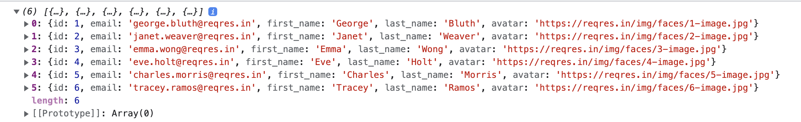

# API aanroepen

In dit onderdeel gaan we leren hoe we een API endpoint gaan aanspreken aan de hand van [fetch](https://developer.mozilla.org/en-US/docs/Web/API/Fetch_API/Using_Fetch).

Er zijn nog andere manieren die het mogelijk maken om API requests te doen. Maar fetch is de meest eenvoudige.

## fetch

De Fetch API biedt een JavaScript-interface toegang tot, en manipulatie van delen van de HTTP-pipeline, zoals requests en responses. Het biedt ook een globale `fetch()`-methode die een gemakkelijke en logische manier biedt om bronnen asynchroon over het netwerk op te halen.

### de fetch()-methode

De methode `fetch()` in zijn eenvoudigste definitie, is **een functie in JavaScript voor interactie met API's**. Deze interacties omvatten:

1. Het ophalen van gegevens (**GET**).
2. Het uploaden van gegevens (**POST**).
3. Het bewerken van gegevens (**PUT**).
4. Het verwijderen van gegevens (**DELETE**).

Laten we kort bespreken hoe een basis fetch functie eruitziet.

**syntax**

```js
fetch(url, options);
```

**parameters**

Deze methode accepteert twee parameters zoals hierboven vermeld en hieronder beschreven:

* **URL:** Dit is de URL waarnaar de request moet worden gestuurd.
* **options:** Een reeks opties die je kan meegeven aan je fetch request. (=optionele parameter)
  * **method**: Een string met de request methode. Bv. **GET, POST**.
  * **headers**: Een object met alle headers die je aan je request wilt toevoegen. Bv. `application/json`
  * Bekijk de [mozilla documentatie](https://developer.mozilla.org/en-US/docs/Web/API/fetch) voor alle mogelijke opties.

**voorbeeld van options**

```js
const options = {
  method: 'GET',
  headers: {
    'Content-Type': 'application/json'
    }
}
```

**retourwaarde**

Het geeft een [Promise](https://github.com/barbaralettany/webtech-js/blob/main/asynchroon-programmeren/4-apis/asynchroon-programmeren/3-asynchroon-programmeren/promises.md) terug, of het nu is opgelost of niet. De retourgegevens kunnen van het formaat **JSON** of **XML** zijn. Het kan een array van objecten zijn of een enkel object.

## een GET request met de fetch methode

Laten we eens kijken hoe een request wordt afgehandeld met de `fetch()` methode. Voor dit voorbeeld zullen we gegevens opvragen van de [`Reqres API`](https://reqres.in/api).

**Standaard gebruikt de Fetch API de GET methode voor API requests.** M.a.w. je moet hiervoor geen `options` object meegeven als parameter. Laten we de [Reqres API](https://reqres.in) gebruiken om een lijst met gebruikers op te halen:

```js
fetch("https://reqres.in/api/users")
    .then(function(response) {
        return response.json()
    })
    .then(function(response) {
        console.log(response.data);
    });
```

1. We roepen de methode `fetch()` aan en geven deze de URL door van de bron die we willen ophalen.
2. Vervolgens kan je de methode `.then()` zien vastgeketend aan het einde van `fetch()` - deze methode maakt deel uit van **Promises**, een moderne JavaScript-functie voor het uitvoeren van asynchrone bewerkingen.
3. `fetch()` retourneert een promise, die wordt omgezet in het antwoord dat door de server is teruggestuurd. We gebruiken de `.then()`-functie om ​​de data dat we opvragen verder te verwerken nadat de promise is opgelost.
4. De `.then()`-functie krijgt automatisch het antwoord van de server als parameter wanneer de `fetch()`-promise wordt opgelost. Binnen de `.then()`-functie pakken we het antwoord en voeren we daarop de methode `.json()` uit. `response.json()` zal de response van de server omzetten in JSON-formaat zodat we deze kunnen gebruiken in onze code.
5. Je zult zien dat `.json()` ook een promise retourneert, dus we koppelen er nog een `.then()` aan vast, waarbinnen we een functie definiëren om de onbewerkte json response te ontvangen.
6. Binnen de functie van de de laatste `.then()` gebruiken we een `console.log()` om de response weer te geven in de developer tools van onze browser.
7. We krijgen een array terug met daarin 6 verschillende gebruikers.



## fetch() foutafhandeling

Omdat de methode `fetch()` een promise retourneert, is het afhandelen van fouten eenvoudig. We kunnen de methode `catch()` gebruiken om elke fout te onderscheppen die tijdens de uitvoering van de request wordt gegenereerd.

Er wordt echter geen fout gegenereerd als de request de server bereikt en terugkomt, ongeacht welk antwoord door de server is geretourneerd. De request die wordt geretourneerd door de `fetch()` verwerpt geen HTTP-fouten, **zelfs niet als de HTTP-antwoordcode 404 of 500 is**.

Een request wordt alleen afgewezen bij netwerkstoring of als iets verhinderde dat het verzoek werd voltooid.

Gelukkig kun je de ok-eigenschap van het `response`-object gebruiken om te controleren of de request is gelukt of niet.


De **ok-eigenschap** van een `response`-object bevat de **statuscode** van je request. Dit kan bv 202, 404, enz zijn.


Een `response-`object zal alleen `true` retourneren als de waarde van de ok-eigenschap (`response.ok`) in het bereik van 200-299 ligt:

```js
fetch('https://reqres.in/api/users/22') // 404 Error
    .then(function(response) {
      if (response.ok) {
            return response.json();
        } else {
            return Promise.reject(response.status);
        }
    })
    .then(function(response) {
        console.log(response)
    })
    .catch(function(error) {
        console.error("Error with message: " + error)
    });
```
