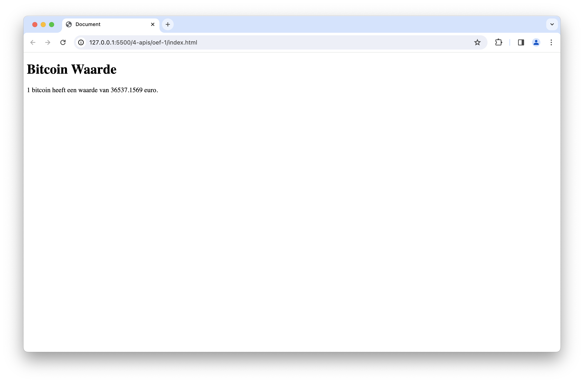
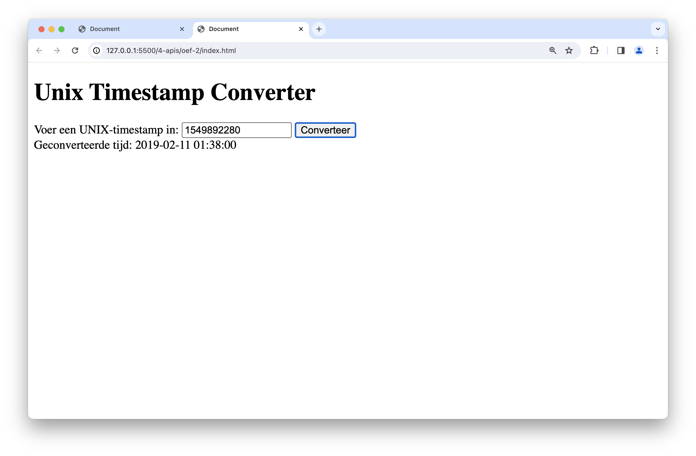
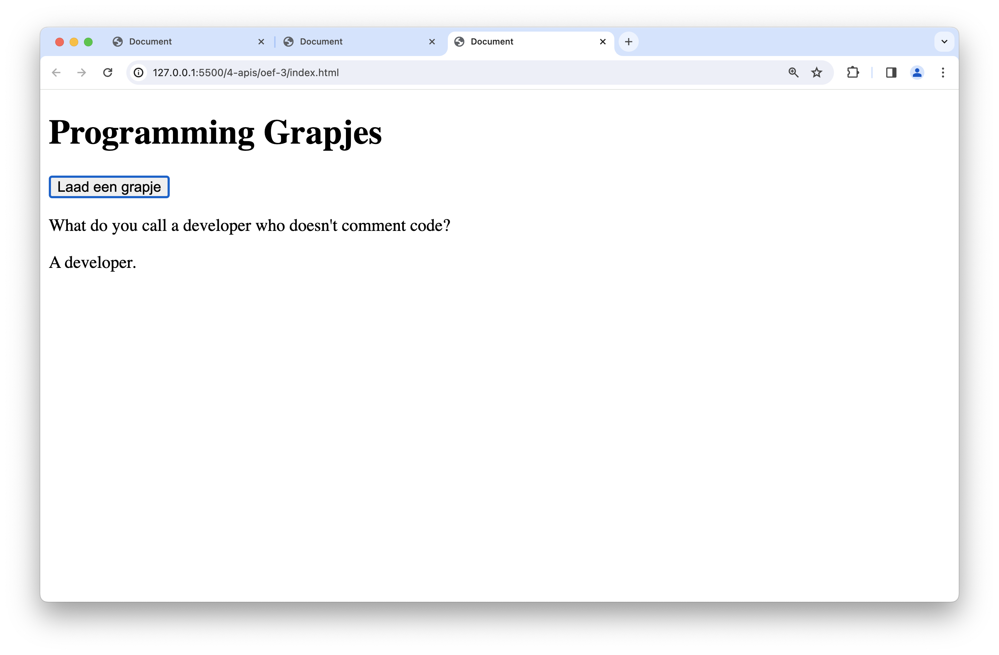
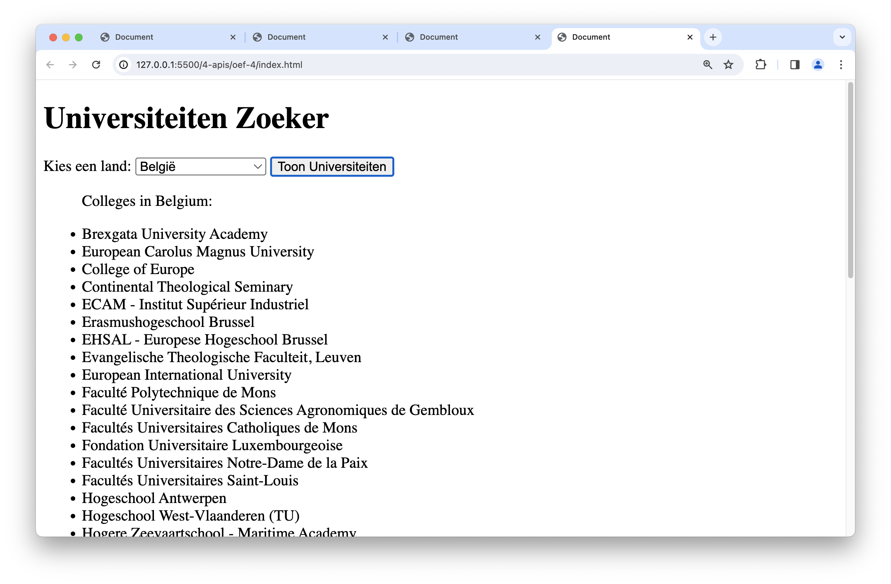
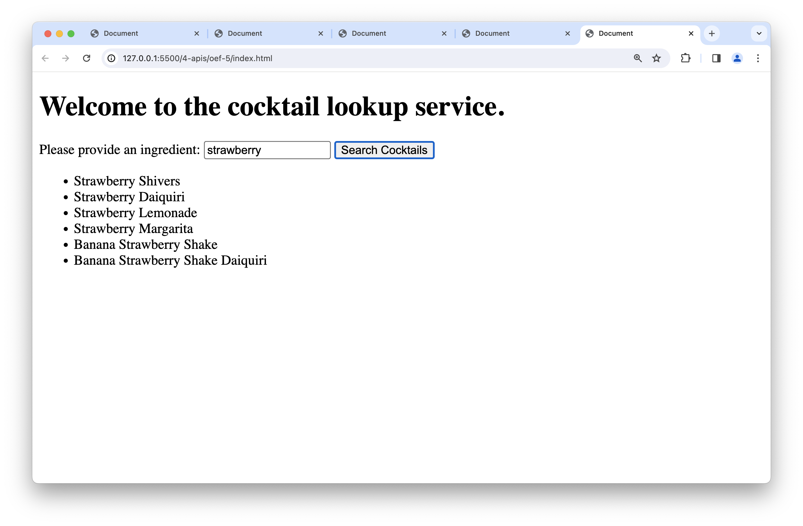

# oefeningen


Bekijk bij elke oefening de API eerst via Postman!


## oefening 1: Bitcoin waarde

**leerdoelen**

* Kennismaking met de Fetch API
* Weergeven van gegevens in de DOM

**functionele analyse**

Lees een API uit die de actuele waarde in euro geeft van 1 Bitcoin en toon deze waarde in de DOM.

**technische analyse**

1. Gebruik de `fetch`-functie om gegevens op te halen van de API: [https://api.coindesk.com/v1/bpi/currentprice.json](https://api.coindesk.com/v1/bpi/currentprice.json).
2. Haal de actuele waarde van 1 Bitcoin (bpi.EUR.rate\_float) uit het responsobject.
3. Toon deze waarde in de DOM.

**voorbeeldinteractie**

<figure><figcaption></figcaption></figure>

## oefening 2: Unix timestamp converter

**leerdoelen**

* Gebruik van de Fetch API
* Weergeven van gegevens in de DOM
* Werken met invoer van de gebruiker

**functionele analyse**

Maak gebruik van een API die een UNIX-timestamp als input krijgt en onze datum/uur notatie teruggeeft. Toon de geconverteerde tijd in de DOM.

**technische analyse:**

1. Gebruik de `fetch`-functie om gegevens op te halen van de API: [https://helloacm.com/api/unix-timestamp-converter/?cached\&s=1451613802](https://helloacm.com/api/unix-timestamp-converter/?cached\&s=1451613802).
2. Vraag de gebruiker om een UNIX-timestamp in te voeren.
3. Voeg de ingevoerde timestamp toe aan de API-url.
4. Toon het geconverteerde tijdstip in de DOM.

**voorbeeldinteractie**

<figure><figcaption></figcaption></figure>

## oefening 3: programmeergrapjes

**leerdoelen**

* Gebruik van de Fetch API
* Weergeven van gegevens in de DOM
* Interactie met de gebruiker

**functionele analyse**

Toon programmeergrapjes aan de gebruiker en laat ze kiezen of ze meer grapjes willen zien.

**technische analyse**

1. Gebruik de `fetch`-functie om gegevens op te halen van de API: [https://v2.jokeapi.dev/joke/Programming?type=twopart](https://v2.jokeapi.dev/joke/Programming?type=twopart).
2. Toon de setup en delivery van het grapje in de DOM.
3. Vraag de gebruiker of ze meer grapjes willen zien.

**voorbeeldinteractie**

<figure><figcaption></figcaption></figure>

## oefening 4: universiteitenzoeker

**leerdoelen**

* werken met objecten en JSON-gegevens
* gebruik van de Fetch API in een frontend-omgeving
* dynamisch bijwerken van de DOM

**functionele analyse**

Laat de gebruiker een land kiezen uit een lijst van landen. Op basis van de keuze toon je de hogescholen/universiteiten uit dat land in de website. De gebruiker kan doorgaan met het selecteren van landen zolang hij of zij dat wenst.

**technische analyse**

1. Maak een HTML-pagina met een dropdown voor het kiezen van een land, een knop om universiteiten op te halen, en een lijst om de resultaten weer te geven.
2. Gebruik de `fetch`-functie om gegevens op te halen van de API: [http://universities.hipolabs.com/search?country=Netherlands](http://universities.hipolabs.com/search?country=Netherlands).
3. Haal het geselecteerde land op uit de dropdown.
4. Toon de universiteiten uit het geselecteerde land in de lijst op de website.
5. Laat de gebruiker herhaaldelijk landen kiezen zolang hij of zij dat wenst.
6. Toon de resultaten dynamisch in de DOM.

**voorbeeldinteractie**

<figure><figcaption></figcaption></figure>

## oefening 5: cocktails

**leerdoelen**

* Werken met objecten
* Dot notatie gebruiken
* Gebruik/uitlezen van JSON
* Schrijven van functies
* Gebruik maken van Async/Await

**functionele analyse**

Probeer nu met de opgedane kennis uit de voorgaande oefeningen zelf een cocktail lookup service te scripten. Baseer je hiervoor op onderstaande voorbeeldinteractie.

**technische analyse**

Je maakt hiervoor gebruik van de volgende api-url:

```js
https://www.thecocktaildb.com/api/json/v1/1/search.php?s=kiwi
```

Bovenstaande URL zoekt naar alle cocktails met kiwi als ingrediënt.


Opgelet: Voor deze fetch-api call zal je ook nog extra header info moeten meegeven. Dat doe je door bij de `fetch`-methode de 2e parameter in te stellen:

```js
fetch(
  apiUrl,
  {
    headers: { "Accept-Encoding": "gzip,deflate,compress" }
  }
)
```


**voorbeeldinteractie**

<figure><figcaption></figcaption></figure>
