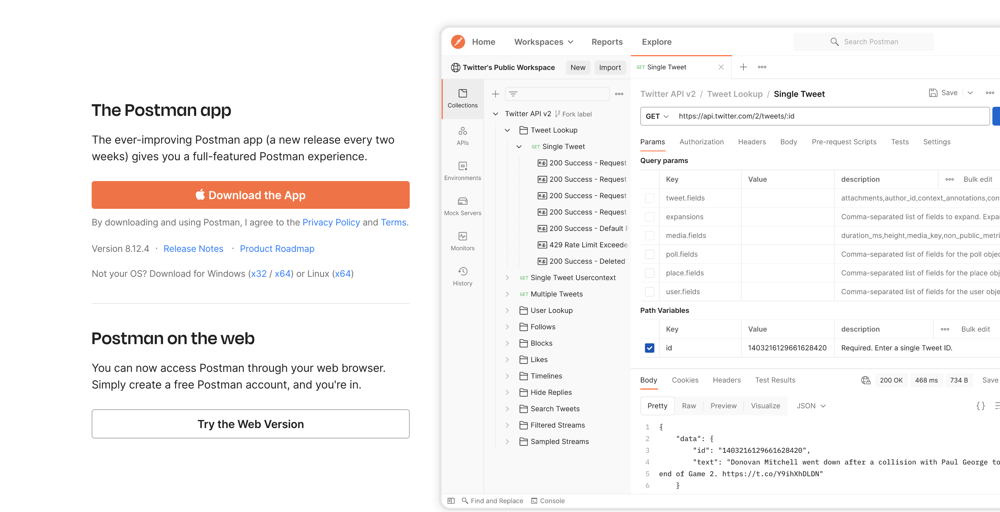
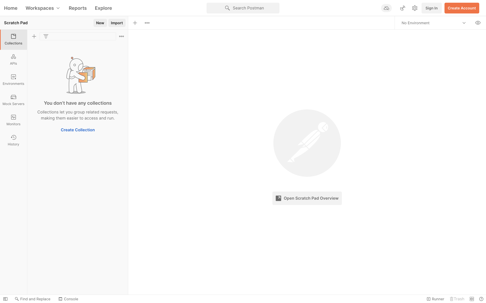
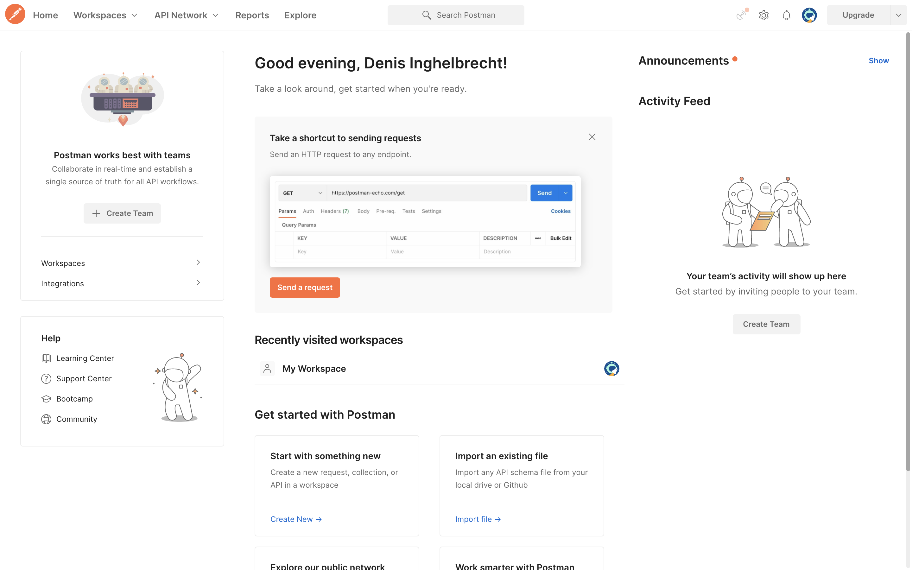
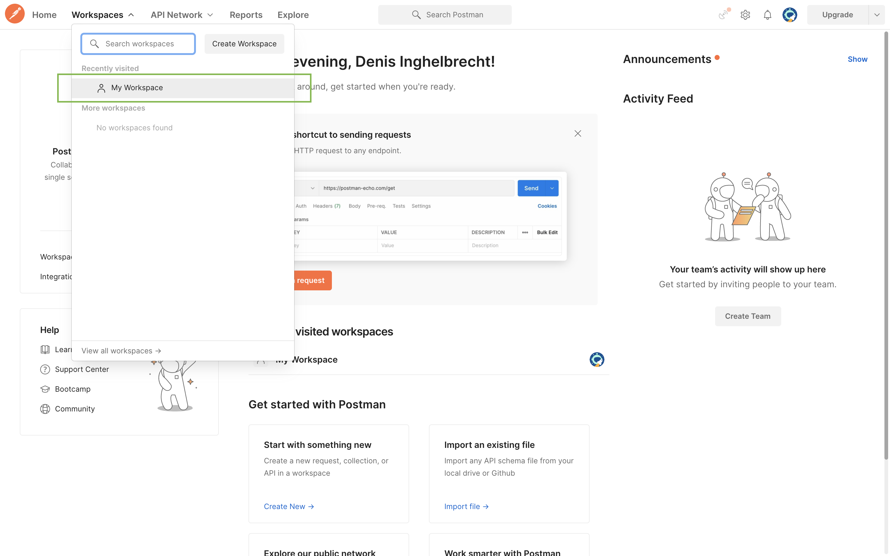
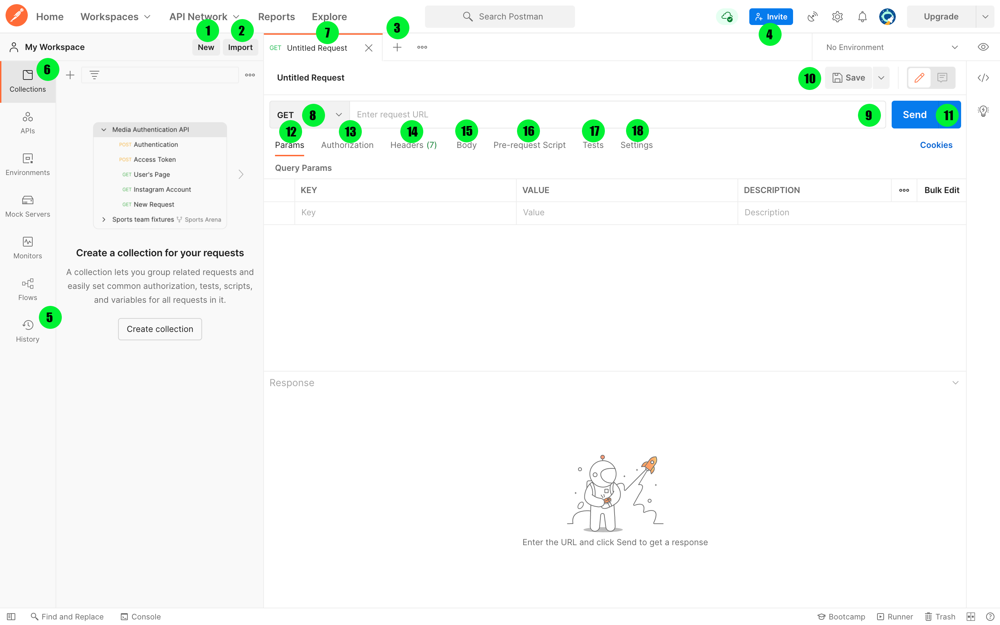

# Postman

## wat is Postman

API's zijn essentieel voor het bouwen van software applicaties. Ze worden evenzeer voor grote als kleine projecten benut. Geschikte test- en testmethoden zijn dus ook vereist. Door API's te testen kan je fouten herkennen en tijdig elimineren. In dit deel van de cursus overlopen we het installatieproces en de basis functionaliteit van Postman.

Eenvoudig uitgelegd is Postman **een API ontwikkelingstool die helpt bij het bouwen, testen en wijzigen van API's**. Vrijwel alle functionaliteit die een ontwikkelaar nodig zou hebben, is ingekapseld in deze tool. Het wordt elke maand door meer dan 5 miljoen ontwikkelaars gebruikt om hun API-ontwikkeling gemakkelijk en eenvoudig te maken. Het heeft de mogelijkheid om verschillende soorten HTTP-verzoeken uit te voeren (**GET, POST, PUT, PATCH**) en collecties te maken voor het testen van al je API requests.

## installatie Postman

Omdat het een Open Source-tool is, kan Postman eenvoudig worden gedownload. Dit zijn de stappen om Postman te installeren:

**Stap 1)** Ga naar [https://www.postman.com/downloads/](https://www.postman.com/downloads/) en kies uit Mac, Windows of Linux. Klik op Downloaden.

**Stap 2)** Wacht tot dat je Postman-download is voltooid. Voer vervolgens het installatieproces uit.

\*\* Stap 3)\*\* Doorloop het installatieproces tot je het scherm hieronder te zien krijgt. Klik vervolgens op de knop "**Create Account**" in de linkerbovenhoek. Je zal doorverwezen worden naar de website van Postman. Doorloop het creatieproces van een account.


**Opmerking** :eyes:: Er zijn twee manieren om je aan te melden voor een Postman-account. Een daarvan is om een eigen Postman-account aan te maken en de andere is om een Google-account te gebruiken. Hoewel Postman gebruikers in staat stelt de tool te gebruiken zonder in te loggen, zorgt het aanmelden ervoor dat je collecties worden opgeslagen en dusdanig toegankelijk zijn voor later gebruik.


**Stap 4)** Eenmaal als je een account hebt aangemaakt, navigeer je terug naar de desktop applicatie van Postman. Log in met je account. Je zal het startscherm hieronder te zien krijgen.

Proficiat je hebt Postman correct geïnstalleerd! :tada:

### Postman gebruiken om API's te testen

Navigeer naar "**Workspaces**" en klik op "**My Workspace**". Laten we het stapsgewijze proces bekijken voor het gebruik van Postman en de verschillende functies die Postman ons te bieden heeft voor het uittesten van API's!

1. **New** – Hier maak je een nieuwe request, collectie of environment aan.
2. **Import** – Dit wordt gebruikt om een ​​collectie of environment te importeren.
3. **Open New Tab** – Open een nieuw tabblad voor een nieuwe request aan te maken door op deze knop te klikken.
4. **Invite** – Werk samen aan een workspace door teamleden uit te nodigen.
5. **History** - Eerdere requests die je hebt verzonden, worden weergegeven in History. Dit maakt het gemakkelijk om requests die je eerder hebt uitgevoerd te raadplegen.
6. **Collections** – Organiseer je API requests door collecties te maken. Elke collectie kan submappen en meerdere requests omvatten. **Een request of map kan ook worden gedupliceerd zodat je voor nieuwe requests niet van nul moet beginnen!**
7. **Titel van een request** – Hier wordt de titel weergegeven van de request waaraan je werkt. Standaard wordt "**Untitled Request**" weergegeven voor requests waarvoor er nog geen titel is opgegeven.
8. **HTTP-verzoek** - Als je hierop klikt, wordt een vervolgkeuzelijst weergegeven met verschillende verzoeken, zoals **GET, POST, COPY, DELETE**, enz. Voor deze cursus zal je alleen moeten werken met de **GET** methode.
9. **Request URL** - Ook bekend als een **eindpunt**, dit is waar je de link identificeert waar de API mee zal communiceren.
10. **Save** - Als er wijzigingen in een aanvraag zijn, is het klikken op "**Save**" een must, zodat nieuwe wijzigingen niet verloren gaan of worden overschreven.
11. **Send** - Door op deze knop te drukken zal je request worden uitgevoerd en zal er een antwoord worden weergeven.
12. **Params** - Hier schrijft je de parameters die nodig zijn voor een request.
13. **Authorization** – Om toegang te krijgen tot API's is de juiste autorisatie vereist. Het kan de vorm hebben van een gebruikersnaam met wachtwoord, een token, enz.
14. **Headers** - Je kan headers instellen, zoals inhoudstype JSON.
15. **Body** - Hier kan je details aanpassen voor **POST** requests.
16. **Pre-request Script** – Dit zijn scripts die vóór een request worden uitgevoerd.
17. **Tests** – Dit zijn scripts die tijdens een request worden uitgevoerd.
18. **Settings** - Hier kan je verschillende opties aanpassen omtrent de manier waarop de API wordt aangesproken.
