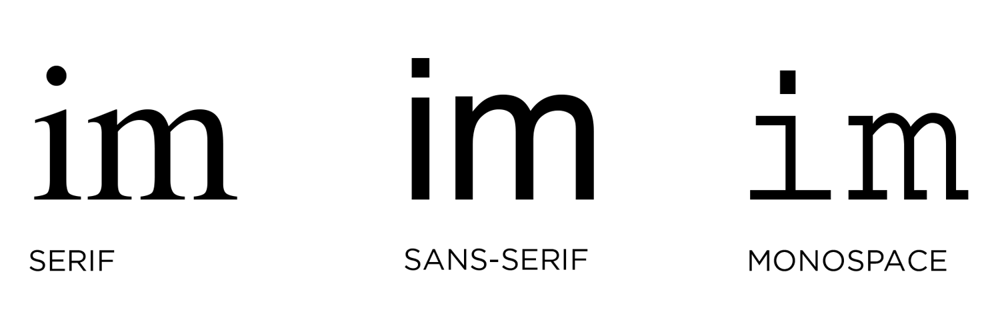
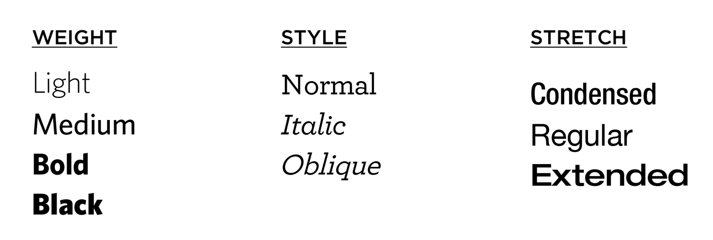
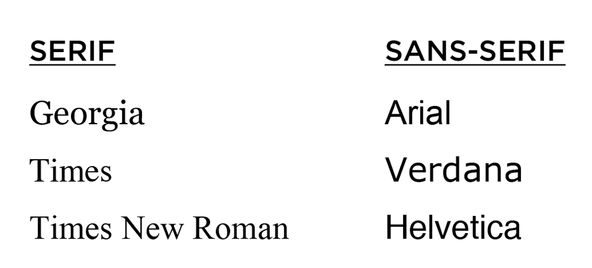
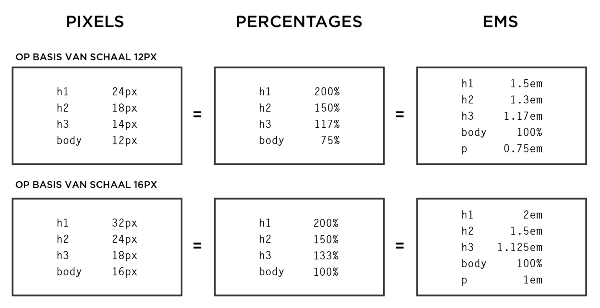

# lettertype

## lettertype terminologie







## CSS & tekst

### font-family

```css
p {
  font-family: "Times New Roman", Times, serif;}
```

Bij `font-family` staat een opsomming van soortgelijke lettertypes, gescheiden door komma's . Het eerst genoemde lettertype draagt de voorkeur weg, de overige worden vermeld als extra font voor wanneer het voorgaande lettertype niet ondersteund wordt door de browser.

{% embed url="https://flems.io/#0=N4IgzgpgNhDGAuEAmIBcIB0ALeBbKIANCAGYCWMYaA2qAHYCGuEamO+RIsA9nYn6wA8AQgAiAeQDCAFQCaABQCiAAnZQAfAB06gtVp1YIDJPsFh4ATxj6MABwCMy4NuXKSveAFoSTChdTKmiDSZMxgygByEADuygBK3LgMdEGEyiFhaZAATmQkANzaAL7a2nYATE4ubh7evlD+ygCCuQxQaQAS0ABuEPBksAxZyWCeOXmFdCUpdHYAzFV0ru58dbh+AUEAMgCusGRIDMqSvGDcMKmBICc7uRDZkTGXuLzcYLYMsBCT04IA9OYrBBTH9DMZTAAjbhICz6bS6ezqSQAZWRNVWPnWDX+WER8NsylgUAYYDAAF4gg4guppFgyOF6cojh9sgwAOas2xYLJYbjRJZkJbwQzpUIQcJRWIJJJLFbwDD-WymAlEknkynlam0xmM5kMVkchhcnl8gVCkUtMhtdHyxXKwnE0kUkC2OZaukM8J6g2c7nKMC8-nKQXKYUQZS7faHY6nc7huUKv5K0o6P5QmEgvQp7ScSAwBBkU6scoADlQAAYQEVCPQmCx0BgAFZUYg8PgQAToKs1kCMZisDCwUmcNv8eCsKsAXSKQA" %}

### font-style

```css
p.normal {
  font-style: normal;}
p.italic {
  font-style: italic;}
```

`font-style`: normal | italic | oblique | initial | inherit;

**normal**: De browser toont de standaard versie van het lettertype.\
**italic**: De browser toont de cursief versie van het lettertype.\
**oblique**: De browser toont de schuine versie van het lettertype, gelijkend op de cursieve versie.\
**initial**: De standaardwaarde van het lettertype wordt teruggezet.\
{% embed url="https://flems.io/#0=N4IgzgpgNhDGAuEAmIBcIB0ALeBbKIANCAGYCWMYaA2qAHYCGuEamO+RIsA9nYn6wA8AQgAiAeQDCAFQCaABQCiAAnZQAfAB06gtVp1YIDJPsFh4ATxj6kZAG7Lg25cp5RuAJ1TKPyANzOygBGnkgQXsoAjAAOAB7KYNxQZEjBUACuEH7K2gC+2tpYkY6Bbp7eZHRk8GQMUNl52oIA9OZWEKbNhsamIUgW+k22dvouupHqAJJVNXUtRaPKgtHq0oaqRmEeygwhdhA7dKnwWGRgytEMHgwA5tfRWMpnT3RgKQcMyqKTAGrK0BBmHxCMo1gdvn8AUD4KoGOcTgcyttoh5uNFwpYEhAYfBuDkQL4kJpMKD1t0tv8YNDYedquckRdUeiPJjIDi8cTKtValBiSCAO6nWCPSrKE7PWBwg7PYlBKAMWAAa2JGBaKyazWGgx0zT6Aw1ek4kBgCDIvCo6AATJbUAB2EC5Qj0JgsdAYABWVGIPD4EAE6AdTpAjGYrAwsDAXq4vH48FYDoAurkgA" %}

**inherit**: De browser neemt de eigenschap over van her bovenliggende element.\

{% embed url="https://flems.io/#0=N4IgzgpgNhDGAuEAmIBcIB0ALeBbKIANCAGYCWMYaA2qAHYCGuEamO+RIsA9nYn6wA8AQgAiAeQDCAFQCaABQCiAAnZQAfAB06gtVp1YIDJPsFh4ATxj6wABwZ1lwbcuU8o3AE6plAIygArhAA3C5+XkgQ3soAjLYAHspg3FBkSH5QDLAA1qF0AL7a2hgQ8fCeDEn2js6ObilePmR0hp5k8HmFOgD05lYQpt2Gxqa+3EgW+tqCSGQAbvquABJREMpkYMpm1eqVdg7K0BDMfIK9O8oA7lhksFjrm-5BhMoMm-uORyfwmwyea5B4Mp4Nw-BAMNNurMFkUdNC3JkwGAALyaEClcoMNFJSwwVFcBreADm-wgdDRi2UK3+Dy2H12VQOXzJ8DO9KuNzutJJEDJL18cAYAUg6yBzVa7U2JE83Fwos29n+fAhPWhUzh8xx-Xx7ka-yQFLC1LWGzpOz21UOMG+bIu11u91NTwgLzejM+1pZvxpgOBoIFKrOathZzGE0Gek4kBgCDIvCo6AATABOVAAdhA+UI9CYLHQGAAVlRiDw+CzWJnsyBGMxWBhYEjOKX+PAK-kALr5IA" %}

{% embed url="https://flems.io/#0=N4IgzgpgNhDGAuEAmIBcIB0ALeBbKIANCAGYCWMYaA2qAHYCGuEamO+RIsA9nYn6wA8AQgAiAeQDCAFQCaABQCiAAnZQAfAB06gtVp1YIDJPsFh4ATxj6ADhjrcATrgZRlwbcuUle8ALTmVhCoyg7OrgDc2gC+2tp2ZPCuZLDunt6+AZYwIYnJsFF0sXTxGNwARlBkAI4ArhBpdF4+fFlBIRVVdRCFxYIA9IHW2gOGxqbl3EgW+iNYAIzq0oYZrUMNNo7cNhCOlqOLcTo2yrBQDGBgALyaIGEuULdLWGRgyq-KDMo2DI4MAOZ-GxYd5Ne6uZTrDADGymE5nC7XW55KqwJ7LD4fL4-P6AhjA0HvJKoyHZCDQ-qwkbw86XG4gTo1erol5vLHfX4AoEgshNRndUlBClUko6fqTaamfp6I7aTiQGAIMi8KjoABMAE5UAAGEDRQj0JgsdAYABWVGIPD4EAE6D1BruRtYGFgl04Vv48FYeoAutEgA" %}

### font-weight

```css
p.normal {
  font-weight: normal;}
p.thick {
  font-weight: bold;}
```

```css
p.light {
  font-weight: 100;}
p.normal {
  font-weight: 400;}
p.thick {
  font-weight: 700 ;}
p.thicker {
  font-weight: 900 ;}  
```

`font-weight`: normal | bold;

**normal**: De browser toont de normale standaardletters.\
**bold**: De browser toont de vette versie van het lettertype.\
**100 > 900**: Het 'gewicht' van een font kan ook weergegeven worden aan de hand van een getal tussen 100 en 900. Google fonts werken veelal op deze manier ([https://fonts.google.com](https://fonts.google.com)).

{% embed url="https://flems.io/#0=N4IgzgpgNhDGAuEAmIBcIB0ALeBbKIANCAGYCWMYaA2qAHYCGuEamO+RIsA9nYn6wA8AQgAiAeQDCAFQCaABQCiAAnZQAfAB06gtVp1YIDJPsFh4ATxj6ADhjrcATrgZRlwbcuUle8ALQA7hBkAOY4qMoOzq4A3NoAvtradlChOO6e3r6BwWHwEal5EI5xdIl0yRjwWGSwANYZdF4+fDlp+coARtxQSKXlldW1dcWNzdlB7REAnAAMs-3aggD05lYQpsuGxqbdSBb6S1gAjOrShlmtk3nKNo7cNsWWKyeHOjbKsFAMYGAAvJoQFEXFBAWcamBlGRIQxbgxHAwQgibFgMCsbKYPl8fv9AYUcGDztCoTC4QikQwUWjlhilljvr8ASAhvVCRCScpYTZ4Yjkaj0ZjPgzccyavVimzicSuTyKVSBUkdMs9gclls8BpFdpOJAYAgyLwqOgAMwAFlQsxA8UI9CYLHQGAAVlRiDw+BABOgrTagXbWBhYL9OG7+PBWFaALrxIA %}

### font-size

```css
body {
    font-family: Arial, Verdana, sans-serif;
    font-size: 12px;}
h1 {
    
font-size: 200%;}
h2 {
    font-size: 1.3em;}
```

De `font-size` geeft de grootte van het lettertype weer, veelal in pixels (**px**), maar ook in percentages (**%**), \*\*em \*\*of **rem**.

**pixels (px)**: Pixels worden vaak gebruikt door webdesigners omdat ze op deze manier precies weten hoeveel ruimte hun tekst zal innemen op een webpagina. Het aantal pixels is gevolgd door de letters px.\
**percentages (%)**: De standaardgrootte van tekst in browsers is 16 px. Dus een font van 75% komt grotendeels overeen met 12 px en 200% wordt dan 32 px.\
Als binnen het `<body>`-element van de website gekozen wordt voor een standaard lettertype met de grootte van 12px, dan zal 75% van de standaard grootte resulteren in een font van 9px groot (75% van de 12px lettergrootte).\
**em**: Een em is gelijk aan de breedte van een letter m.\
**rem**: Een rem staat gelijk aan de font grootte van het HTML-element (voor de meeste browsers veelal standaard 16px).\
[https://www.sitepoint.com/understanding-and-using-rem-units-in-css/](https://www.sitepoint.com/understanding-and-using-rem-units-in-css/)





### text-transform

```css
h1 {
    text-transform: uppercase;}
h2 {
    text-transform: lowercase;}
.credits {
    
text-transform: capitalize;}
```

Met `text-transform` kan je kiezen wanneer hoofdletters of kleine letters worden weergegeven.

**uppercase**: zet alle letters om naar hoofdletters\
**lowercase**: laat alle hoofdletters weg\
**capitalize**: geeft elk eerste letter van een woord een hoofdletter

{% embed url="https://flems.io/#0=N4IgzgpgNhDGAuEAmIBcIB0ALeBbKIANCAGYCWMYaA2qAHYCGuEamO+RIsA9nYn6wA8AQgAiAeQDCAFQCaABQCiAAnZQAfAB06gtVp1YIDJPsFh4ATxj6kZAG4YGy4NuXLEAD3gBaeACcGOjASbj9cVGUAVwAHaIg-WAZIAG5tAF9tbVsHACNnV3cIL18AoJCwiKhuAHd4xJT0zLpsjFh8ujdPH39A4NDw5UTosngGKDIALwhUugydAHpzKwhTecNjUxzuJAtTLABGdWlDQuKesv7leT9uOL9LQTXDpt0AJnUukt7ygZi7+ogqEeWHe2kE2UGUCSYAAvJoQAx4eoADKhCC4ZRkaJgSIYpDcKp+ZRgEbKJgQeCEQa8SAICmRInGLFkMCwMh0ADmymgIwwj2y+jBII+RW6pT6FWUVVqCSSgOBoJ0ENgULAsPhOSRqL86Mx2NxynxhOJpPJlOpQTgiHgDLJtmGrPZXJ58D58wFL2Fn3OEoGQxGY0m8rWivB9kh0LhXC1aIxWJxeIJoRN8DJzHNPEtdJtjPtLLZnO541d-PsgoWWx2qz0nEgMAQZBprAAzAAGVAAdhAaUI9HJrAwACsqMRM-x4Kxu72QIxmAPYGrOGOIAJ0N2ALppIA %}

### text-decoration

```css
h1 {
  text-decoration: overline;}
h2 {
  text-decoration: line-through;}
.credits {
  text-decoration: underline;}
a {
  text-decoration: none;}
```

`text-decoration`: none | underline | overline | line-through

**none**: verwijdert de alle eigenschappen die reeds werden gelinkt aan tekst\
**underline**: plaatst een lijn onder de tekst\
**overline**: plaatst een lijn boven de tekst\
**line-through**: doorstreept de tekst



### line-height

```css
div.a {
  line-height: normal;}
div.b {
  line-height: 80%;}
p {
  line-height: 1.6em;}
```

De `line-height` geeft de hoogte van een tekstlijn weer binnen een tekst. Hierbij zijn negatieve waarden niet toegestaan.

{% embed url="https://flems.io/#0=N4IgzgpgNhDGAuEAmIBcIB0ALeBbKIANCAGYCWMYaA2qAHYCGuEamO+RIsA9nYn6wA8AQgAiAeQDCAFQCaABQCiAAnZQAfAB06gtVp1YIDJPsFh4ATxj6kZAG4YGy4NuXKoZOhAC0hsgHMcVGU6bgAnXAYoAG5tAF9tbVsHACNnV3dPHz9A+GCARgwANli6BLok+wxYdLo3Dy9fCACg5QAOAAYAUlLyyockWvqsppa85QAmDu7e7UEAenMrCFN5w2NTFO4kC305rHz1aUNMxpycZXkw7gAHCDDLBYO9gwn1Buzm3ODQiKjlAAUSAgJAYAFcoPAAJSoJ5vObJZSwKAMMBgAC8mhADCxRywZDAygJyicNwYYQY-gpNywygA7mR4LSnOYGHQkOTBh9RrkMIIUmF9McIMpWezOacRed4ES6rhuOZlALuHTIGFCcSGFswTL8vlusp4NxlPkpl0+fNki9dG9udKCsVAWE4NxcMx2cgYXDTIjkaiMViUrjjsTNcoyRSqQwafTGbSmSLnTw3RAPVyRtK+QKhScPqovhdiYZnaKIDKjSbihhlCGNYSnGC6IzKIS7FEwRBovzBdpmGzPP5DVgGOXc1l82NY1AoErE9AR-YRRWE8oSLwZWAyAAvCAWq2JV7vDMF8adLqwtbwnS+lFozFcYP4usk8PkynU2kMpkvsCRaf3SUeRwLMezoYVJQnXIiUJYsRUgctjTPPd7GtLBbWPMZgimboLzQn17CRW8AxAJBH1DetX0jD9Y2-JwUgCfwALtE8QJzEU82laD8xLeDDWNbDzQWfcKh0eYth2VY9E4SAYAQMheCodAABYAGZUAAdhAOJCHoJgWHQDAACsqGIHg+FTeBWC0nSQEYZhWGqNFODM-hLPQLSAF04iAA %}

### letter-spacing, word-spacing

```css
h1, h2 {
    
text-transform: uppercase;
    letter-spacing: 0.2em;}
.credits {
    font-weight: bold;
    word-spacing: 1em;}
```

Kerning is de term die typografen gebruiken voor de ruimte te duiden tussen elke letter afzonderlijk. De ruimte tussen elk letter kan aangepast worden met behulp van de `letter-spacing`. Dit kan handig zijn wanneer een titel of zin allemaal in hoofdletters staat (uppercase) of in het vet om zo mogelijk de leesbaarheid te verhogen.



\
Met `word-spacing` kan je de witruimte tussen woorden aanpassen.

{% embed url="https://flems.io/#0=N4IgzgpgNhDGAuEAmIBcIB0ALeBbKIANCAGYCWMYaA2qAHYCGuEamO+RIsA9nYn6wA8AQgAiAeQDCAFQCaABQCiAAnZQAfAB06gtVp1YIDJPsFh4ATxj6ADhgbLgy7cuUB3bgCckAWjA2GWDI6AHNUZTovXAYoAG5tAF9tbTsAI0dnOlcPbz8AoNDwgGYABhsAD3i6JLoUjFgMl3cvX39A4LDlAEZYXCqawQB6cysIU0HDY1NU7iQLfW1dLvVpQ2bctoKQ5XlPbhsIT0shrGXkgwAmdRzW-I7wyM9oqFQTq8WbZVgoBjAwAF5NCAGECVlgyGBlBDlGBuMxlIhyvAMMpVtDobD4YjkUMbAtLtcWnl2oVlKUKq8Ju8dJ9vr8AUDUqC0ZCMXCIAiIEiUSyoZDMRzsRhcfjdFcbsStuEerhKVhqYJaT8-oCuMzwaz+ezOdzURq+TDtUKRechjM5uM9JxIDAEGReFR0EUuqgAOwgBKEehMFjoDAAKyoxB4fAgAnQHq9IEYzFY9T+nBD-HgrA9AF0EkA %}

### text-align

```css
h1 {
    text-align: center;}
h2 {
    text-align: left;}
p {
    
text-align: justify;}
.credits {
    text-align: right;}
```

`text-align` bepaalt de horizontale uitlijning van een tekstelement.

**justify**: Dit geeft aan dat elke regel van een paragraaf, behalve dan de laatste regel, zowel links als rechts uitgelijnd wordt.

{% embed url="https://flems.io/#0=N4IgzgpgNhDGAuEAmIBcIB0ALeBbKIANCAGYCWMYaA2qAHYCGuEamO+RIsA9nYn6wA8AQgAiAeQDCAFQCaABQCiAAnZQAfAB06gtVp1YIDJPsFh4ATxj6kZAG4YGy4NuXLEAD3gBaBlDIA5nSoyrAQfBAATgDc2gC+2tq2DgBGzq7uEF6+-kEhMCTwsXQJdEn2GLDpdG6ePn6BwcqRgTjFccqJdMkYSNW1WfW5TQBWAK7mZCQW7Z06APTmVhCm84bGpincSBb62roAjOrShpnZDUHK8pHcAA5RloJrR12CyaFQDGBgALyaIAx-qYsAAmdR1HKNEJhCKRVBPUGmW7qAAy3EiEFwyjItzAYyxSG4UHRyjAZHgyiYEHghFCvEgCGpY0ilNstzIYFgZDoAWU0HJGGUingZCYpMx9xZtjFDApUVlyluYygdm5DEitIVSpVapZJH5YGUKU+3QFygAahBJillfjlHYiWN4LcFYgoFAJsppbhaTw6JAAI5jBUBSIMVVIJz+FJRbjNLC8WCep0YJ7I-bzZJ7HTvWCfb5-EApIH7REQi5NArweFrMH7ZFojFYnF4glEklkilUml0-1wRDwZmsnEcrk8vn+eCC4WirGQXCSr2zylysMU7WqxgaleK5Wb9XKfX+Q3GhimqcWq0im0erEOj3O13QD2G72++kQIMhsMRqNkGM3PGibJlOaarFmry5vmvz-LAJYGGC5bDCELQBDgNaIvWqLopi2K4nahLEiynaUswPZ+gyA5DsYI6ctyvL8heM5ivOi7eju8rrnuuqalxOpboeBpGiatgXpa1q2nejqPhSbovkuTDvn2X4UqG4ZkJGyjRrGQF0EmhopmBGYQWUOb2B8XwwSASDwboiGDJCeTKOMkzTBhdY6A2OHNvhbZEaS5KkdSSmUUyLI0eydHjox04iixEpRApWIKpxu78eqvFpfuepCae56CuJ16Sfa0kurJz6em+vaBsGqk-hpf4AXGkQJnpIGpvM6YLCZGZbDsqx6JwkAwAgZD0qwAAsABsqAAOwgHEhD0FSrAYCMVDEH6-DwKwC1LSAjDMKtsDfJwW3hDt6ALQAunEQA %}

### vertical-align

```css
img.a {
  vertical-align: baseline;}
img.b {
  vertical-align: text-top;}
img.c {
  vertical-align: text-bottom;}
```

De eigenschap `vertical-align` is niet bedoeld om tekst binnen een paragraaf verticaal uit te lijnen. Wel wordt dit gebruikt voor de `<td>` en `<th>` binnen een tabel. Ook wordt het gebruikt bij inline elementen zoals ``.

{% embed url="https://flems.io/#0=N4IgzgpgNhDGAuEAmIBcIB0ALeBbKIANCAGYCWMYaA2qAHYCGuEamO+RIsA9nYn6wA8AQgAiAeQDCAFQCaABQCiAAnZQAfAB06gtVp1YIDJPsFh4ATxj6yuAOYYGy4NuXKAbhABO8MrAZQALQBZHZ0qMoARgyQUGR0EADc2gC+2tq2DpHOrh7evv5BIWERiAAe8IHw3AAOyXRpdBn2GLA5dG6ePn4BwXElyuWVkdzw1bj1jc0OSO2d+T1F-eHKYACukZPpdJkYEHN53YV9oSvrNd5bOgD05lYQpteGxqYjSBb62roAjOrShocCr1ih15F5avkLIInr9troAEzqLpApanCLRWLxfYACiQEBIDDWUHgAEpUNCsIivjV1ABBDqCTLKWBQGJgAC8mhADC5qy8sE5IBw8BqYFQ12uXgYAHcMHYyPAsBs1pB+bx+PBWtxcNdafJAgBJaSBADiAAlrmyIPAwIE8bhuLbpRBIohYFhrgAGABsnsi8IA7JFviQXd7YEGSABOKMMf0QT0AVjjDG93yjAA4AMxZpAMb6REgkT3XGrxQJxBKBPy8DA1Oh2XnSshIRWCqO8wyhHDtrnqZS2Bh2fbNxXKJx4glE+Dj5bMPgYaE05RwylIhbHEGlCAVKq1clPKk6Gn05SM+zM1lgDlcyK8sD8wXC0XiyUyuUKpWRFXeHh8CALjwOp6oaxrmpa17Wra9qOoEzqunAHo+n6gbBqGkThpGMZxvCCbJtEaaZjmeYFkWJZlnQFZYtWf51g2TYtm2XIdiAqgQN28C9iA-aDsOyijlg46DDulTVDUs6nPOmpLv2q6IsiiwnAMQyBCMYzagea7UnSDJMiybKCrA96Plyz5ihKUqyvKirKqqf4alqwH6kapoWlaNp2hADpOi6bpIb6-pBiGYYRoW2HxkmKaEdmub5oWxaluWlYQDRtb1o2rHNq2WBcWxHFcTxuBDiOn5CSpanjBJYRSYupafAY8kbsCywROskSaUeggnrpF76degpIMZAqmWML4We+1lfj+ar-oB2q6s5YFuZBHkwT5CHul6AWocFGGhdGsYRfhqbpjFJHxeRSXUTWdB0Rl-GMTlzGduxdg9s93EDkVfECUJbVVXQNUySuTQNeuRzNWiqxrDUHWmN1Z56VeN4gBAQ1PqN5lvlZn62b+6oAZqQELaBrkQZAq1ebB8F+VtKFBehmFhYduGRQRp3EXFZGJZRyWpbd6UMdluVdm9nEfYVxUPWOTjnN4ANA3VcLXG8HxfE8eAaJwsRwL4vBUOgnqoJ6gQACyJqgAYgCkhD0EwLDoBgABWVDEPZhOsNbtsgIwzCsK016cO7AjoNbAC6KRAA %}

### text-indent

```css
div.a {
  text-indent: 50px;}
div.b {
  text-indent: -2em;}
div.c {
  text-indent: 30%;}
.credits {
    text-indent: 20px;}
```

`text-indent` laat de eerste regel van een tekstblok inspringen. De waarde van dit element mag negatief zijn.

{% embed url="https://flems.io/#0=N4IgzgpgNhDGAuEAmIBcIB0ALeBbKIANCAGYCWMYaA2qAHYCGuEamO+RIsA9nYn6wA8AQgAiAeQDCAFQCaABQCiAAnZQAfAB06gtVp1YIDJPsFh4ATxj6kZAG4YGy4NuXLEAD3gBaMnSQQfKjKAKwADAAOHgDc2gC+2tq2DgBGzq7uEF6+-oHwwd4ATBC4sXQJdEn2GLDpdG6ePn4BQcoAzGEApGUVggD05lYQpn2GxqYp3EgW+tq6AIzq0oaZ2c15yvIATtwREFuW-ViLiQaF6o05LfmhkR6oR+dzycqwUAxgYAC8miAMv-o3IIIuoADLcLYlZRkCJgACuuGUSG4UAhyjAZHgyiYEHghFevEgCFxcK22NsETIYFgfgA5spoJiMMpFPAyEx0SU9mTbByGFj9vzlBE4VA7H4GFt8UKRWKJWSSIywMoUu9-EzlAA1CDmMgpUUI5R2FFw+ARIWIKBQOHK3m4fE8OiQACOcKFtK2DHFSCcUD1+24yi2WF4sBtylNGH6ILmfWSszOFyyTVyrSKJQeoyeOhebw+31+KQBGWBYIhUJh8MRyNRZIxWJxeIJTrgiHgpPJMKpNLo9MZ8GZrPZiMguG5SOH2IFnqxsvFjClU+FovnkuUir9ytVDHVA61OrZ+utiON1rNFug1ttw4dhIgrvdnu9vv9OyDIboYeVkejI3jp10c5LnWVoOk6TMsGzQRc3eT4fi4Yt6mUUtwUhRFK0NGs0XrbFmCbR0iTbDtjC7ak6QZP09yHDlR3HO0l0FWcV3laUmLlBd1yVFU1VsPdtV1I9DVPU1zSxS0rwnJhbxbB8sQ9L0yB9ZQ-RSAN31DcMfz6GMdDjewE36SZphGPROEgGAEDIQlWDaAB2VBbJAOJCHoHFWAwAArKhiEdfh4FYJyXJARhmHc2BPk4Xy8gCuIAF04iAA %}

### text-shadow

```css
h1 {
  text-shadow: 2px 2px 7px #ff0000;}
```

`text-shadow` voegt schaduw toe aan een tekst.

**eerste waarde** geeft lengte aan hoe ver naar links of rechts de schaduw zou moeten vallen\
**tweede waarde** geeft de afstand tot de bovenkant of onderkant mee ten overstaande van de tekst\
**derde waarde** is optioneel en specificeert de hoeveelheid vervaging die op de schaduw aangebracht wordt\
**vierde waarde** is de kleur van de slagschaduw



## speciale lettertypes

Omdat niet elk computersysteem is uitgerust met dezelfde lettertypes, kunnen we ons eigen lettertype meegeven aan de website. We doen dit met de `@font-face` selector in CSS.

```css
@font-face {
  font-family: "Sansation Light";
  src: url(../fonts/sansation_light.woff) format(woff);
  font-weight: light;
}
@font-face {
  font-family: "Sansation Bold";
  src: url(../fonts/sansation_bold.woff) format(woff);
  font-weight: bold;
}

div {
  font-family: "Sansation Light", sans-serif;
}
```

{% embed url="https://flems.io/#0=N4IgzgpgNhDGAuEAmIBcIB0ALeBbKIANCAGYCWMYaA2qAHYCGuEamO+RIsA9nYn6wA8AQgAiAeQDCAFQCaABQCiAAnZQAfAB06gtVp1YIDJPsFh4ATxjrl2gAIle8ALQkGsCMuDblyx31cmCgtUZVwLADEyACdzCKcAbh9lMGjYUIBXaKgACjAGOnz4Ml4AfSgyAHMcDAB3bhISAEokugBfbW0kMgA3L2T-FzdcYNDwqNj4eL5Wjp0AenMrCFN5w2NTACNuJAt9bV0ARnVpQ2UHJ0CPZQAlDJhBNePOnW6e9QB1MngsZUkAZX+hGUtQgmzA3wgYGUsAKfjIjCgUAsygykD8Tmh3B+EGiyh+cJxygADtFPJAYAhkLYQKDNs58iQIJoQBi+GAMI83vsFttdqs9JwKXBirwqOgAEyHVAAdhAbUI9CYLHQGAAVlRiDw+BABOh5YqQIxmKwMLAwJquE5dfBWPKALptIA %}

Niet elk lettertype is beschikbaar om op jouw eigen webserver te installeren. Daarom kan je ook gebruik maken van lettertypes die op externe servers staan. Gebruik hiervoor de `@import` selector.

```css
@import url(//fonts.googleapis.com/css?family=Open+Sans);

body {
  font-family: 'Open Sans', sans-serif;
}
```

Je kan de lettertypes ook als een aparte `link` toevoegen aan de `head` van jouw website.

```markup
<link href='//fonts.googleapis.com/css?family=Open+Sans' rel='stylesheet' type='text/css'>
```

{% embed url="https://flems.io/#0=N4IgzgpgNhDGAuEAmIBcIB0ALeBbKIANCAGYCWMYaA2qAHYCGuEamO+RIsA9nYn6wA8AQgAiAeQDCAFQCaABQCiAAnZQAfAB06gtVp1YIDJPsFh4ATxjrl2gAIle8ALQkGsCMuDblyx31cmCgtUZVwLADEyACdzCKcAbh9lMGjYUIBXaKgACk0QHHgABzBUAHoy6IYAdwwAczJ4LAyAIwzINKcIPgweXDKAQXlnAElpZwBxAAkyhjBIeDBnJAhcbiXqiBbEWCwy3AYyOjKwBjpT+DJeAH0oMjqcDGruEhJ8gEokugBfbW0kMgANy8yX8LjcuGCoXCUVi8HifC+vx0J0s1m0gjKhmMpha3CQFn0GKwAEZ1NJDMoHE5Ah5lAAlDIwTGkok6AGA9QAdUaWGUkgAygLCMpNi0wI0IGBlLAzn4jgwoFALMp2p4wdLuE0INFlE05drlEVop5IDAEMhbCAxc5TiQIPk-E4wBhMRy2Zi8QTTFi8BpOGa4JdeFR0AA2VAkgBMIG+hHoTBY6AwACsqMQeHxuvBWLH4yBGMxWL15pxM-wc+hYwBdb5AA %}
