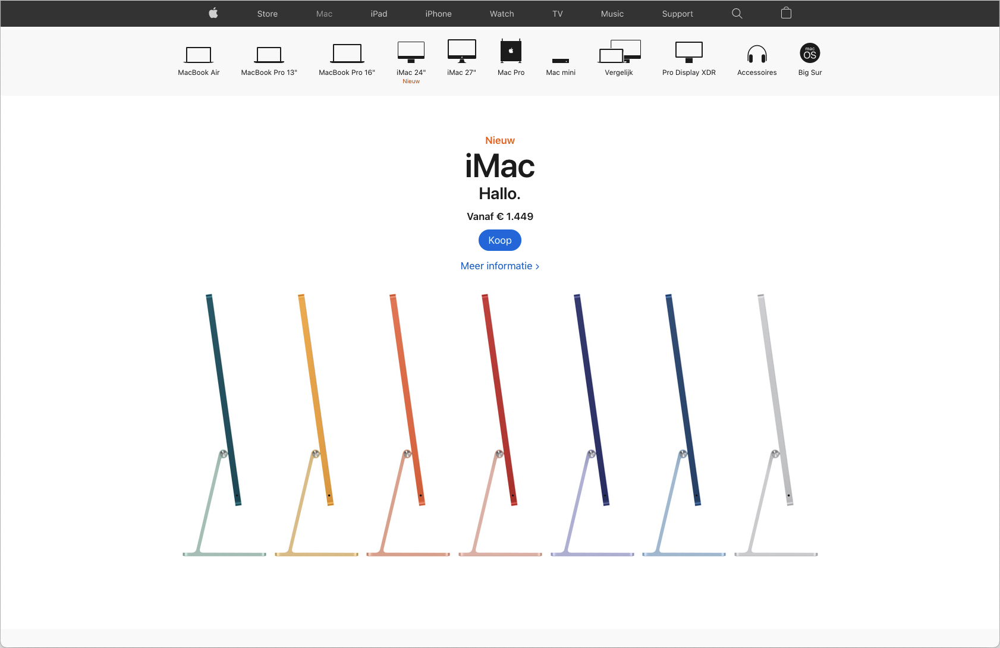
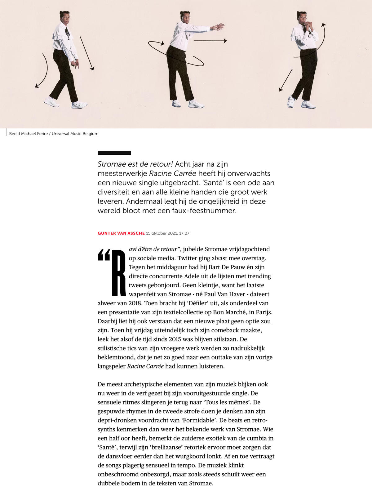
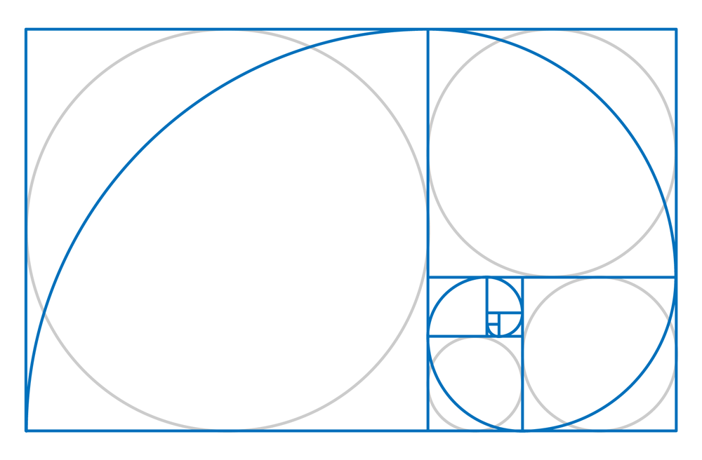
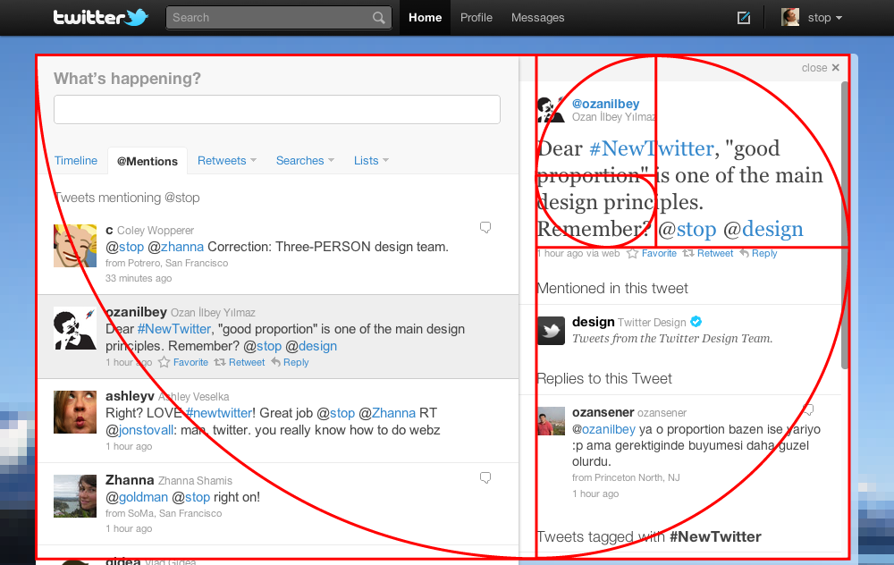

# 5: UI/UX

In het onderdeel UI/UX gaan we een hele resem aan onderwerpen behandelen die ervoor zorgen dat websites en -applicaties een aangename ervaring geven aan de bezoekers en gebruikers. Dit komt in de eerste plaats door een consistente stijl te hanteren maar er zijn een hoop tips en tricks die je kunnen helpen.

## plaatsing

### ruimte in het ontwerp

Ruimte kan worden gebruikt om elementen in een ontwerp zowel te scheiden als te verbinden. **Bredere ruimtes scheiden** elementen van elkaar en **smallere ruimtes verbinden** elementen om relaties tussen duidelijk te maken. Overlappende elementen maximaliseren hun relatie. Door de ruimte in ontwerpen te beheersen en vorm te geven, wordt ritme, richting en beweging gecreëerd, kortom een **designflow**.

Witruimte zorgt voor drie belangrijke dingen in een ontwerp:

* het maakt groeperingen van elementen,
* het creëert nadruk en hiërarchie,
* het verbetert de leesbaarheid.

Een systematisch gebruik van **witruimte** op pagina's verbindt die pagina's. Ruimte is **indeling**. Wanneer de ruimte tussen elementen op een pagina hetzelfde blijft, raken bezoekers niet gedesoriënteerd. Navigatie en logo staan op elke pagina op dezelfde plaats.

Natuurlijk kunnen verschillen qua indeling ook binnen een bepaalde sectie. Zolang de \*\*standaardtekst qua plaats consistent \*\*blijft, is het duidelijk voor de bezoeker dat hij zich op dezelfde site bevindt.

Het evenwicht en systematisch gebruik van **witruimte is een kenmerk van professioneel ontwerp**. Veelal is bij een ontwerp van een amateur te weinig aandacht besteed aan de ruimte binnen het ontwerp.

**Witruimte** geeft de ogen rust en net dat is wat ze nodig hebben om de **boodschap op te nemen**. Witruimte is een visuele aanwijzing dat er een breuk in de inhoud zit, of dat de inhoud afgerond is. Het zorgt er ook voor dat \*\*navigeren \*\*op een pagina **makkelijker** wordt.

Witruimte kan actief of passief zijn. Wanneer de ruimte in een ontwerp symmetrisch in balans is, wordt de ruimte passief. Het is statisch en formeel en eerlijk.... voor het grootste deel saai. Wanneer die ruimte **asymmetrisch in balans** is, wordt ze actief. Het is dynamisch, **modern** en interessant.

### ruimte in webdesign

Het gebruik van ruimte binnen een ontwerp voor webdesign onderverdeeld worden in twee types.

**micro witruimte**

Micro-witruimte houdt zich bezig met **ruimte tussen kleinere elementen**, zoals de marges rond tekst en de ruimte (line-height) tussen tekstregels of de spaties tussen afzonderlijke tekens. Het is ruimte tussen elementen van een lijst en ruimte tussen een afbeelding en het bijschrift. Het betreft ook de ruimte tussen elementen binnen een groter element. Stel dat er bijvoorbeeld 2 afbeeldingen in een zijbalk naast elkaar staan, of een zoekvak en een zoekknop op een formulier.

Veel van de micro-witruimte zal in **typografie** plaatsvinden. Het correct gebruik van ruimte in typografie speelt een grote rol speelt in hoe leesbaar teksten zijn. Denk maar aan het instellen van de regelafstand (line-height).

**macro witruimte**

Macro witruimte is de ruimte tussen de belangrijkste elementen binnen het ontwerp. Deze ruimtes zijn meestal groter en hierdoor meestal meteen duidelijk. Ruimte wordt gebruikt om elementen te scheiden en te verbinden. **Randen (borders en achtergronden (background)** worden vaak gebruikt om sommige **elementen te verbinden**, terwijl ze zo ook worden gescheiden van andere elementen.

Witruimte kan worden gebruikt om elementen te benadrukken. Degenen die in of nabij grote blokken ruimte worden geplaatst, winnen aan belang door hun scheiding van andere elementen. Ze vallen natuurlijk ook op in een veld van lege ruimte.

**rasters en ruimte**

**Grid** of rasters zijn een **manier om ruimte te organiseren**. Door grid gebruiken wordt een ontwerper gedwongen na te denken over witruimte en deze te leren vormgeven in ontwerpen. Rasters worden gedeeltelijk zichtbaar door de manier waarop elementen worden uitgelijnd en ook door de velden en paden van lege ruimte die niet zijn gevuld. Grid of rasters moedigen aan om meer dynamische en asymmetrische composities te creëren waarin ruimte niet alleen aanwezig is, maar ook door en rond elementen in het ontwerp stroomt.

**vaste en vloeiende lay-outs**

Veel webdesigners ziet kiezen voor een **vaste of fixed lay-out**, is omdat het de werkruimte van je ontwerp vastlegt. Het zorgt voor minder verrassingen in de witruimte. Momenteel is het gebruikelijk om de paginabreedte in te stellen op **960px**. Dit geeft webdesigners meer controle over de horizontale ruimte, aangezien één aspect van de totale ruimte vast ligt. Vaak zijn die vaste lay-outs **gecentreerd in het browservenster**. Dit creëert een passieve (symmetrische) balans van ruimte buiten de pagina. Binnen de 960px is de ontwerper vrij om passieve of actieve ruimte te gebruiken.

Door te kiezen voor een\*\* fluid of vloeiende lay-out\*\* wordt de controle over de totale ruimte losgelaten. Hoe vloeiender het ontwerp, hoe minder controle je hebt over de totale witruimte: Zal elke kolom in het ontwerp vloeiend zijn? Zo ja, hoe wordt de microruimte in de kolom beheerd als de kolom uitzet en inkrimpt? Kunnen sommige kolommen 'fixed' worden en zo ja, hoe wordt de macroruimte tussen de belangrijkste elementen beheerd?

De grootste tekortkoming bij vloeiende lay-outs is de manier waarop de **witruimte verandert bij verschillende browserformaten**. Wat er goed uitziet en gemakkelijk te lezen is op de ene breedte, ziet er vreselijk uit en wordt moeilijk te lezen op de andere. Dat verklaart het meer voorkomen en dus gebruik van vaste lay-outs.

## gulden snede

Eeuwen geleden begonnen mensen patronen te observeren in de prachtige natuur om zich heen: van de bladschikking bij planten tot het patroon van de roosjes van een bloem, de schutbladen van een dennenappel of de schubben van een ananas,... telkens kwam hetzelfde patroon terug. Dit patroon werd omgezet in een getallenreeks 1, 2, 3, 5, 8,13, 21, 34,... Wanneer je begint met het berekenen van de verhouding van het [fibonacci-getal](https://nl.wikipedia.org/wiki/Rij_van_Fibonacci) met het vorige fibonacci-getal, eindigen we met iets als 1.61803 ... een irrationeel getal afgerond op 3 decimalen 1.618, wat de gulden snede is waarover we lezen.

Wiskundig wordt gesproken van een gulden snede of golden ratio als twee grootheden in hun verhouding gelijk zijn aan de verhouding van hun som tot de grootste van de twee grootheden.

`(a+b)/a = a/b`

