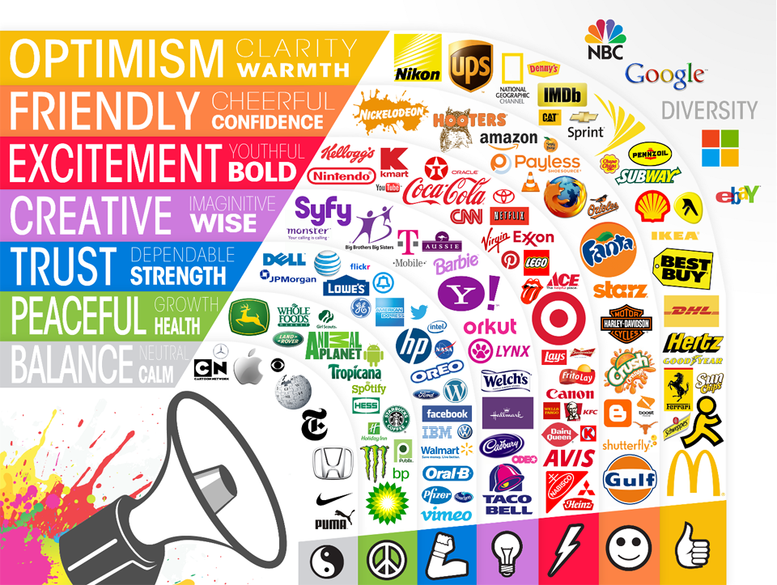

# kleurentheorie

Het kleurenpallet is een belangrijk aspect binnen een digitaal ontwerp. Voor sommige ontwerpers wordt kleur beschouwd als een esthetische keuze, maar het is in feite een belangrijk onderdeel van de **psychologische impact van een ontwerp op gebruikers**, en dus ook op UX.

Een goed doordacht kleurenpalet kan een ontwerp van "goed" naar "geweldig" verheffen, terwijl een slecht kleurenpalet afbreuk kan doen aan de **algehele ervaring** van een gebruiker. Het kan zelfs het vermogen van een gebruiker om een ​​site of app te gebruiken kan belemmeren, denk maar aan kleurenblinden.

## kleurenpsychologie

De psychologische effecten die kleur op gebruikers kan hebben, is een vaak complex en subjectief. De emotionele impact van kleuren mag dus niet over het hoofd worden gezien. En hoewel sommige kleuren "**universeel**" zijn in UX-ontwerp (zoals **zwart, wit en grijs**, waarvan er minstens één wordt gebruikt in vrijwel elk goed ontwerp dat er is), kunnen de **kleuren** waarmee ze worden **gecombineerd** een enorme \*\*impact hebben op perceptie \*\*van een gebruiker.

Er kan veel over gezegd en geschreven worden, maar misschien kan het best uitgelegd worden aan de hand van voorbeelden.

De manier waarop kleur wordt gebruikt kan een sterke invloed hebben op hoe het wordt waargenomen. Blauw dat als **primaire kleur** wordt gebruikt in een modern, minimalistisch ontwerp, zal bijvoorbeeld een heel andere uitstraling hebben dan hetzelfde blauw dat wordt gebruikt als **accentkleur** in een meer complex bedrijfsontwerp.

## kleuren & branding

**Merken** moeten een belangrijke rol spelen bij het creëren van een kleurenpalet.\*\* Industrienormen\*\* zijn ook van cruciaal belang én de kleuren die al door **concurrenten** worden gebruikt. Het gebruik van een kleurenpalet dat bijna identiek is aan de concurrentie van een merk is een geweldige manier om verwarring te creëren en ervoor te zorgen dat het merk niet opvalt.

De eerste stap naar het creëren van een kleurenpalet is om de betekenis van de verschillende kleuren te begrijpen en hoe ze lichter/helderder/donkerder/doffer/etc. kan hen beïnvloeden. Hier is een basisoverzicht van wat verschillende kleuren betekenen:

<mark style="color:red;">**Rood**</mark> is de kleur van gevaar en passie, maar ook van opwinding. Het is een zeer sterke kleur en kan sterke reacties bij mensen oproepen. Door het lichter te maken tot roze wordt het vrouwelijker en romantischer, terwijl het donkerder maken van de tint tot kastanjebruin het ingetogener en traditioneler maakt.

<mark style="color:orange;">**Oranje**</mark> is een zeer creatieve kleur die ook wordt geassocieerd met avontuur en jeugd, dus ook erg energiek. Door de sterke binding van oranje met de jaren 70-stijl kan het ook een retro-gevoel oproepen.

<mark style="color:yellow;">**Geel**</mark>\*\* \*\*wordt geassocieerd met geluk, optimisme en is opgewekt. Het is populair in ontwerpen voor zowel kinderen als volwassenen. Meer pasteltinten worden vaak gebruikt als een genderneutrale babykleur, terwijl helderder geel populair is in creatieve ontwerpen. Donkerdere tinten geel worden goud, wat wordt geassocieerd met rijkdom en succes.

<mark style="color:green;">**Groen**</mark> heeft verschillende verenigingen. Aan de ene kant roept het gevoelens van rijkdom en traditie op (met name donkere tinten), terwijl het aan de andere kant sterk wordt geassocieerd met milieubewustzijn en de natuur. Kalkgroenten worden vaak geassocieerd met vernieuwing en groei.

<mark style="color:blue;">**Blauw**</mark> wordt meestal geassocieerd met loyaliteit en vertrouwen. Helderdere blues kan worden geassocieerd met communicatie, terwijl saaiere en donkerdere blues kan worden geassocieerd met verdriet en depressie. Blauw is de meest geliefde kleur ter wereld, wat misschien verklaart waarom zoveel bedrijven kiezen voor blauwe tinten voor hun branding.

<mark style="color:purple;">**Paars**</mark> is een andere tint met verschillende betekenissen. Het wordt al lang geassocieerd met royalty's en rijkdom (aangezien paarse kleurstof zeldzaam was in veel oude beschavingen, was het gereserveerd voor royalty's). Maar het wordt ook geassocieerd met mysterie en spiritualiteit. Paars kan ook creativiteit oproepen.

**Zwart** staat voor verfijning en luxe. Het kan echter ook worden gekoppeld aan verdriet en negativiteit. Afhankelijk van de andere UX-kleuren die naast zwart worden gebruikt, kan het modern of traditioneel, formeel of casual aanvoelen.

**Wit** is gebonden aan zuiverheid, onschuld en positiviteit. Wit is ook erg populair in minimalistische ontwerpen, vanwege zijn neutraliteit en eenvoud. Net als zwart neemt wit gemakkelijk de kenmerken aan van andere kleuren waarmee het wordt gebruikt.

**Grijs** heeft verschillende betekenissen, afhankelijk van de context. Het kan conservatief en verfijnd zijn of groezelig en saai. Het kan emotieloos of humeurig zijn. Het kan ook worden geassocieerd met verdriet en verdriet.

**Bruin** (wat eigenlijk een donkere tint oranje is) wordt geassocieerd met nuchter en geaard zijn. Het wordt ook geassocieerd met de natuur en zelfs gezelligheid. En het kan natuurlijk te maken hebben met vies of groezelig zijn.

Het kennen van deze basiskleuren en hun betekenissen geeft ontwerpers een solide basis om kleurenpaletten voor elk merk of product te bouwen.


Het effect van kleuren

