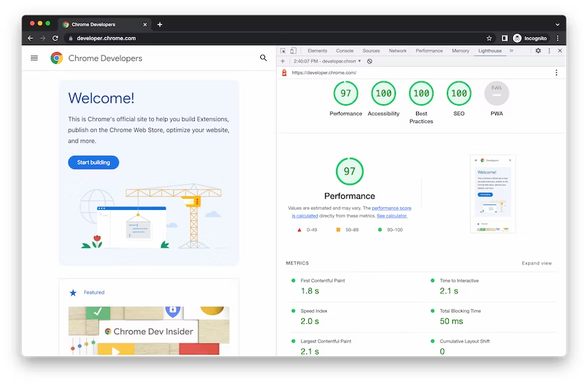

# snelheid

## gebruikerservaring

Je gaat online naar bepaalde informatie op zoekt. Een lijst met zoekresultaten verschijnt en je wil de eerste relevante optie bekijken. Maar bij het openen van die website krijg je een leeg scherm te zien, want de pagina is aan het laden is... Je wacht even om dan naar de volgende optie in de lijst te gaan. Paginasnelheid - de snelheid waarmee de inhoud laadt - heeft een enorme impact op de **tevredenheid** van bezoekers. En ook voor Google is de sitesnelheid belangrijk bij het rangschikken en dus weergeven van resultaten. Afhankelijk van de laadsnelheid van een pagina creëert dit mogelijk frustratie bij gebruikers:

* 0,1 seconden > gevoel van onmiddellijke reactie
* 1 seconde > gevoel van kleine vertraging, maar wel gevoel van controle.
* 10 seconden > hier ligt de limiet voor de aandacht bezoekers die de site onmiddellijk verlaten

Wanneer mensen moeten wachten op **inhoud**, wordt er gefocust op het wachten en niet op de taak die ze willen voltooien. Indien alles vlot verloopt, voelen bezoekers zich meer betrokken en kunnen ze zich concentreren op de inhoud.

## oorzaken vertraging

**server**

Over het algemeen moet de responstijd van de server minder dan 200 ms zijn. De oorzaken waarom een server traag reageert, zijn veelal in te delen in drie categorieën:

* trage applicatielogica (niet geoptimaliseerde databasequery's, code, enz.)
* onvoldoende hardwarebronnen (onvoldoende CPU, RAM, enz.)
* trage netwerkverbinding

De tweede en derde factor zijn direct relevant voor webhosting. Daarom heeft een juiste hostingselectie, evenals de fysieke locatie, een enorme impact op de laadtijd.

**onnodige omleidingen**

Elke keer dat een pagina doorverwijst naar een andere pagina, is er extra tijd nodig alvorens de HTTPS request-response cyclus is voltooid. Het is essentieel om omleidingen te identificeren en te verminderen. Via [Yslow](http://yslow.org) kan u nagaan of een website goed presteert.

**zware CSS-, HTML- en JS-bestanden**

Het is van cruciaal belang om de grootte van CSS-, HTML- of JavaScript-bestanden die groter zijn dan 150 bytes te verkleinen. Door [gzip-compressie](https://gtmetrix.com/enable-gzip-compression.html) in te schakelen kan de grootte van de respons met maximaal 90% worden verminderd, wat de hoeveelheid tijd die nodig is om de bron te downloaden aanzienlijk kan verminderen. Voor afbeeldingen kan gzip echter niet gebruikt worden.

**zware afbeeldingen**

GIF-, PNG- en JPEG-bestanden zijn goed voor meer dan 90% van het totale beeldverkeer op het internet. Het is van vitaal belang om afbeeldingen te **optimaliseren voor het web** - verklein de bestandsgrootte zonder de visuele kwaliteit aanzienlijk te verminderen. Hoe minder bytes de browser hoeft te downloaden, hoe sneller de browser inhoud op het scherm kan downloaden en weergeven. Het is vooral belangrijk om dit voor mobiele gebruikers te doen, omdat te zware afbeeldingen op mobiele apparaten nog steeds vertragingen kunnen veroorzaken.

* Gebruik de juiste bestandsformaten. Sommige beeldformaten zijn zwaarder dan andere. **PNG's** zijn over het algemeen beter voor afbeeldingen met minder dan 16 kleuren, terwijl **JPEG's** over het algemeen beter zijn voor foto's. **GIF en PNG** zijn verliesvrije formaten en ze zijn zwaarder dan JPG.
* Gebruik tools zoals [TinyPNG](https://tinypng.com) of [JPGmini ](https://www.jpegmini.com)om afbeeldingen te comprimeren met behoud van de visuele kwaliteit.
* Gebruik contentdistributienetwerken (CDN's). CDN's zijn netwerken van servers die worden gebruikt om de lading van het leveren van inhoud te verdelen. Kopieën van de inhoud - meestal afbeeldingen - worden opgeslagen in meerdere, geografisch diverse datacenters, zodat gebruikers sneller en betrouwbaarder toegang hebben tot een website.

**geanimeerde effecten**

Mooie animaties en complexe widgets vereisen complexe gegevensverwerking, zowel aan de server- als clientside. Echter subtiele geanimeerde effecten zijn niet alleen goed in termen van bruikbaarheid, maar ze zijn ook goed in termen van laadtijd van de pagina.

### laadtijd meten

De procedure om een website qua snelheid te optimalisatie begint met het onderzoeken en analyseren van het huidige laadgedrag. Hiervoor worden [PageSpeed ​​Insights](https://developers.google.com/speed/pagespeed/insights/?hl=nl) of [GTmetrix](https://gtmetrix.com) aanbevolen. Beide tools analyseren de inhoud van een webpagina en genereren suggesties om die pagina qua snelheid te optimaliseren.\
PageSpeed ​​Insights analyseert een pagina om te zien of deze de aanbevelingen van Google volgt zodat die in minder dan één seconde weergegeven wordt op een mobiel netwerk.

## mobile first

**wat vooraf ging**

Om het concept van mobile-first design beter te begrijpen, komen eerst twee andere topics aan bod. Onderstaande concepten bestonden voordat responsief webdesign zijn intrede deed. Om de web- of applicatie-interface op een redelijke manier op verschillende apparaten weer te geven, boden ontwerpers aangepaste productversies voor verschillende doeleinden.

* \*\*Progressive advancement \*\*houdt in dat wanneer we een product ontwerpen, we eerst een versie bouwen voor de relatief lagere browser (zoals die op een mobiele telefoon). Deze versie bevat de \*\*meest elementaire functies \*\*en kenmerken. Daarna neigen we naar de \*\*geavanceerde versie \*\*voor een tablet of pc, die wordt gemaakt door interacties, meer gecompliceerde effecten, enz. toe te voegen aan de basisversie voor een betere gebruikerservaring.
* Bij **graceful degradation** begint het productontwerp vanaf een geavanceerd einde zoals desktop en bouwt aan het begin een **versie met goed afgeronde functies**. Vervolgens maken ontwerpers het product compatibel met mobiele uiteinden door enkele functies of inhoud te verwijderen.

**definitie**

Responsief webdesign is een methode waarmee -aan de hand van css- websites automatisch schalen bij verschillende schermgroottes, zodat de inhoud wordt weergegeven op een manier waarbij bezoekers zich comfortabel voelen. Responsief webdesign vermindert de handelingen van gebruikers, zoals inzoomen en scrollen tijdens het surfen aanzienlijk.

Als het ontwerp van het **mobiele eindproduct** als uitgangspunt wordt genomen, met beperkingen zoals **bandbreedte, schermgrootte** enzovoort, zullen ontwerpers de belangrijkste punten van een product aangrijpen en op zoek gaan naar een slank en netjes product met de meest belangrijke functies. Wanneer het platform echter wordt uitgebreid naar een **tablet of pc**, kunnen ontwerpers profiteren van de unieke kenmerken van deze **geavanceerde** uiteinden om het product stap voor stap te versterken, ook wel **progressieve vooruitgangsstrategie** genoemd.

**Mobile first ligt in het verlengde van deze "progressieve vooruitgang**".

"**Mobile first**", zoals de naam al doet vermoeden, betekent dat we het productontwerp beginnen vanaf het mobiele uiteinde, dat **meer beperkingen** heeft, en vervolgens de functies uitbreiden om een ​​tablet- of desktopversie te maken. waarom "Mobile First"?Behalve de overwinning van progressieve vooruitgang tegen sierlijke degradatie, zoals hierboven vermeld, hebben we meer tastbare redenen om te geloven dat het principe van mobiel eerst belangrijk is bij productontwerp. Dat wil zeggen, de **explosie van mobiel gebruik**. 1. Mobiel internetgebruik heeft in 2016 het desktopgebruik overtroffen.2. Mensen hebben steeds meer tijd op internet doorgebracht vanaf mobiele apparaten.3. Begin 2012 heeft de verkoop van smartphones de pc-verkoop ingehaald.

De sleutel tot het mobile first-principe is in feite een **op inhoud gericht**e geest.Ontwerpers kunnen wanneer ze het mobile first-principe toepassen op verschillende websites of mobiele apps, snel beginnen met een handige prototyping-tool om hun ontwerp tijdig te testen en mogelijke problemen in een vroeg stadium op te sporen en op te lossen. Op deze manier zijn ontwerpers in staat om op een soepele en efficiënte manier een product voor meerdere doeleinden te creëren in plaats van meedogenloos die goede eigenschappen te verwijderen om een ​​bijzaak te krijgen.Kortom, het "mobile first"-principe speelt een belangrijke rol bij productontwerp. Enerzijds helpt het om ontwerptijd te besparen en de productiviteit van ontwerpers te verbeteren. Aan de andere kant dwingt het ontwerpers om **meer aandacht te besteden aan de inhoud van een product**, wat hen helpt om praktische ontwerpen te maken.En een desktopversie wordt dan verkregen door meer functies aan de mobiele versie toe te voegen en het weergavegebied voor promoties en advertenties te vergroten .

## Google Lighthouse

"Google Lighthouse is een open-source tool waarmee de snelheid, prestaties en algehele kwaliteit van een website kan geoptimaliseerd worden. Het genereren van Lighthouse-rapporten maakt het gemakkelijker om uw webpagina's te verbeteren. Er zijn diverse manieren om van deze tool gebruik te maken, waaronder:

* de Chrome-ontwikkelaarstools
* een Chrome-extensie
* een node module
* via de web interface (UI)

Wanneer u een URL naar deze geautomatiseerde tool verzendt, voert deze meerdere audits op de pagina uit en levert een gedetailleerd rapport over de prestaties ervan. U kunt de aanbevelingen uit deze resultaten benutten om de kwaliteit van uw website te verhogen. Belangrijk om te onthouden, Lighthouse is niet exclusief voor ontwikkelaars; het is bedoeld voor elke eigenaar van een website die inzicht wil verwerven in de prestaties van hun site en concrete maatregelen wil nemen om deze te optimaliseren."

### hoe pagina's beoordelen

De voornaamste focus van Lighthouse-audits ligt op Google's Core Web Vitals. Als deze term nieuw voor u is, Core Web Vitals zijn cruciale statistieken die Google hanteert om de snelheid van webpagina's en de algehele gebruikerservaring (UX) te meten. Ze omvatten Largest Contentful Paint (LCP), First Input Delay (FID), en Cumulative Layout Shift (CLS). In eenvoudiger bewoordingen, met Lighthouse kunt u uw website analyseren op dezelfde wijze als Google dat doet. De waardevolle inzichten die het oplevert, stellen u in staat om uw pagina's te optimaliseren voor verbeterde zichtbaarheid in zoekmachines.

Lighthouse-rapporten worden onderverdeeld in vijf categorieën:

* performance (prestatie)
* accessibility (toegankelijkheid)
* SEO
* best practices
* progressieve web-app

Daarbij hanteert Lighthouse een beoordelingssysteem dat varieert van 1 tot 100 en test het de prestaties op locaties met een gesimuleerde 3G-verbinding. Belangrijk om te benadrukken is dat deze scores in de loop van de tijd kunnen veranderen, omdat Google regelmatig zijn rangschikkingscriteria herziet. Het is daarom verstandig om op de hoogte te blijven van updates van Lighthouse. Bovendien, hoewel Lighthouse enige overeenkomsten heeft met PageSpeed ​​Insights, zijn ze niet identiek. Lighthouse biedt een breder overzicht dan uitsluitend de prestaties van webpagina's, zoals PageSpeed ​​Insights dat doet."

### hoe Lighthouse gebruiken

Zoals eerder vermeld, zijn er diverse methoden om Lighthouse toe te passen. Indien u geen extensie wilt installeren of opdrachten wilt invoeren, kunt u opteren voor web.dev of DevTools. Hieronder verschaffen wij gedetailleerde, stapsgewijze instructies voor elk van deze mogelijkheden."

* [Google Lighthouse](https://www.google.com/chrome/) met [Chrome DevTools](https://developer.chrome.com/docs/lighthouse/overview/#devtools)
* Google Lighthouse met [web.dev](https://pagespeed.web.dev/)
* Google Lighthouse met [Chrome extension](https://chrome.google.com/webstore/detail/lighthouse/blipmdconlkpinefehnmjammfjpmpbjk)
  * [https://developer.chrome.com/docs/lighthouse/overview/#extension](https://developer.chrome.com/docs/lighthouse/overview/#extension)

### Lighthouse in Chrome DevTools

Lighthouse heeft een eigen paneel in Chrome DevTools. Om een rapport uit te voeren, volg je best onderstaande stappen:

* [download Google Chrome voor desktop](https://www.google.com/chrome/)
* Ga in Google Chrome naar de URL die u wilt controleren. U kunt elke URL op internet controleren.
* Open [Chrome DevTools](https://developer.chrome.com/docs/devtools/open/)
* Klik op het tabblad "Lighthouse".

<figure><figcaption></figcaption></figure>

* Klik op "**Analyze page load"**. DevTools toont u een lijst met auditcategorieën. Laat ze allemaal ingeschakeld.
* Klik op "**Run audit"**. Na 30 tot 60 seconden geeft Lighthouse u een rapport op de pagina.

<figure><figcaption></figcaption></figure>
