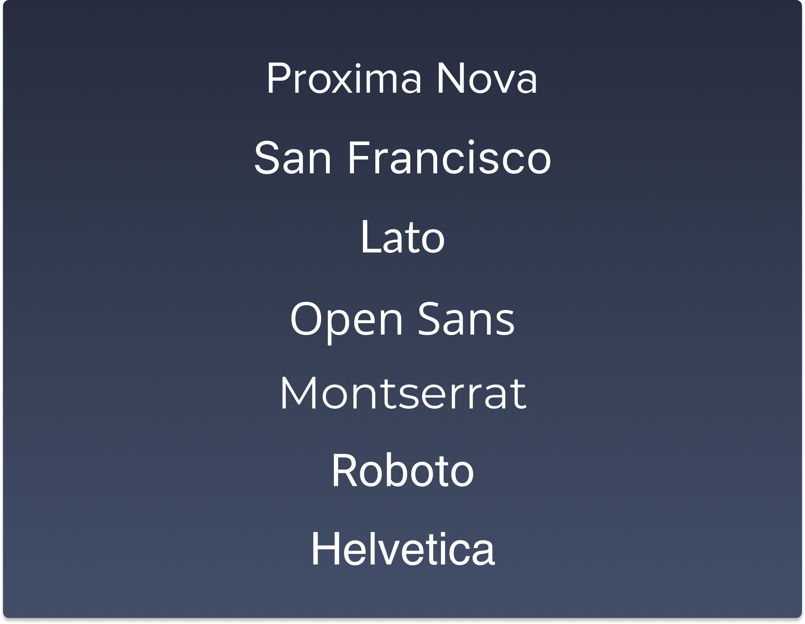

# typografie

Met 16,8 miljoen kleuren en 100.000 verschillende lettertypen op het web zijn de mogelijkheden vrijwel onbeperkt. Qua typografie volgen nu een aantal 'best practices' voor webtypografie om duidelijke communicatie mogelijk te maken. Door het maken van de juiste keuze beoog je een mooie en vooral comfortabele leeservaring.

## font keuze

Elke zin die op een scherm gelezen wordt, gebruikt een lettertype en zorgt zo voor een bepaalde stemming en uiterlijk. Hieronder staat een lijst met de namen van de beste sans-serif webfonts op dit moment.



## lettergrootte

Nog niet zo lang geleden stond het web vol met piepkleine lettertypen. Onderzoek heeft ondertussen meermaals aangetoond dat een grote lettergrootte sterkere gevoelens oproept en de inhoud beter overbrengt.

Maar hoe bepaal je de juiste lettergrootte? Begin met de hoofdtekst (body) en de **font-size** naar een lettergrootte tussen 15-25px. Vroeger werd veelal een te kleine lettergrootte gebruikt, meestal standaard 12px. Een kleine lettergrootte belast de ogen en leest minder vlot. Vandaag gaat de voorkeur uit naar een **standaard** fontgrootte van **16px**.

```css
html {
font-size: 100%; // in de meeste browsers staat dit standaard op 16 pixels

@media (min-width: 768px) {
font-size: 112.5%; // = in de meeste browsers 18 pixels}
}
```


## titels

Titels dienen als wegwijzers voor lezers zodat ze snel de algemene structuur van de inhoud kunnen verwerken. Indien het kan, beperk je dan tot twee niveaus (h1 & h2).

Zorg hierbij dat de grootte van de **hoofdtitel (h1) ongeveer 180-200%** van de hoofdtekst is. Een **ondertitel (h2) zou qua grootte 130-150%** van de hoofdtekst zijn.

## regelafstand

Soms is een tekst moeilijk te lezen, enkel en alleen omdat er een gebrek aan witruimte is. Om een tekstblok meer leesbaar te maken, wordt de regelafstand (**line-spacing**) ingesteld op **120–145% van de puntgrootte**.

## space-between

Voeg ruimte tussen letters toe (tekenspatiëring), zodat de tekst er ruimer uit ziet. Er komt dus meer ruimte tussen de tekens in een groep tekst. Hierbij twee tips:

* gebruik minder spatiëring bij grotere lettergroottes
* gebruik meer ruimte bij titels

## witruimte

De afstand tussen de koptekst (h1 tot h6) en de hoofdtekst moet open en licht aanvoelen. Deze ruimte beïnvloedt de manier waarop de aandacht naar de inhoud gaat. Wanneer de ruimte tussen headers en de body wordt ingesteld, kan dit helpen:

* witruimte tussen h1 en tekst: 30px
* witruimte tussen h2 en tekst: 20px
* witruimte tussen h3 en tekst: 15px

## aantal woorden per regel

Om de leesbaarheid te optimaliseren wordt de breedte van een tekstblok beperkt. De optimale lengte van een regel voor een pagina met **één kolom is 45-90 tekens**. De ideale breedte van een **tekstblok is 66 karakters**.

Indien er meer dan 90 tekens per regel gebruikt worden, zal je als lezer overweldigd wordt. De tekst wordt hierdoor minder (of zelfs niet) gelezen. Dit komt omdat de aandacht en focus psychologisch gaat naar het begin van elke nieuwe regel. De focus neemt echter langzaam af als de woorden verderop in de rij staan.
