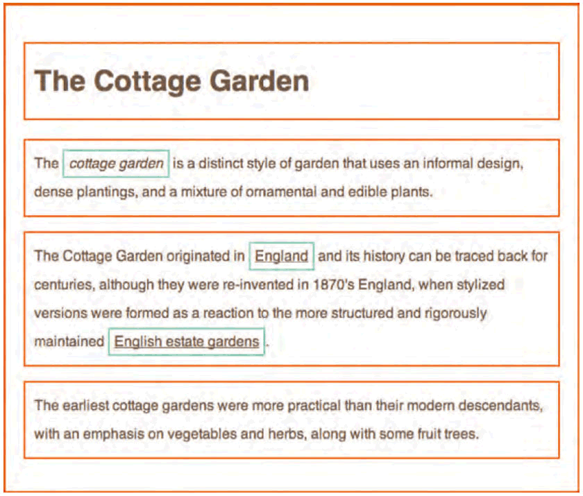
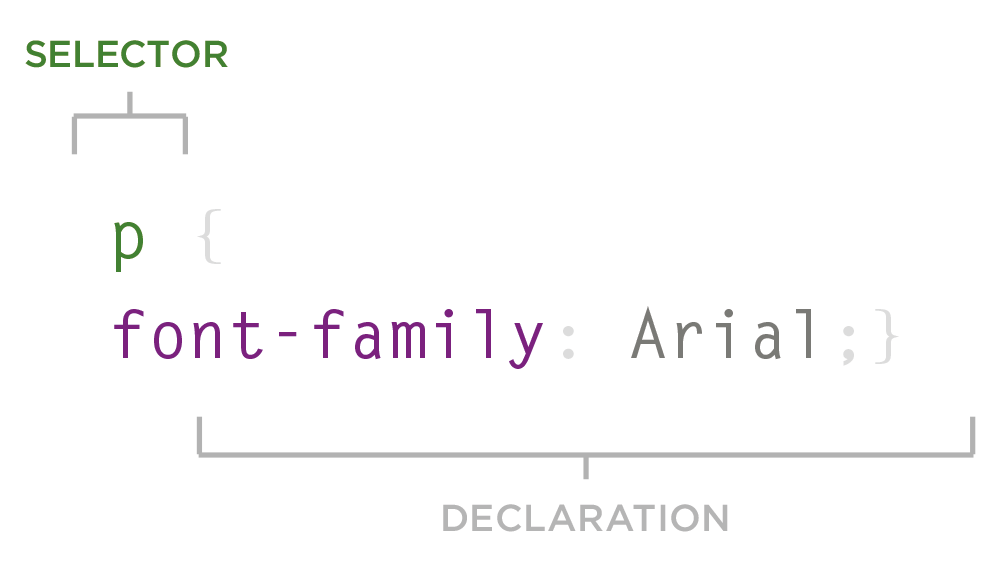
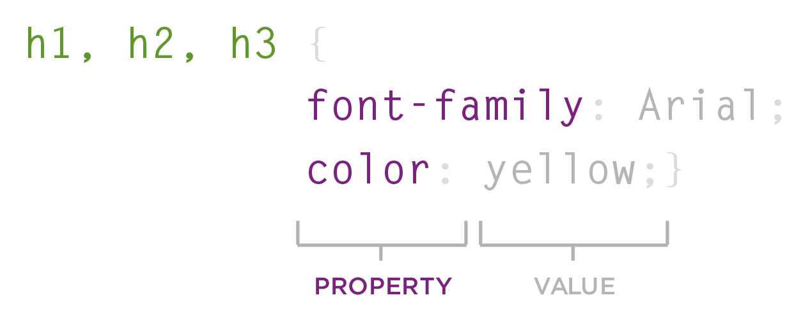
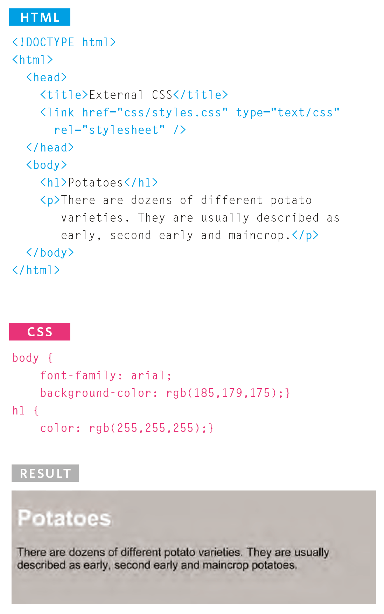

# 1: syntax

Door gebruik te maken van CSS in combinatie met HTML kan je een webpagina visueel aanpassen. Concreet staat CSS toe om via code te bepalen hoe een element er op een pagina zal uitzien. Je kan bijvoorbeeld de achtergrondkleur van een webpagina bepalen, hoe de paragrafen er zullen gaan uitzien door te kiezen voor een bepaalde kleur en lettertype, of bijvoorbeeld dat alle `h1`-titels in een cursief blauwe Times-font staan van 16pt groot.

Om CSS te begrijpen en te kunnen toepassen hoe je best in het achterhoofd dat rond elk element een onzichtbaar kader staat die de lay-out beperkt tot net dat element.



Door gebruik te maken van CSS kunnen zowel block- als inline-elementen binnen een webpagina er dus anders gaan uitzien. In de bovenstaande afbeelding worden de block-element, zoals `<body>`, `<h1>`, `<h2>` en `<p>` aangegeven door oranje kaders en rond de inline-elementen `<i>` en `<a>` staan groene kaders.

Wat kan er zoal aangepast worden met CSS?\
**kaders**: `width` en `height`, `border` (`color`, `width` en `style`), `background-color` en `background-images`, `position` binnen het scherm\
**tekst**: `font-family`, `size`, `color`, `italic`, `bold`, `uppercase`, `lowercase`, `small-caps`\
**specifiek**: elementen zoals lijsten, tabellen en formulieren

## stijlregel, een close-up

CSS werkt door dit te gaan combineren en linken aan HTML-elementen. Dit zal dan bepalen hoe bepaalde elementen binnen een webpagina getoond zullen worden.

Een stijlregel bestaat uit 2 elementen: een **selector** en een **declaratie**, veelal een blok met één of meer stijldeclaraties die wordt begrensd door accolades (gekrulde haken).

### selector



De selector selecteert dat element waarvoor de stijl geldt. Hier staat een voorbeeld van een **type-selector**.

Er zijn verschillende soorten selectoren die [later](https://github.com/barbaralettany/webtech-js/blob/main/css/1-syntax/css/2-selectors/intro.md) besproken zullen worden.

### css-declaratie



Een stijldeclaratie bestaat uit een eigenschap en een waarde voor die eigenschap. Concreet bestaat een CSS-declaratie uit 2 delen: een **eigenschap** (property) en een **waarde** (value), vervat binnen gekrulde haken. Er kunnen meerdere stijldeclaraties tegelijk worden opgenomen door ze naast of onder elkaar te plaatsen, gescheiden door een punt-komma.

De CSS-declaratie van bovenstaand voorbeeld in detail bekeken en benoemd:

* **h1, h2, h3** = type selector
* **{** = codeblok tussen {}
* **font-family** = eigenschap (property)
* **:** = toekenning (assignment)
* **Arial** = waarde (value)
* **;** = einde declaratie
* **color** = eigenschap (property)
* **:** = toekenning (assignment)
* **yellow** = waarde (value)
* **;** = einde declaratie
* **}** = codeblok tussen {}

## koppelen van HTML met CSS

Stijlen kunnen op verschillende manieren aan HTML gekoppeld worden.

### inline CSS

Bij **inline CSS** wordt CSS geschreven tussen de HTML-code.

```html
<!DOCTYPE html>
<html>
    <body>
        <h1 style="background-color: red; color: yellow;">Dit is een gele titel op een rode achtergrond.</h1>
        <p style="color: red;">Dit is een paragraaf met rode tekst.</p>
    </body>
</html>
```

Deze manier van werken is de originele en verouderde methode die zo goed als niet meer wordt toegepast. Je moet alle stijlregels meermaals beschrijven. Dit is zeer onderhoudsintensief en onoverzichtelijk. We kunnen onze CSS beter groeperen op één plaats.

### interne CSS

Met behulp van een **stijlblok** binnen het `style`-element in het `head`-element van het document kan ook CSS geschreven worden. Onderstaand is een voorbeeld van **interne CSS**, waarbij deze stijlregels zullen toegepast worden op alle h1 en p-elementen binnen de pagina.

```html
<!DOCTYPE html>
<html>
  <head>
    <title>interne CSS</title> 
    <style>
      h1 {
        background-color: red;
        color: yellow;
      }

      p {
        color: red;
      }
    </style>
  </head>
  <body>
    <h1>Dit is een gele titel op een rode achtergrond.</h1>
    <p>Dit is een paragraaf met rode tekst.</p>
  </body>
</html>
```

De stijlregels zijn nu gegroepeerd en staan bovenaan de pagina. Maar we moeten nog steeds alle stijlregels op alle verschillende pagina's gaan onderhouden. Daarom plaatsen we stijlregels bijna altijd extern.

### externe CSS

Aangezien een bepaalde stijl op meerdere pagina's binnen een website meestal terugkomt, is het verstandig om de CSS in een extern stijlblad te plaatsen, een **externe CSS** (css/style.css).\
Een **extern stijlblad** is een document, waarin stijlen zijn beschreven die door één of meer HTML-documenten gebruikt kunnen worden.

De koppeling vanuit een HTML-document naar een stijlblad gebeurt door het `link`-element te plaatsen in de head van een HTML-document. Aan het `link`-element worden de attributen `href`, `rel` en `type` toegevoegd.

```html
<!DOCTYPE html>
<html>
    <head>
        <title>externe CSS</title> 
        <link rel="stylesheet" type="text/css" href="css/style.css">
    </head>
    <body>
        <h1>Dit is een titel.</h1>
        <p>Dit is een paragraaf.</p>
    </body>
</html>
```



Het `link`-element mag een onbeperkt aantal malen opgenomen worden in een document.\
Het `href`-attribuut specificeert welk stijlblad, waarvan de bestandsnaam de extensie css heeft, geopend moet worden. Het `rel`-attribuut geeft aan dat het bij het gerelateerde bestand gaat om een stylesheet en heeft dan ook als waarde "stylesheet". Het `type`-attribuut definieert het Internet Media (MIME) type van het bestand waarnaar verwezen wordt. Voor Cascading Style Sheets is dat "text/css".
