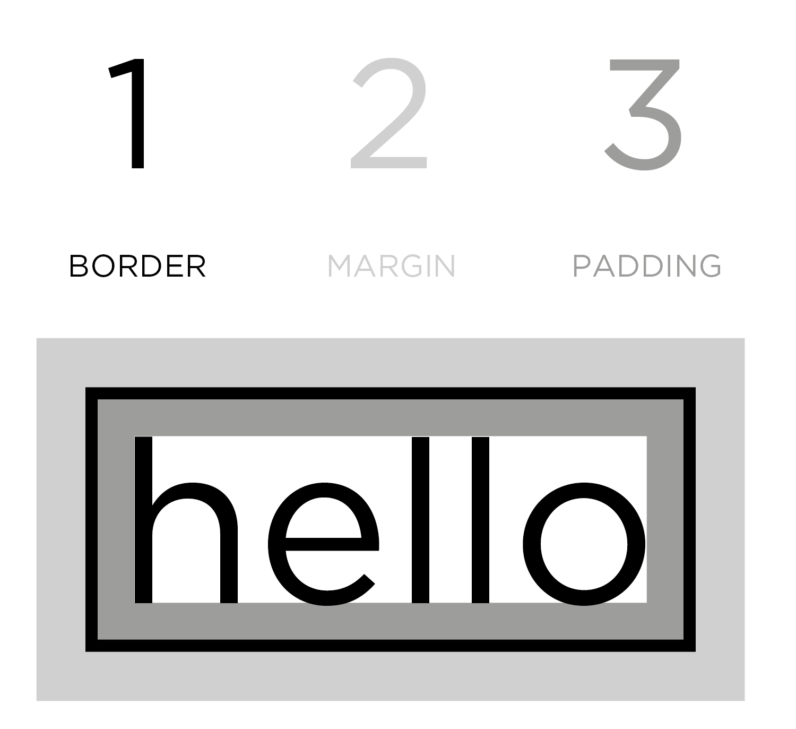

# randen en spaties



Met CSS kunnen we van elk element de afmetingen gaan aanpassen. Hiervoor gebruiken we de `width`- en `height`-eigenschappen. Pas wanneer een element een bepaalde afmeting heeft, kunnen we de randen en spaties rond het element gaan beïnvloeden. Het is dus belangrijk om een element altijd afmetingen te geven. Sommige elementen krijgen van de browser standaard een afmeting toegewezen.

```css
header {
    height: 300px;
    width: 300px;
}
p {
    height: 75%;
    width: 75%;
}
```

## margin

De `margin` bevindt zich langs de buitenkant van de rand van de kader. De breedte van de margin zorgt voor een witruimte tussen bijvoorbeeld twee kaders onderling.

```css
p {
    width: 200px;
    margin: 20px;
}
```

`margin`: margin-top | margin-right | margin-bottom | margin-left;

try it yourself: [https://www.w3schools.com/css/tryit.asp?filename=trycss\_margin\_intro](https://www.w3schools.com/css/tryit.asp?filename=trycss_margin_intro)\
try it yourself: [https://www.w3schools.com/css/tryit.asp?filename=trycss\_margin\_sides](https://www.w3schools.com/css/tryit.asp?filename=trycss_margin_sides)

## padding

`padding` is de ruimte binnenin het kader, te tellen vanaf de kant tot waar de inhoud binnenin het kader begint. Het toevoegen van witruimte binnenin het kader verhoogt de leesbaarheid van een tekst binnenin.

```css
p {
    width: 275px;
    padding: 10px;
}
```

`padding`: padding-top | padding-right | padding-bottom | padding-left;

try it yourself: [https://www.w3schools.com/css/tryit.asp?filename=trycss\_padding\_intro](https://www.w3schools.com/css/tryit.asp?filename=trycss_padding_intro)\
try it yourself: [https://www.w3schools.com/css/tryit.asp?filename=trycss\_padding\_sides](https://www.w3schools.com/css/tryit.asp?filename=trycss_padding_sides)

## border

Elke kader heeft een `border`, een rand, zichtbaar of onzichtbaar (0px breed)

```css
p {
    width: 250px;
    border: 3px dotted #0088dd;}
```

[w3schools](https://www.w3schools.com/css/tryit.asp?filename=trycss_border)

### border-width

Een border heeft een breedte. Deze breedte kan voor de 4 verschillende zijden worden gedefinieerd.

```css
p.one {
    border-width: 2px;}
p.two {
    border-width: thick;}
p.three {
    border-width: 1px 4px 12px 4px;}
```

### border-style

Een border heeft een stijl. Dit is een bepaalde weergave van de border.

```css
p.one {
    border-style: solid;}
p.two {
    border-style: dotted;}
p.three {
    border-style: dashed;}
p.four {
    border-style: double;}
p.five {
    border-style: groove;}
p.six {
    border-style: ridge;}
p.seven {
    border-style: inset;}
p.eight {
    border-style: outset;}
```

`border-style`: dotted | dashed | solid (=standaardwaarde) | double | groove | ridge | inset | outset | none | hidden;

### border-color

Je kan ook de kleur van de border veranderen.

```css
p.one {
    border-color: #0088dd;}
p.two {
    border-color: #bbbbaa #111111 #ee3e80 #0088dd;}
```

### border-image

De border kan ook bestaan uit een afbeelding. Deze afbeeling verwacht dan nog extra eigenschappen zoals de afmetingen en de plaatsing.

```css
p.one {
    border-image: url("images/dots.gif") 11 11 11 11 stretch;
}
p.two {
    border-image: url("images/dots.gif") 11 11 11 11 round;
}
```

### border-radius

We kunnen de border ook afronden en hierdoor elementen creëeren die afwijken van de standaard vierhoekige vorm. Deze techniek wordt veel gebruikt en biedt een enorme waaier aan mogelijkheden.

```css
p {
    width: 275px;
    padding: 20px;
     
    border: 5px solid #cccccc;
    border-radius: 10px;
}
```

## box-shadow

Je kan ook een speciale soort rand rond jouw element plaatsen. Dit is een schaduw die jouw element dan zal werpen. Deze schaduw is geen onderdeel van de afmetingen van jouw element zelf.

```css
.one {
    box-shadow: -5px -5px #777777;
}
p.two {
    box-shadow: 5px 5px 5px #777777;
}
p.three {
    box-shadow: 5px 5px 5px 5px #777777;
}
```

## outline

`outline` is een eigenschap die vaak wordt gebruikt om een grens rondom een element aan te geven, maar zonder de lay-out van het element te beïnvloeden. Het `outline`-attribuut wordt vaak gebruikt voor interactieve elementen zoals links en knoppen, om visuele feedback te geven wanneer ze zijn geselecteerd of gefocust.

### basisgebruik

```css
a:focus {
  outline: 2px solid #3498db;
}
```

In dit voorbeeld wordt een blauwe grens van 2 pixels breed toegevoegd aan een hyperlink wanneer deze de focus ontvangt. Dit helpt gebruikers om te begrijpen welk element momenteel is geselecteerd.

### aanvullende eigenschappen:

* **`outline-color`:** Specificeert de kleur van de outline.
* **`outline-style`:** Geeft het stijltype van de outline aan (bijvoorbeeld: solid, dashed, dotted).
* **`outline-width`:** Bepaalt de breedte van de outline.

```css
button:hover {
  outline-color: #27ae60;
  outline-style: dotted;
  outline-width: 3px;
}
```

In dit voorbeeld wordt bij het zweven over een knopelement een gestippelde, groene outline met een breedte van 3 pixels weergegeven.


* **Niet te verwarren met `border`:** De `outline` heeft geen invloed op de layout van het element en wordt meestal gebruikt voor visuele doeleinden. Het verschilt van `border`, dat wel de lay-out kan beïnvloeden.
* **Toegankelijkheid:** Het gebruik van `outline` is belangrijk voor de toegankelijkheid van een website. Het geeft duidelijkheid over welk element momenteel de focus heeft, vooral voor mensen die navigeren met het toetsenbord.

Het gebruik van `outline` is een handige techniek om de interactieve elementen in een webpagina visueel te accentueren zonder de lay-out te beïnvloeden. Het draagt bij aan een betere gebruikerservaring en verbetert de toegankelijkheid van de website.

