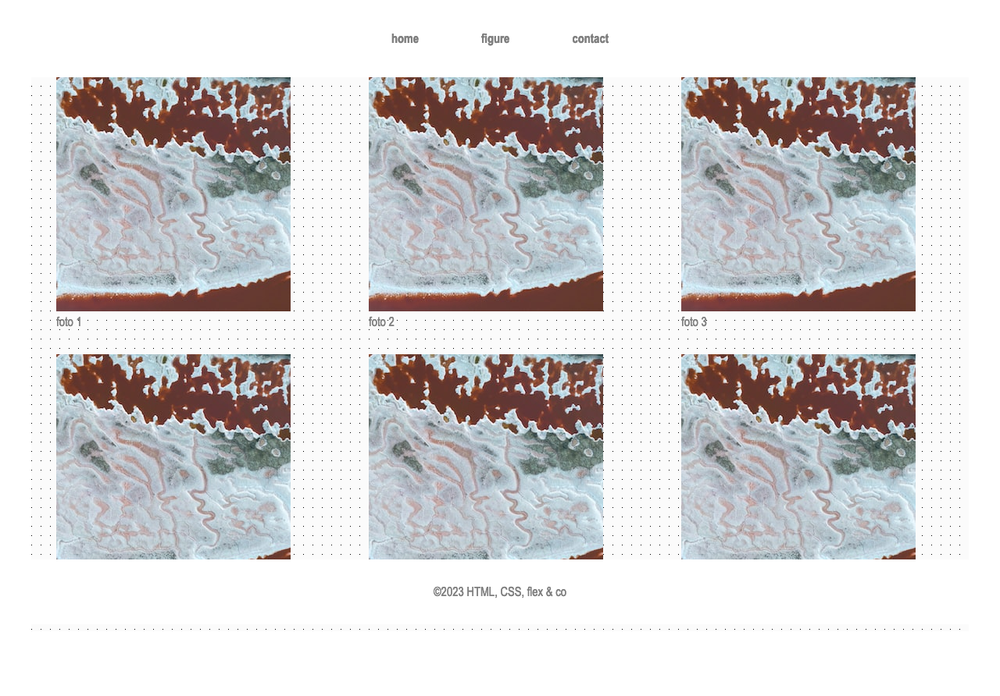

# oefeningen


**Opgelet** Deze oefeningen zijn _deprecated_, we verwijzen je graag door naar de oefeningen in de nieuwe [oefeningen sectie](../../../oefeningen/LW4/labo7/oefeningen.md)



Deze oefeningen worden behandeld tijdens LW4 (UI\&UX en CSS): Labo 7


## oefening 1

Maak de preview van het flex-box model na.

* een main met daarin een section en 6 artikels (`article`)
* section is steeds `90%` breed, gecentreerd en heeft een maximum breedte van `1200px`.
* breedte van een flex-item is `350px`
* zorg voor een gap-size van `20px`
* link afbeeldingen: [https://placehold.co/400x200](https://placehold.co/400x200)
* lees meer heeft een link naar `#`
* font-family: Arial,...&#x20;
* nav staat ook in een flex
* kleur van links nav: `darkgray` en hoofdletters met css&#x20;
* achtergrondkleur van section: `rgb (240, 240, 240)`

<figure><figcaption>
oefening 1: desktop
</figcaption></figure>

<figure><figcaption>
oefening 1: tablet
</figcaption></figure>

<figure><figcaption>
oefening 1: mobile
</figcaption></figure>

## oefening 2

Maak de preview van het flex-box model na.

* zowel nav als main staan in een flex
* een `main` met daarin 8 paragrafen met een klasse `.item`
* main heeft een achtergrondkleur `lightgrey` en een achtergrondafbeelding die wordt herhaald ([link](css/natuurlijke-volgorde/flex/oefeningen.md#assets-oefening-3))
* het derde .item heeft een achtergrondkleur `rgba(139, 211, 146, 0.5)` en de eerste letter heeft een grote van `200%`
* de kleur van de links is `grey`
* lees meer heeft een link naar `#`&#x20;

<figure><figcaption>
oefening 2: desktop
</figcaption></figure>

<figure><figcaption>
oefening 2: tablet
</figcaption></figure>

<figure><figcaption>
oefening 2: mobile
</figcaption></figure>

#### assets oefening 2


De achtergrondafbeelding die je gaat herhalen


### oefening 3

Maak de preview van het flex-box model na.&#x20;

• zowel nav als main staan in een flex

• main heeft een maximum-breedte van `1200px`

• het lettertype over de gehele pagina is `Franklin Gothic Medium`,...&#x20;

• een `main` met daarin 6 figures

• link afbeeldingen:  [https://placehold.co/300](https://placehold.co/300)

• zet © om naar een HTML-entiteit in de footer

• de footer is [sticky](https://developer.mozilla.org/en-US/docs/Web/CSS/Layout_cookbook/Sticky_footers) en heeft een witte achtergrond en een padding van `2rem`

* de main heeft een herhalende achtergrond afbeelding ([link naar assets](css/natuurlijke-volgorde/flex/oefeningen.md#assets-oefening-3))

<figure><figcaption>
oefening 3: desktop
</figcaption></figure>

<figure><figcaption>
oefening 3: tablet
</figcaption></figure>

<figure><figcaption>
oefening 3: mobile
</figcaption></figure>

#### assets oefening 3



### oefening 4

Deze oefening is een vervolg op [de oefening van LW4 - labo 5](https://apwt.gitbook.io/webtechnologie/css/intro-4/reset/oefening). Vertrek vanaf die oplossing.

Maak een extra pagina `studenten.html` aan

* de pagina heeft structureel dezelfde opmaak als `index.html`
* tussen section `info` en de quote komt een section `portfolio`
* plaats in de section `portfolio` 6 afbeeldingen met bijhorende tekst (gebruik `display: flex`)
* elke figure heeft een afbeelding (breedte 432px) met alt en een `figcaption`&#x20;
* de te gebruiken afbeeldingen en teksten staan onderaan bij de assets ([link](css/natuurlijke-volgorde/flex/oefeningen.md#assets-oefening-4))
* op de figure staat een link naar “#”
* zet de nav met de menu-items in een flex

<figure><figcaption>
oefening 4: desktop
</figcaption></figure>

<figure><figcaption>
oefening 4: tablet
</figcaption></figure>

<figure><figcaption>
oefening 4: mobiel
</figcaption></figure>

#### assets oefening 4 
















