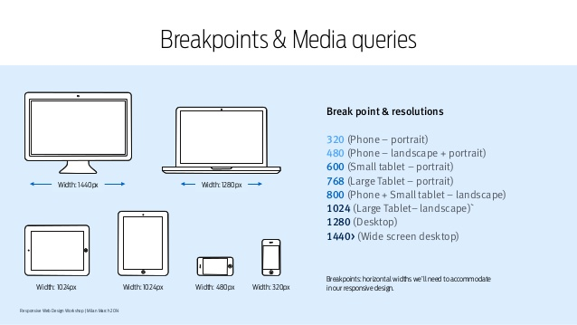

# media queries

## definitie

Websites kunnen tegenwoordig bekeken worden op smart-phones, tablets, pc of op een breedbeeld scherm. CSS heeft hiervoor media queries waarmee **op basis van de breedte van een scherm aparte CSS geschreven kan worden**.

Een media query is een stuk CSS-code in de stylesheet van een website, die informatie zoals de grootte van het browserscherm van de bezoeker opvraagt tijdens het laden van jouw website. Op basis van opgevraagde informatie worden specifieke CSS-stijlregels weergegeven voor een welbepaalde schermgrootte of **viewport**.



## syntax

```css
@media media-type and (media-feature-rule) {
   / * CSS-regels komen hier * /
}
```

* **media-type** vertelt de browser voor wat voor soort media deze code bestemd is (bijv. print of screen)
* **media-expressie**, een regel of een voorwaarde waaraan voldaan moet zijn, vooraleer de opgegeven CSS kan worden toegepast
* **CSS-regels** worden toegepast als aan de voorwaarde voldaan wordt en het media-type correct is

## media-types

```css
/* Als de pagina wordt afgedrukt heeft de body een lettergrootte van 12pt . 
Het is niet van toepassing wanneer de pagina in een browser geladen wordt. */
@media print {
    body {
        font-size: 12pt;
    }
}
```

* **all**
* **print**
* **screen**
* **speech**

## **media-kenmerken**

Nadat het media-type werd opgegeven, kan een stijlregel opgesteld worden voor het opgegeven media-kenmerk, veelal de breedte en de hoogte van het opgegeven media-type.

De functie die het vaakst gebruikt wordt om responsieve ontwerpen te maken (en mét brede browser-ondersteuning) is de **breedte van de viewport** door middel van `min-width`, `max-width` en `width` media-kenmerken.

### mobile first design

```css
/* stijlregels voor alle schermen kleiner dan 320px breed */
@media only screen and (min-width: 320px) {
    /* stijlregels voor browserschermen > 320px en < 720px */
}

@media only screen and (min-width: 720px) {
    /* stijlregels voor browserschermen > 720px en < 1024px */
}

@media only screen and (min-width:1024px) {
    /* stijlregels voor browserschermen ≥ 1024px */
}
```

### desktop first design

```css
/* stijlregels voor schermen groter dan 1024px breed */
@media only screen and (max-width: 1024px) {
    /* stijlregels voor schermen > 720px en ≤ 1024px breed */
}

@media only screen and (max-width: 720px) {
    /* stijlregels voor schermen > 320px en ≤ 720px breed */
}

@media only screen and (max-width:320px) {
    /* stijlregels voor schermen ≤ 320px breed */
}
```

try it yourself: [https://www.w3schools.com/css/tryit.asp?filename=trycss\_mediaqueries\_ex1](https://www.w3schools.com/css/tryit.asp?filename=trycss_mediaqueries_ex1)

### breakpoints en media-queries



## voorbeelden

### media-queries en font-size



### media-queries en background-color



### media-queries en flexbox


