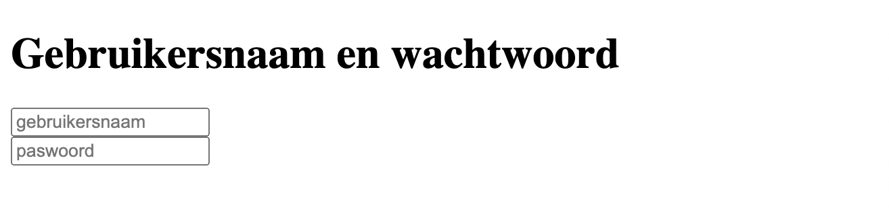
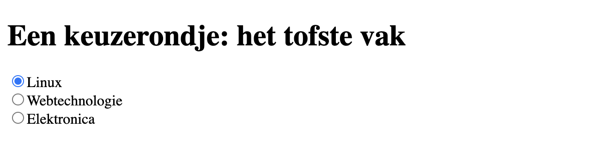
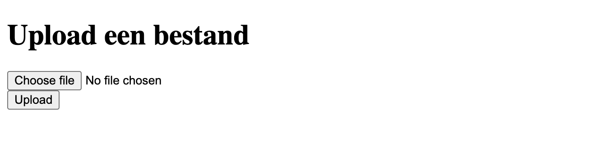
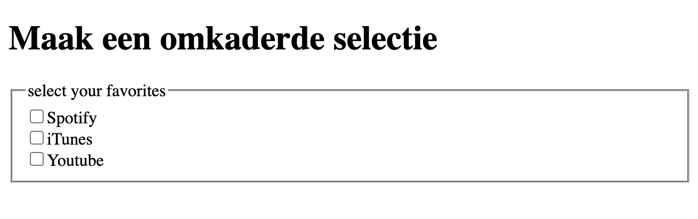
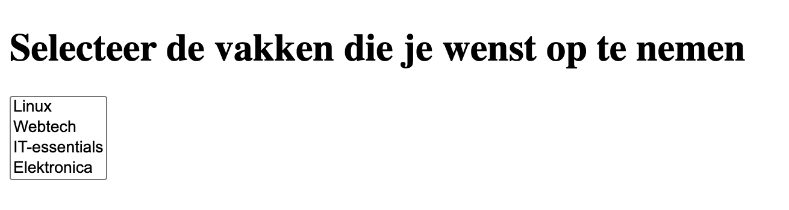
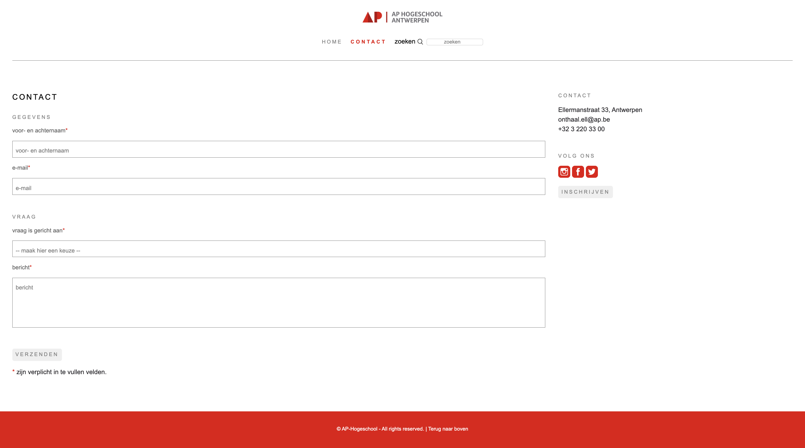

# oefeningen


Deze oefeningen worden behandeld tijdens LW3 (HTML & CSS): Labo 06


### oefening 1

Maak een formulier aan om een gebruikersnaam en wachtwoord op te geven.

<figure><figcaption></figcaption></figure>

### oefening 2

Maak een formulier aan met een keuze menu.

<figure><figcaption></figcaption></figure>

### oefening 3

Maak een formulier aan met de input velden _e-mail_ en _paswoord_, voeg labels toe aan je input velden en voeg een submit button toe.&#x20;

<figure><figcaption></figcaption></figure>

**bijlagen:**



### oefening 4

Maak een formulier aan om een bestand te uploaden.

<figure><figcaption></figcaption></figure>

### oefening 5

Maak een omkaderde selectie.

<figure><figcaption></figcaption></figure>

### oefening 6

Maak een formulier waarin je de vakken (meerdere) die je wil opnemen in kan selecteren.

<figure><figcaption></figcaption></figure>

### oefening 7

Maak het volgende formulier aan om op de website van AP te tonen die we hebben nagemaakt. Start hiervoor van het bestaande ontwerp dat we voorheen hebben gemaakt. Maak hierin een nieuwe pagina ”contact.html” aan.&#x20;

* Pas de menu in de index.html aan en link naar de nieuwe pagina.&#x20;
* Voeg een zoek-functie toe in de menu met search (in een form).

Het formulier heeft 2 fieldsets en telkens een legend

* gegevens
* vraag
* vraag is gericht aan:
  * keuze: maak hier een keuze, secretariaat, graduaat IT, stuvo

<figure><figcaption></figcaption></figure>

**bijlagen:**


