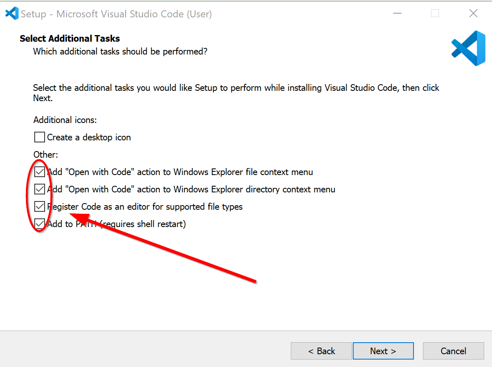

# IDE

Visual Studio Code (VS Code) is een populaire en krachtige geïntegreerde ontwikkelomgeving (IDE) die veel wordt gebruikt in de webontwikkelingsgemeenschap. Het biedt een gebruiksvriendelijke interface en een uitgebreide set functies. Laten we enkele belangrijke aspecten van het gebruik van VS Code in het kader van webtechnologie verkennen.

## 1. **installatie van VS Code:**

* Bezoek de officiële [VS Code-website](https://code.visualstudio.com/).
* Download de versie die compatibel is met je besturingssysteem.
* Volg de installatie-instructies.



### **projectmappen in VS Code:**

* Open een map of project in VS Code met behulp van `File > Open Folder`.
* Gebruik de zijbalk (Explorer) om door je projectbestanden te navigeren.
* Werk met meerdere projecten tegelijkertijd door ze in **verschillende** vensters te openen.
  * In 1 VS Code-venster heb je dus maximaal 1 project/oefening gelijktijdig openstaan.


In Windows kan je een map openen met VS Code via rechtermuisklik. 

In MacOS kan je de map naar het symbool van VS Code in jouw lint slepen.


### **Emmet: snel HTML en CSS typen:**

* Emmet is een krachtige toolkit voor webontwikkelaars waarmee je sneller HTML en CSS kunt typen.
* Typ een eenvoudige HTML-structuur zoals `div>ul>li*3` en druk op `Tab` om het uit te vouwen naar een volledige structuur.
* Hier vind je een uitgebreide [Emmet Cheat Sheet](https://docs.emmet.io/cheat-sheet/).

## 2. Extensies installeren

In VS Code heb je de mogelijkheid om extensies te installeren.


### **Prettier: code formatter**
Prettier automatiseert het formatteren van je code volgens vastgestelde regels.
Installeer de Prettier-extensie in VS Code.

### **Live Server: live preview van je website:**

* Installeer de Live Server-extensie in VS Code.
* Klik met de rechtermuisknop op je HTML-bestand en selecteer "Open with Live Server".
* Je ziet een live voorbeeld van je website en automatische updates bij het opslaan van bestanden.

### **HTMLHint: fouten in html zichtbaar maken**
* Installeer de HTMLHint extensie VS Code om fouten in HTML zichtbaar te maken.

## 4. **Configuratie VSCode**

* Druk op `Ctrl+Shift+P` (of `Cmd+Shift+P` op macOS) om het Command Palette te openen.
* Typ `Preferences: Open Settings (JSON)` en selecteer deze optie om de instellingen in JSON-formaat te openen.
* Alternatief: Je kunt ook naar de instellingen navigeren via `File > Preferences > Settings` (of `Code > Settings > Settings` op macOS), en daar de JSON-instellingen openen door op het `Open Settings (JSON)` icoon in de rechterbovenhoek van het instellingenvenster te klikken.
* Voeg de volgende configuraties toe aan je settings.json:

```json
{
  "files.autoSave": "afterDelay",
  "editor.formatOnSave": true,
  "editor.defaultFormatter": "esbenp.prettier-vscode"
}
```

De instellingen zorgen ervoor dat Visual Studio Code automatisch je bestanden opslaat na een korte vertraging met "files.autoSave": "afterDelay", automatisch de code formatteert bij het opslaan met "editor.formatOnSave": true, en Prettier instelt als de standaard formatter voor al je codebestanden met "editor.defaultFormatter": "esbenp.prettier-vscode". Hierdoor wordt je code consistent geformatteerd en hoef je je geen zorgen te maken over handmatig opslaan of formatteren.

