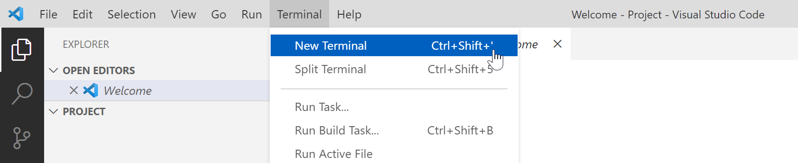

# IDE

Visual Studio Code (VS Code) is een populaire en krachtige geïntegreerde ontwikkelomgeving (IDE) die veel wordt gebruikt in de webontwikkelingsgemeenschap. Het biedt een gebruiksvriendelijke interface en een uitgebreide set functies. Laten we enkele belangrijke aspecten van het gebruik van VS Code in het kader van webtechnologie verkennen.

## 1. **installatie van VS Code:**

* Bezoek de officiële [VS Code-website](https://code.visualstudio.com/).
* Download de versie die compatibel is met je besturingssysteem.
* Volg de installatie-instructies.

### **projectmappen in VS Code:**

* Open een map of project in VS Code met behulp van `File > Open Folder`.
* Gebruik de zijbalk (Explorer) om door je projectbestanden te navigeren.
* Werk met meerdere projecten tegelijkertijd door ze in **verschillende** vensters te openen.
  * In 1 VS Code-venster heb je dus maximaal 1 project/oefening gelijktijdig openstaan.


In Windows kan je een map openen met VS Code via rechtermuisklik. 

In MacOS kan je de map naar het symbool van VS Code in jouw lint slepen.


### **Emmet: snel HTML en CSS typen:**

* Emmet is een krachtige toolkit voor webontwikkelaars waarmee je sneller HTML en CSS kunt typen.
* Typ een eenvoudige HTML-structuur zoals `div>ul>li*3` en druk op `Tab` om het uit te vouwen naar een volledige structuur.
* Hier vind je een uitgebreide [Emmet Cheat Sheet](https://docs.emmet.io/cheat-sheet/).

## 2. Extensies

In VS Code heb je de mogelijkheid om extensies te installeren.

### **Prettier: code formatter:**

* Installeer de Prettier-extensie in VS Code.
* Prettier automatiseert het formatteren van je code volgens vastgestelde regels.
* Activeer "Format on Save" om je code automatisch te laten formatteren bij het opslaan.
* Kijk ook na dat Prettier geselecteerd staat als "Default Formatter".

### **Live Server: live preview van je website:**

* Installeer de Live Server-extensie in VS Code.
* Klik met de rechtermuisknop op je HTML-bestand en selecteer "Open with Live Server".
* Je ziet een live voorbeeld van je website en automatische updates bij het opslaan van bestanden.

## 3. **terminal gebruiken in VS Code:**

* Open de terminal in VS Code met `View > Terminal` of gebruik de sneltoets `Ctrl +` (backtick).
* Hier kun je commando's uitvoeren zoals `npm install` of `git commit`.

Het gebruik van Visual Studio Code als je IDE kan je productiviteit aanzienlijk verhogen. Met functies zoals Emmet, Prettier en Live Server kun je efficiënter werken en tegelijkertijd genieten van een intuïtieve ontwikkelervaring. Verken de mogelijkheden van VS Code en pas ze aan aan jouw ontwikkelingsbehoeften.
