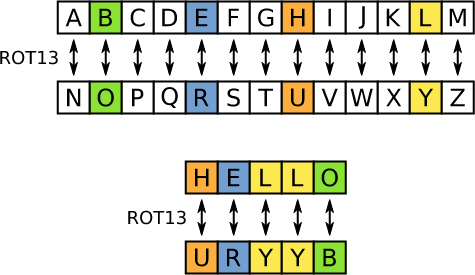

# extra oefeningen

## oefening 10: color-blind

**leerdoelen**

* functionaliteit strings (replace, meerdere keren replace)
* escapen van karakters

**functionele analyse** De color-blind applicatie dient uitgebreid te worden zodat de foutieve kleur meerdere keren kan vervangen worden. De fout wordt nu wel ook in omgekeerde richting gemaakt.

**technische analyse** We kunnen de applicatie van color-blind overnemen en uitbreiden. We moeten er nu voor zorgen dat de kleuren meerdere keren worden vervangen.

De volgende kleuren worden foutief geschreven:

* blue -> red
* yellow -> green maar ook:
* red -> blue
* green -> yellow

Om te voorkomen dat een bepaalde kleur die al omgezet werd terug wordt omgezet naar het origineel vervangen we de kleur met de kleur in hoofdletters.

**voorbeeldinteractie**

```
roses are blue, violets are red, strawberries are blue and we always define variables with let
=
roses are red, violets are blue, strawberries are red and we always define variables with let.
```

## extra oefening: Caesar-rotation

**leerdoelen**

* functionaliteit strings (replace, meerdere keren replace)

**functionele analyse** We willen een programma maken dat geheimschrift decodeert dat gemaakt is aan de hand van de de Caesar-rotatie (rot13). De tekst is in **lowercase**.

**technische analyse** Je voorziet een variabele voor de inputString. Je zorgt dat de vertaling gebeurd volgens het volgende schema. Wij gebruiken hier wel alleen kleine letters.

<figure><figcaption></figcaption></figure>

Caesar-rotation

**voorbeeldinteractie**
