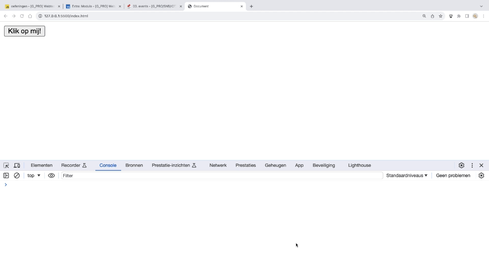
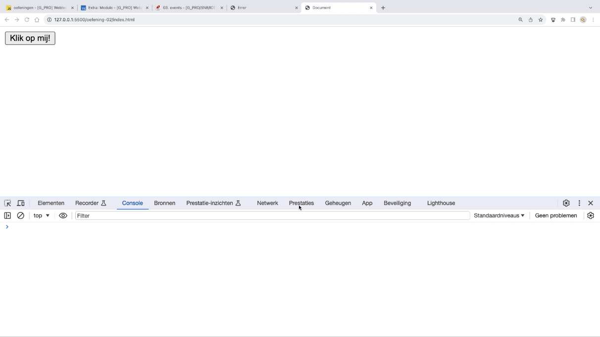
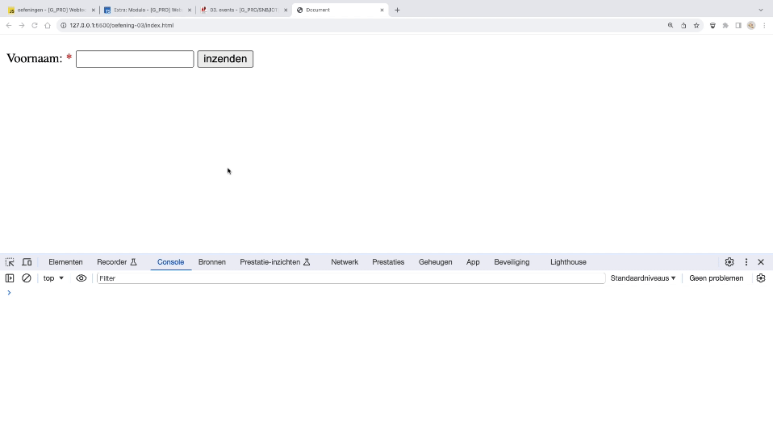
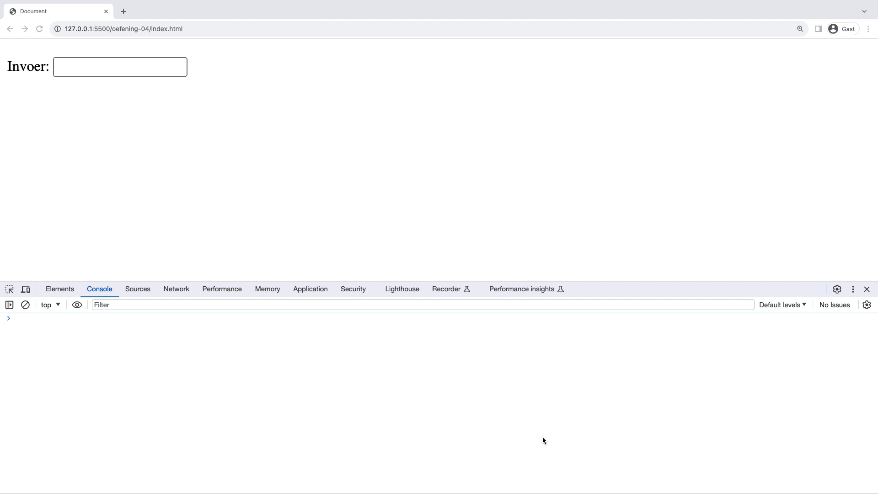
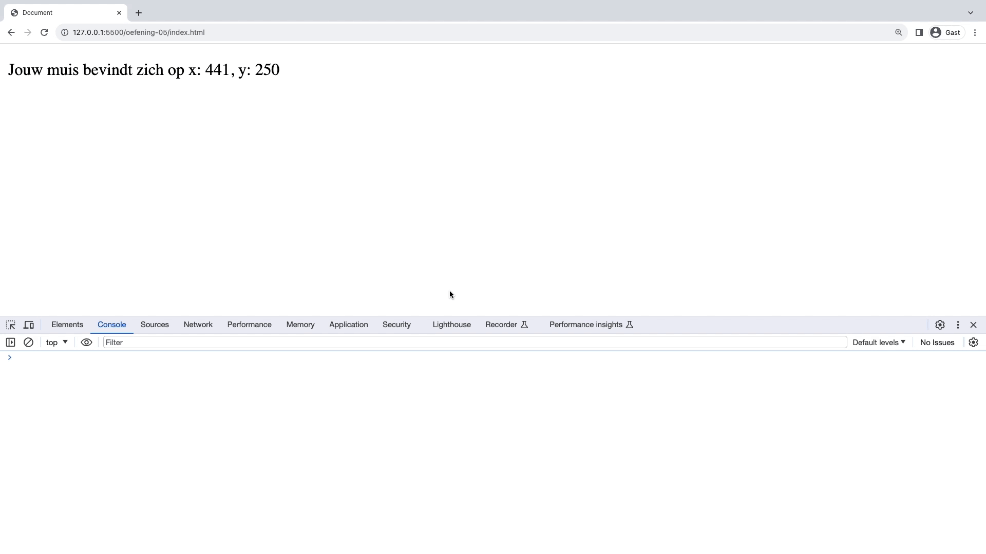
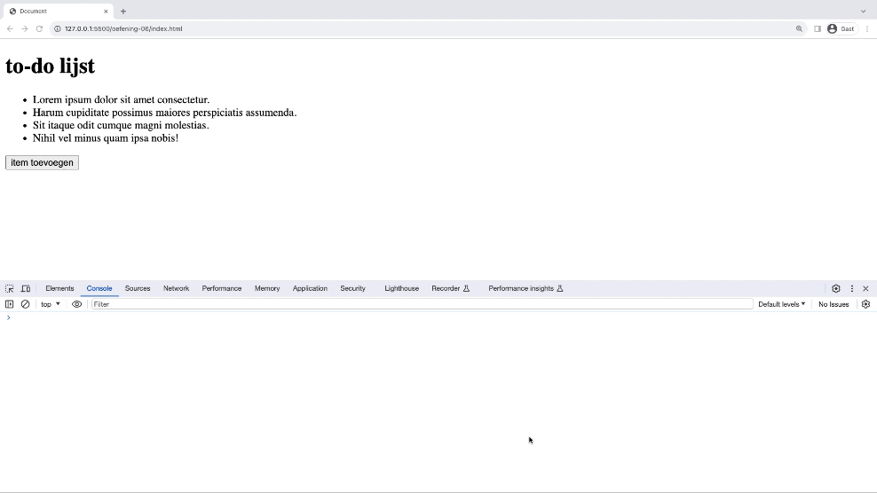

# oefeningen

## oefening 1: eerste event afhandelen

**leerdoelen**

* kennismaken met een event listener in JavaScript

**functionele analyse**

Reageer op een muisklik op een knop door een bericht in de console weer te geven.

**technische analyse**

In jouw HTML plaats je een button-element met een id, bijvoorbeeld "myAction" en wat tekst, bijvoorbeeld "Klik op mij".

In jouw JavaScript-code selecteer je deze button op basis van het id en voeg je er een event listener aan toe om te reageren op het "click"-event.

Wanneer de knop wordt geklikt, toon dan "er werd op mij geklikt" in de console.

**voorbeeldinteractie:**

<figure><figcaption></figcaption></figure>

## oefening 2: reageren in DOM

**leerdoelen**

* kennismaken met een event listener in JavaScript
* DOM-manipulatie naar aanleiding van event

**functionele analyse**

Reageer op een muisklik op een knop door een bericht op de website weer te geven.

**technische analyse**

In jouw HTML plaats je een button-element met een id, bijvoorbeeld "myAction" en wat tekst, bijvoorbeeld "Klik op mij". Daaronder plaats je een p-element met een id, bijvoorbeeld "myText". Je laat de p nog leeg.

In jouw JavaScript-code selecteer je deze button op basis van het id en voeg je er een event listener aan toe om te reageren op het "click"-event.

Wanneer de knop wordt geklikt, toon dan "er werd op mij geklikt" in de p.

**voorbeeldinteractie:**

<figure><figcaption></figcaption></figure>

## oefening 3: reageren om form event

**leerdoelen**

* form event gebruiken
* default voorkomen

**functionele analyse**

Wanneer een gebruiker het formulier verzend, toon je de naam van de gebruiker op het scherm.

**technische analyse**

Op jouw pagina staat een formulier met daarin 1 veld, nl. "voornaam".

Wanneer de gebruiker het veld heeft ingevuld (tip: required) en het formulier verzend, zal jouw code voorkomen dat het formulier verzonden wordt.

Je toont de ingevulde naam van de gebruiker op het scherm in een welkomstboodschap.

**voorbeeldinteractie:**

<figure><figcaption></figcaption></figure>

## oefening 4: reageren om invoer van gebruiker

**leerdoelen**

* keyboard event gebruiken

**functionele analyse**

Wanneer een gebruiker in een invoerveld typt, toon je de toetsaanslagen van de gebruiker op het scherm.

**technische analyse**

Op jouw pagina staat een invoerveld, nl. "input".

Wanneer de gebruiker iets invuld, toon je de ingevulde tekst van de gebruiker op het scherm.

**voorbeeldinteractie:**

<figure><figcaption></figcaption></figure>

## oefening 5: reageren op muisbeweging

**leerdoelen**

* mouse event gebruiken

**functionele analyse**

Je geeft de positie van de muis weer op het scherm

**technische analyse**

Op jouw pagina staat een tekst, nl.: "Jouw muis bevindt zich op x: 150, y: 300".

Telkens de gebruiker zijn muis beweegt toon je de nieuwe coördinaten in de tekst.

**voorbeeldinteractie:**

<figure><figcaption></figcaption></figure>

## oefening 6: DOM-element toevoegen door te klikken

**leerdoelen**

* DOM manipulatie
* click event

**functionele analyse**

Je voegt lijst-items toe door op een knop te drukken.

**technische analyse**

Jouw website bestaat uit een h1 "todo-lijst" en een oplijsten van enkele to-do's.

Er staat een knop onderaan de lijst. Als op deze knop geklikt wordt, zal er een to-do-item bijkomen op de lijst.

**voorbeeldinteractie:**

<figure><figcaption></figcaption></figure>
