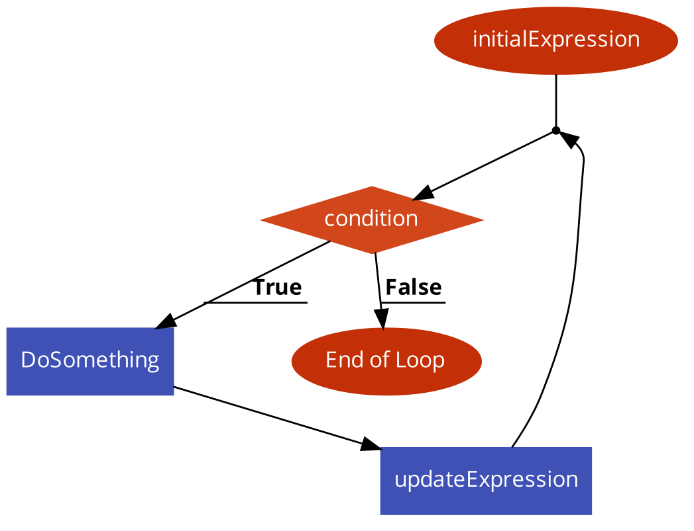
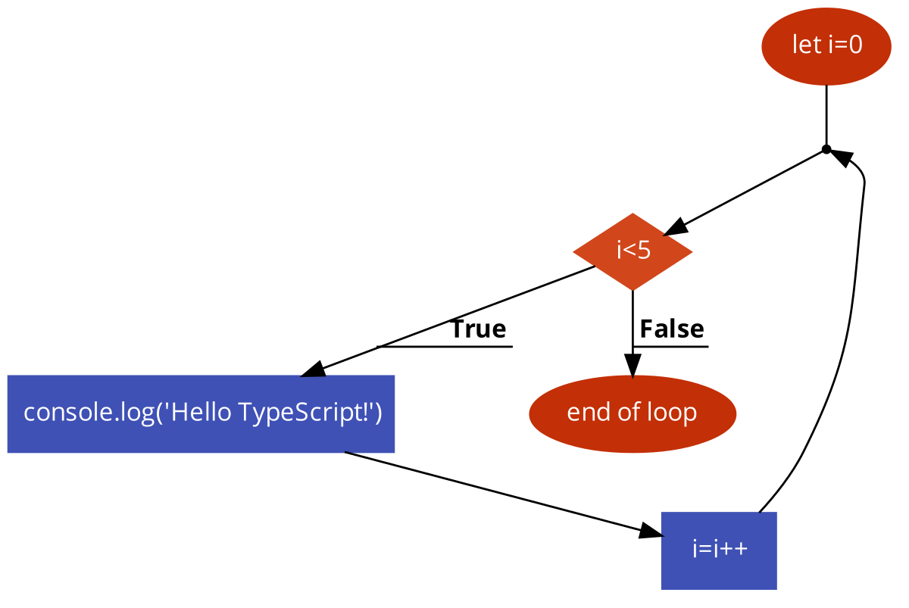

# 6: lussen

Vaak moet een stuk programma meerdere keren achter elkaar worden uitgevoerd worden. Hiervoor worden lussen gebruikt. Een aantal voorbeelden van waar je best lussen voor gebruikt

* Als je een bericht 100 keer op het scherm zou willen tonen
* Als je alle getallen tussen 0 en 100 wilt optellen
* ...

Er zijn verschillende soorten lussen die je kan gebruiken. We beginnen in dit deel met de `for`loop.

### de syntax

De syntax voor de `for` loop is:

```js
for(initialExpression; condition; updateExpression) {
    // for loop body
}
```

1. De **initialExpression** initialiseert en declareert variabelen. Wordt maar 1 keer uitgevoerd in het begin van de `for` lus.
2. De **condition** wordt geëvalueerd.
   * Als de conditie `false`is dan wordt de `for` lus beëindigd.
   * Als de conditie `true`is dan wordt de code in de body van de `for` lus uitgevoerd
3. De **updateExpression** past de waarde van de **initialExpression** aan als de conditie `true` is.
4. De **condition** wordt opnieuw geëvalueerd. Dit proces gaat door totdat de conditie `false` is.



#### Voorbeeld 1: 5 keer herhalen

We zullen nu eens een concreet voorbeeld geven. We willen een stuk tekst 5 keer laten zien op het scherm. We zouden heel naïef de volgende oplossing kunnen voorstellen:

```js
console.log("Hello JavaScript!");
console.log("Hello JavaScript!");
console.log("Hello JavaScript!");
console.log("Hello JavaScript!");
console.log("Hello JavaScript!");
```

Uiteraard gaan we dit niet op die manier doen. Want stel je voor dat we dit 100 keer moeten doen! We gaan hier uiteraard de `for` lus voor gebruiken.

We willen dus eigenlijk gaan tellen van 0 tot 5 en elke keer "Hello JavaScript!" op het scherm tonen. Eigenlijk hebben we nu de verschillende delen van de `for` lus al genoemd:

* De `intialExpression` is hier een variabele die de waarde 0 krijgt. Dus bv. `let i=0`
* De `condition` kunnen we afleiden van hoeveel keer de lus moet herhaald worden. Dit is 5 keer. Dus `i < 5`
* Het stuk code dat moet uitgevoerd worden is `console.log("Hello TypeScript")` dus dat gaat in de body van de for lus
* We willen uiteraard dat de variabele `i` wordt opgehoogd telkens de conditie nog `true` is. Dus we doen hier `i++` of `i=i+1`

We komen nu op het volgende programma:

```js
for (let i=0; i<5; i++) {
    console.log('Hello JavaScript!');
}
```



Nog op eens stap per stap in een overzicht:

| Iteratie | Variable | Condition: i < 5 | Actie                                                              |
| -------- | -------- | ---------------- | ------------------------------------------------------------------ |
| 1st      | `i = 0`  | `true`           | <p>Hello JavaScript! wordt getoond.<br>i wordt verhoogt naar 1</p> |
| 2nd      | `i = 1`  | `true`           | <p>Hello JavaScript! wordt getoond.<br>i wordt verhoogt naar 2</p> |
| 3rd      | `i = 2`  | `true`           | <p>Hello JavaScript! wordt getoond.<br>i wordt verhoogt naar 3</p> |
| 4th      | `i = 3`  | `true`           | <p>Hello JavaScript! wordt getoond.<br>i wordt verhoogt naar 4</p> |
| 5th      | `i = 4`  | `true`           | <p>Hello JavaScript! wordt getoond.<br>i wordt verhoogt naar 5</p> |
| 6th      | `i = 5`  | `false`          | The loop wordt stopgezet                                           |

**voorbeeld 2: toon getallen van 1 tot en met 10**

We beginnen weer met het probleem te ontleden:

* De `intialExpression` is hier een variabele die de waarde 1 krijgt want we willen deze keer van 1 beginnen. Dus bv. `let i=1`
* De `condition` kunnen we afleiden van het feit dat we tot 10 willen tellen. Dus i moet kleiner of gelijk zijn aan 10. Dus `i<=10`
* Het stuk code dat moet uitgevoerd worden is `console.log(i)` want we willen het getal `i` aan de gebruiker tonen.
* We willen uiterard dat de variabele `i` wordt opgehoogd telkens de conditie nog `true` is. Dus we doen hier `i++` of `i=i+1`

De code hiervoor is zeer gelijkaardig aan het vorige programma

```js
for (let i=1; i<=10; i++) {
    console.log(i);
}
```

**voorbeeld 3: maak de som van alle getallen van 1 tot en met 10**

Eigenlijk is deze code een variatie op het vorige voorbeeld. Nu willen we in plaats van iets af te printen gewoon een som maken van de getallen.

```js
let sum = 0;
for (let i=1; i<=10; i++) {
    sum+=i;
}
console.log(sum);
```

**voorbeeld 4: toon getallen van 10 tot en met 1**

Voordat je denkt dat een `for` lus alleen maar naar boven kan gaan kunnen we voorbeeld 2 nu ook omdraaien

```js
for (let i=10; i>0; i--) {
    console.log(i);
}
```

**voorbeeld 5: Geef de veelvouden van 2 tussen 0 en 10**

Je kan ook kiezen om te verhogen met een ander getal en nietmeer met 1 te verhogen bij iedere iteratie.

```js
for (let i=0; i<10; i+=2) {
    console.log(i);
}
```


In JavaScript bestaan er nog speciale vormen van for-lussen. Zo leren we later nog `for ... in`, `for ... of` en `forEach` gebruiken.

