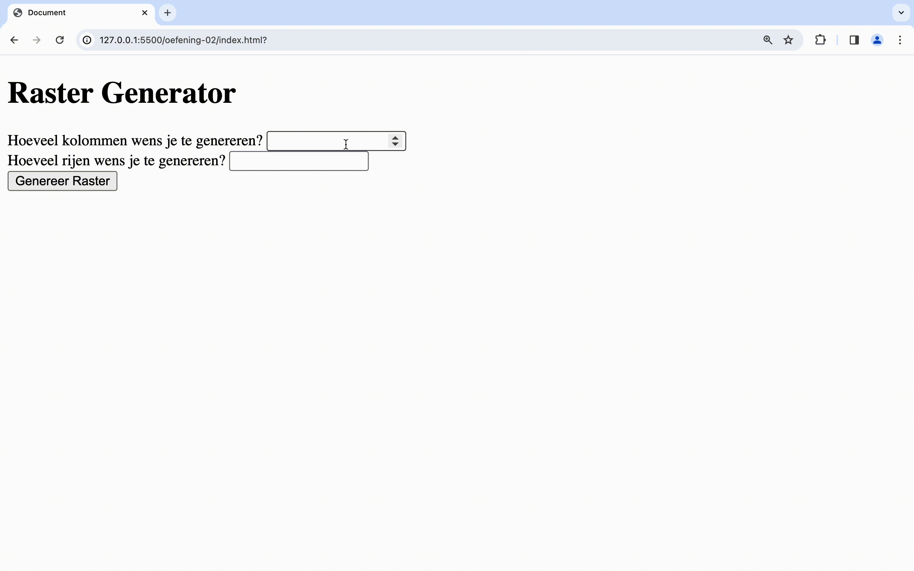
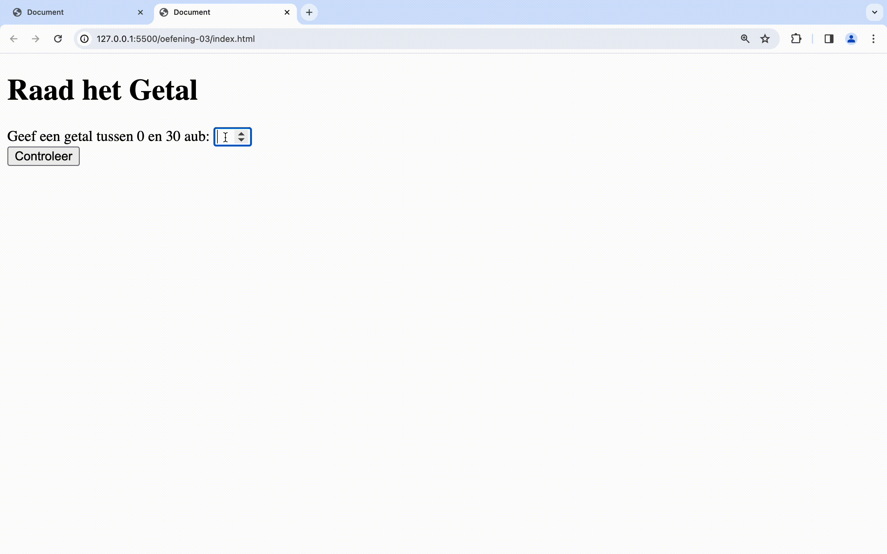


**Opgelet** Deze oefeningen zijn _deprecated_, we verwijzen je graag door naar de oefeningen in de nieuwe [oefeningen sectie](../../../oefeningen/LW7/labo14/oefeningen.md)


# oefeningen

## oefening 1: maaltafel generator

**leerdoelen**

* werken met een for-loop
* wiskundige bewerkingen
* variabelen declareren met let en const
* werken met controlestructuren

**functionele analyse**

Je programma genereert op basis van ingave een maaltafelreeks voor een bepaalde maaltafel met X aantal iteraties.

**technische analyse**

Vraag de gebruiker via een `form` een getal waar de maaltafel moet voor gegenereerd worden en sla deze op in een const.

Vraag de gebruiker via dezelfde `form` ook hoeveel iteraties hij wil uitprinten en sla deze waarde ook op in een const.

Hou een string variabele bij waar je maaltafel gegevens aan toevoegt. Zorg ervoor dat elke waar gescheiden wordt met een “, ”.

Doorloop het gewenste aantal keer je loop en voeg het nieuwe product toe aan de eerder gedeclareerde string

Print vervolgens de maaltafelreeks uit op het scherm van de gebruiker.

**voorbeeldinteractie**

<figure><figcaption></figcaption></figure>

## oefening 2: raster generator

**leerdoelen**

* werken met een for-loop
* werken met strings
* variabelen declareren met let en const

**functionele analyse**

Je programma genereert op basis van ingave een raster van kruisjes.

**technische analyse**

Vraag de gebruiker hoeveel kolommen en hoeveel rijen hij wenst te genereren. Gebruik een for-loop om de rijen te doorlopen. Gebruik voor elke rij een extra for-loop om de kolommen te doorlopen.

**voorbeeldinteractie**

<figure><figcaption></figcaption></figure>

## oefening 3: raad het getal

**leerdoelen**

* werken met een do-while-loop
* werken met getallen
* werken met controlestructuren

**functionele analyse**

Je laat de gebruiker een getal raden tussen 0 en 30. Zolang het getal niet correct wordt geraden vragen we hem opnieuw te raden. Je geeft hem ook een tip mee zodat de gebruiker weet of hij lager of hoger moet raden.

**technische analyse**

Stel een variabele teRadenGetal in op een vaste waarde. Gebruik een While-loop om te controleren of de ingegeven waarde gelijk is aan de te raden waarde. Indien dat niet zo is vraag je de gebruiker om een nieuwe ingave.

**voorbeeldinteractie**

<figure><figcaption></figcaption></figure>
