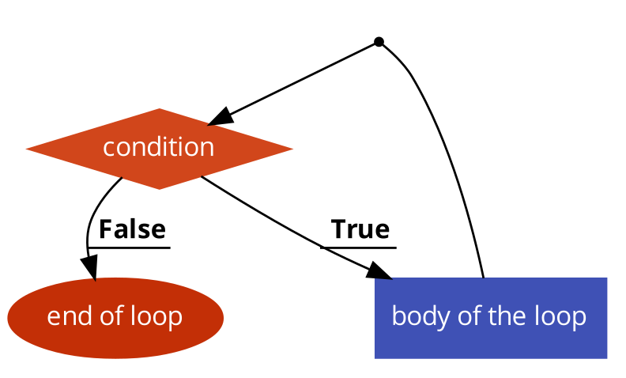

# while

We hebben tot nu toe al een soort lus gezien en dat was de `for` lus. We gaan nu nog een andere soort lus zien genaamd de `while` lus. In essentie is er niet veel verschillend tussen de `for` lus en de `while`lus. Alles wat je met de ene kan, kan je ook met de andere verwezenlijken.

## while

De syntax van de `while` loop is als volgt:

```js
while (condition) {
    // body of loop
}
```

1. In de eerste stap wordt de conditie tussen de haakjes geëvalueerd.
2. Als de conditie `true` is dan wordt het stuk code in de body van de lus uitgevoerd.
3. De conditie wordt daarna terug geëvalueerd.
4. Als de conditie `true` is dan wordt het stuk code in de body van de lus uitgevoerd.
5. De conditie wordt daarna terug geevalueerd.
6. ...
7. Als de conditie `false` is dan stopt de lus.



**voorbeeld 1: 5 keer herhalen**

We gaan nu hetzelfde voorbeeld geven als bij de `for` loop waarbij we een stuk tekst 5 keer moeten herhalen. We hebben niet meer de handige `for` syntax ter handen dus we moeten nu een aantal dingen zelf doen. De initialisatie van de variabelen gebeuren buiten de loop

```js
let i = 0;
```

vervolgens gaan we de `while` lus syntax gebruiken om de lus te herhalen tot dat de conditie niet meer voldaan wordt. In de body plaatsen we terug de `console.log` statement.

```js
while (i < 5) {
    console.log("Hello JavaScript!");
}
```

**Pas op!** Want momenteel wordt `i` niet opgehoogd. Zo ontstaat er een oneindige lus en blijft het programma voor altijd lopen.

We moeten dus nog zelf onderaan de loop body de `i` variabele ophogen met `i++`

We hebben nu

```js
let i = 0;
while (i < 5) { 
    console.log("Hello JavaScript!");
    i++;
}
```

### do while

De syntax van de `do ... while` loop is zeer gelijkaardig aan de `while` loop

```js
do {
    // body of loop
} while(condition)
```

Het enige verschil met de gewone while lus is dat de body altijd minstens 1 keer wordt uitgevoerd en dan pas de conditie getest wordt.

De lus van hiervoor ziet er als volgt uit:

```js
let i = 0;
do {
    console.log("Hello JavaScript!");
    i++;
} while (i < 5)
```

Een voorbeeld waar eventueel een `do while` lus beter kan uitkomen is dat als we een lus willen maken afhankelijk van user input.

Stel dat we een programma moeten maken die een paswoord vraagt en dan nakijkt of het paswoord juist is. Als het paswoord juist is eindigt het programma, als het fout is dan vraagt het programma opnieuw achter het paswoord

```js
// gebruiker wordt gevraagd een wachtwoord in te geven
let password = document.querySelector('#password').value;

while (password !== "password") {
    alert("Dat is het verkeerde wachtwoord!");
    password = document.querySelector('#password').value;
}
```

Als we hier een `while` loop willen voor gebruiken dan moeten we voor de eerste evaluatie van de conditie een extra `input.question` plaatsen want anders kan de conditie niet geëvalueerd worden. We willen dus eigenlijk dat de body van de lus minstens 1 keer wordt uitgevoerd zodat we de vraag kunnen stellen. Met een `do while` kan je dit op de volgende manier uitdrukken.

```js
let password;
do  {
    alert("Geef het juiste wachtwoord in!");
    password = document.querySelector('#password').value;
} while (password !== "password")
```
