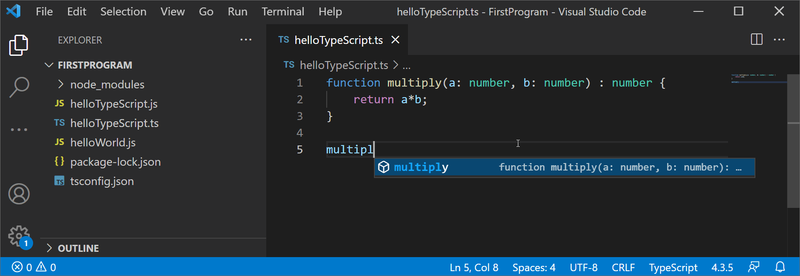
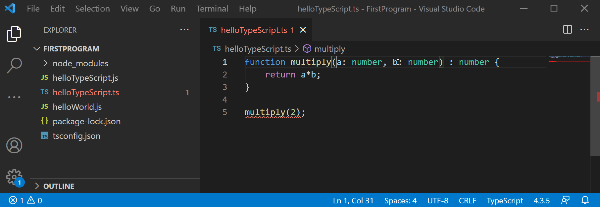

# eigen functies schrijven

Tot nu toe hebben we de functies gebruikt die al in JavaScript aanwezig zijn. Dit zijn de ingebouwde functies. Maar de kracht van functies zit er vooral in dat je deze zelf kan gaan schrijven en gaan gebruiken.

## functies zonder return waarde

We bespreken eerst de syntax voor een functie zonder return waarde.

```js
function myFunction(argument1, argument2, argumentN) {
    // function body
}
```

Deze functie bestaat uit:

* het `function` keyword
* de naam van de functie
* tussen haakjes de argumenten (als er geen argumenten zijn dan staat er niets tussen de haakjes)
* Een function body. (dit is de eigenlijke code die je wil uitvoeren als de functie wordt aangeroepen)

**voorbeeld 1**

Stel dat we een functie willen maken die een gebruiker verwelkomt met "Hallo" gevolgd door zijn/haar naam

```js
function verwelkom(naam) {
    console.log(`Hallo ${naam} !`);
}

verwelkom("Andie");
verwelkom("Lotte");
```

Deze functie print gewoon iets af en heeft dus geen return waarde.

```
Hallo Andie !
Hallo Lotte !
```

**voorbeeld 2**

Stel dat we het volgende stuk code hebben om alle pokémon namen op het scherm te tonen.

```js
let gen1 = ["Bulbasaur","Charmander","Squirtle"];

for (let i=0; i<gen1.length; i++) {
    console.log(gen1[i]);
}
```

Stel dat we nu een nieuwe array definiëren met nieuwe namen in en we noemen die `gen2`

```js
let gen2 = ["Chikorita","Cyndaquil","Totodile"];
```

Als we nu ook deze namen willen op het scherm tonen zouden we de `for`-lus kunnen kopiëren en die er achter plaatsen

```js
let gen1 = ["Bulbasaur","Charmander","Squirtle"];
let gen2 = ["Chikorita","Cyndaquil","Totodile"];

for (let i=0; i<gen1.length; i++) {
    console.log(gen1[i]);
}
for (let i=0; i<gen2.length; i++) {
    console.log(gen2[i]);
}
```

Dit lijkt als dubbel werk. En stel dat we nog 10 andere generaties moeten toevoegen bij deze code. Dan wordt het echt een huzarenstukje om deze code te onderhouden.

Hier is een functie de ideale oplossing voor! We hebben een stuk gedrag dat we meerdere keren willen aanroepen met andere input argumenten.

We breken even alles op in stukjes:

* **functienaam:** printPokemonNames
* **argument(en):** names
*   **body**:

    ```js
    for (let i=0; i<names.length; i++) {
        console.log(names[i]);
    }
    ```

als we dit dan samen gooien komen we op de volgende functie:

```js
function printPokemonNames(names) {
    for (let i=0; i<names.length; i++) {
        console.log(names[i]);
    }
}
```

Nu moeten we deze functie nog aanroepen met de juiste argumenten. Het argument dat we hier willen meegeven is de `gen1` array.

```js
printPokemonNames(gen1);
```

en omdat we identiek hetzelfde willen doen voor de `gen2` array doen we dit nog eens maar dan voor de andere array:

```js
printPokemonNames(gen2);
```

## functies met return waarde

De syntax van een functie met return waarde is zeer gelijkaardig.

```js
function myFunction(argument1, argument2, argumentN) {
    // function body
    return something;
}
```

Het enige verschil is dat we hier in de functie een `return` statement gaan zetten gevolgd door een expressie. Dit kan een variabele zijn die je terug geeft, gewoon een literal of een combinatie van beiden.

Stel dat we een functie willen maken die een getal moet verdubbelen dat je mee hebt gegeven als argument.

* **functienaam:** doubleNumber
* **argumenten:** `a`
* **body**:

```js
function doubleNumber(a) {
    return 2 * a;
}

doubleNumber(2);              // Gaat niets uitprinten
console.log(doubleNumber(2)); // 4
```

Stel dat we nu onze functie willen aanpassen zodat die in plaats van te verdubbelen ook kan verdrievoudigen, verviervoudigen, .... afhankelijk van een argument dat je meegeeft. Dan kunnen we de functie aanpassen als volgt:

```js
function multiply(a, b) {
    return a * b;
}

console.log(multiply(2,3));
```

## optionele argumenten in TypeScript

Stel dat we de `multiply` functie willen aanpassen dat ze ook toestaat om maar 1 argument mee te geven. Als we gewoon de 2de argument zouden weglaten krijgen we een foutmelding. Logisch ook want hij kan helemaal geen vermenigvuldiging doen met 1 getal.



We zouden deze argument optioneel kunnen maken. Dit doe je door `?` achter het argument te plaatsen. Je gaat dan wel nog een extra foutboodschap krijgen die je zal moeten oplossen.



We lossen dit op door een stuk code te schrijven die nakijkt of `b` op `undefined` staat.

Er bestaat ook nog een andere manier om dit op te lossen. We kunnen een default waarde meegeven aan het argument. Het argument moet dan wel niet meer als optioneel aangeduid worden.

```js
function multiply(a, b = 2) {
    return a * b;
}

console.log(multiply(2));   // 4
console.log(multiply(2,2)); // 4
console.log(multiply(2,3)); // 6
```
