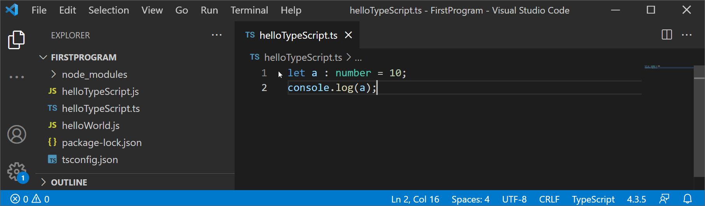

# scope

De scope van een variabele is een belangrijk concept dat je moet begrijpen om goede code te kunnen schrijven in JavaScript. De scope van een variabele geeft aan voor welke stukken code die variabele toegankelijk is. Niet alle variabelen zijn overal beschikbaar, en hier moet je zeker van bewust zijn.

## block/local scope

Local scope zijn variabelen die gedeclareerd zijn binnen een een block. Een block is alles wat in je code tussen accolades staat `{}`. Dit kan een if-statement zijn, een functie body of zelfs gewoon code die je zelf tussen accolades hebt geplaatst.

Variabelen die binnen een bepaald blok zijn gedeclareerd kan je niet buiten dat blok aanspreken.



Het volgende is ook geldig voor

```js
let b = 4;
if (b > 0) {
    let a = 10;
}
console.log(a); // Cannot find name 'a'.
```

Dit zorgt er ook voor dat alle variabelen die in een functie worden gedeclareerd enkel binnen die functie beschikbaar zijn

```js
function multiply(a) {
    let multiplier = 2;

    return multiplier * a;
}
console.log(multiplier); // Cannot find name 'multiplier'.
```

Een speciaal geval hebben we gezien in de vorm van een `for`-lus. Daarin declareerden we in het eerste deel altijd een variabele die dan doorheen de lus kan gebruikt worden. Deze variabele is beschikbaar in de block van de `for`-lus, maar niet daarbuiten.

```js
for (let i=0; i<5; i++) {

}
console.log(i); // Cannot find name 'i'
```

## globale scope

Variabelen die buiten een functie of buiten eender welke block zijn gedeclareerd zijn variabelen die in de global scope leven. Ze worden gewoon in het bestand zelf gezet. Als je gewoon

```js
let a = 0;
```

in een bronbestand zet, dan zeggen we dat `a` in de global scope zit.

## variable shadowing

In andere programmeertalen zoals C# en Java is er een regel dat zolang je in de scope van een variabele bent, je geen nieuwe variabele kan aanmaken met dezelfde naam. In JavaScript is dat niet het geval. De onderstaande code is volledig correcte code:

```js
let getal = 0;
{
    let getal = 10;
}
```

We zeggen hier dat de variabele `getal` uit de binnenste block de global variabele `getal` overschaduwt.


Het is niet omdat het mogelijk is dat je het mag doen. Deze code is hoogst verwarrend en moet te allen tijde vermeden worden. Hou de goede gewoonte van de andere programmeertalen en zorg ervoor dat je variabele namen uniek zijn.

