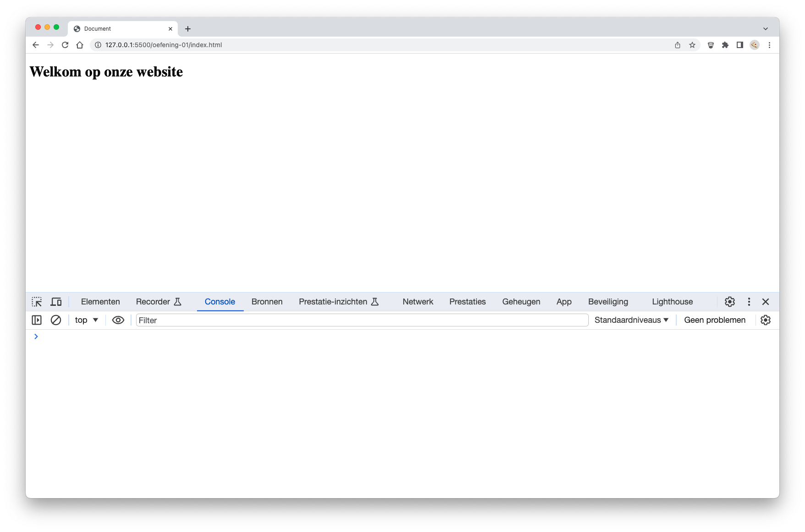
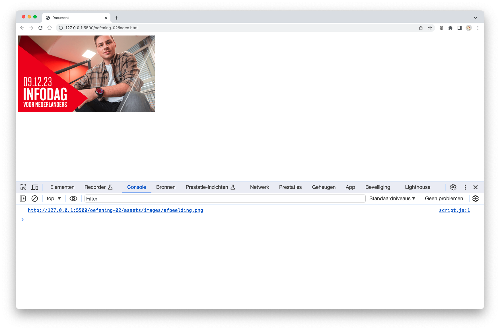
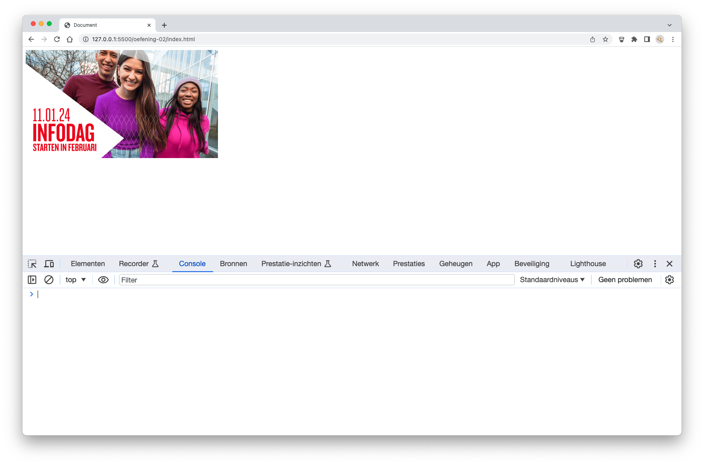
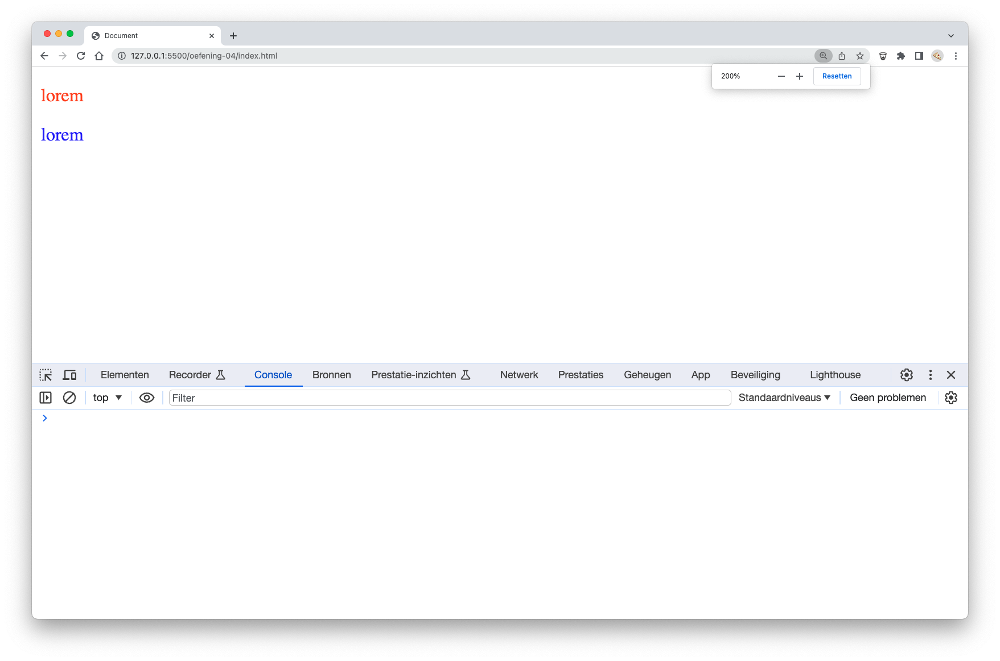
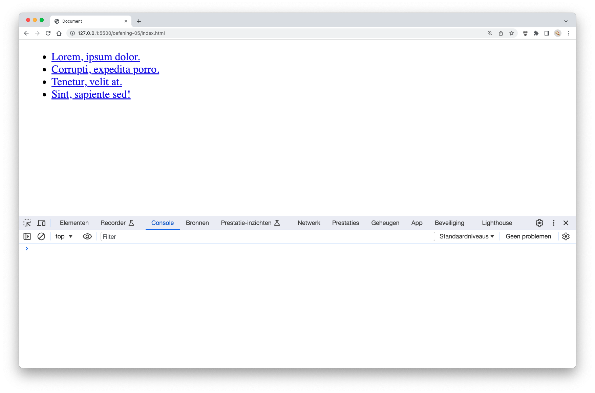
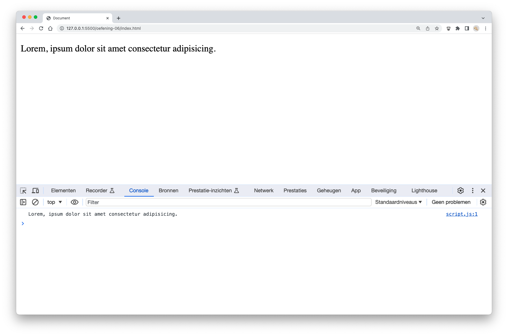
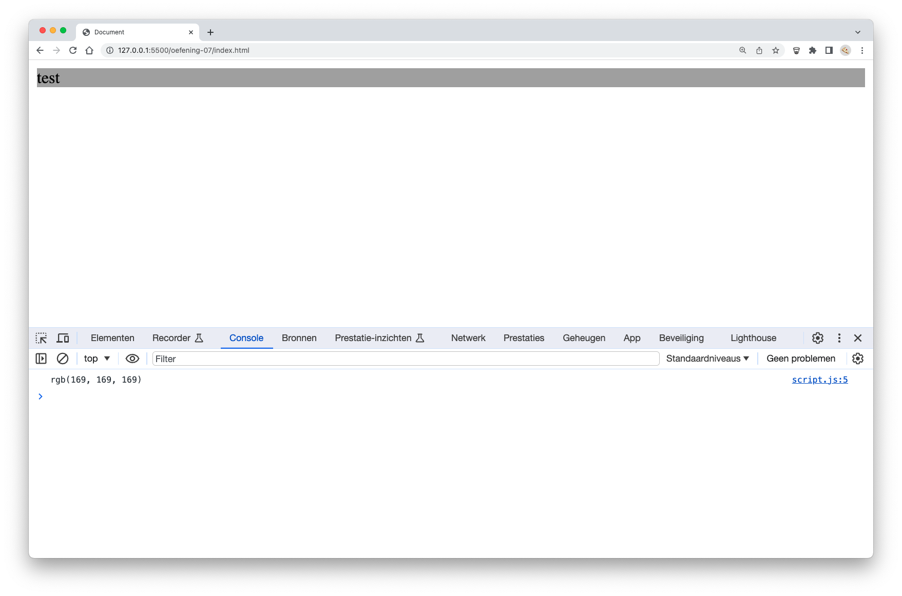
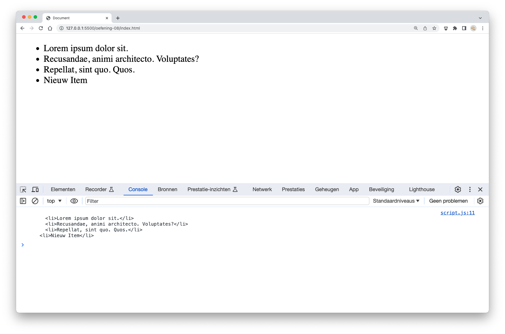


**Opgelet** Deze oefeningen zijn _deprecated_, we verwijzen je graag door naar de oefeningen in de nieuwe [oefeningen sectie](../../oefeningen/LW9/labo17/oefeningen-dom.md)


# oefeningen

## oefening 1: tekst plaatsen

**leerdoelen**

* een HTML-element selecteren o.b.v. id
* de inhoud van een HTML-element wijzigen

**functionele analyse** Jouw programma gaat de titel op een website aanpassen naar de inhoud van een variabele

**technische analyse** In jouw HTML voorzie je een h1-element met als tekst "Hello world!".

Plaats in jouw code de tekst "Welkom op onze website" in een `const`. Gebruik deze `const` om de `h1` op de website aan te passen.

**voorbeeldinteractie**

<figure><figcaption></figcaption></figure>

## Oefening 2: Attributen lezen

**Leerdoelen**

* Een HTML-element selecteren op basis van id
* Attributen van een HTML-element lezen

**Functionele analyse** Lees de waarde van het "src"-attribuut van een afbeelding en toon deze in de console.

**Technische analyse** Voeg in jouw HTML een img-element toe met een id, bijvoorbeeld "myImage", en een standaardbron, bijvoorbeeld "afbeelding.png".

In jouw JavaScript-code, selecteer dit img-element op basis van het id "myImage" en lees de waarde van het "src"-attribuut. Toon deze waarde vervolgens in de console.

**voorbeeldinteractie**

<figure><figcaption></figcaption></figure>

## oefening 3: attributen wijzigen

**leerdoelen**

* een HTML-element selecteren op basis van tag
* attributen van een HTML-element wijzigen

**functionele analyse** Je moet de bron van een afbeelding wijzigen op basis van een variabele.

**technische analyse** In jouw HTML heb je een img-element met een id "myImage" en een standaardbron, bijvoorbeeld "afbeelding.png".

Maak in jouw JavaScript-code een variabele met de naam `newSource` en wijs hieraan een nieuwe afbeeldings-URL toe.

Selecteer het img-element op de pagina op basis van het id "myImage" en wijzig het attribuut "src" naar de waarde van de variabele `newSource`. Zo moet de afbeelding op de website veranderen afhankelijk van de nieuwe bron die je hebt opgegeven.

**voorbeeldinteractie**

<figure><figcaption></figcaption></figure>

## oefening 4: stijlen aanpassen

**leerdoelen**

* een HTML-element selecteren op basis van id
* stijlen van een HTML-element wijzigen

**functionele analyse** Pas de tekstkleur van een alinea aan op basis van een variabele.

**technische analyse** Voeg in jouw HTML een paar p-elementen toe met verschillende tekstinhoud en verschillende klasses, bijvoorbeeld `.red`.

Maak een variabele met de naam `red` en wijs hieraan een kleurwaarde toe, bijvoorbeeld "rood".

Selecteer de p-elementen op de pagina op basis van de klasse en pas de tekstkleur aan naar de waarde van de variabele. Hierdoor moeten de paragrafen een nieuwe tekstkleur hebben.

**voorbeeldinteractie**

<figure><figcaption></figcaption></figure>

## oefening 5: elementen verwijderen

**leerdoelen**

* bestaande HTML-elementen verwijderen

**functionele analyse** Verwijder een item uit een lijst.

**technische analyse** In jouw HTML, creëer een ongeordende lijst (ul) met enkele lijstitems (li).

Selecteer een bestaand lijstitem (je kunt bijvoorbeeld het eerste lijstitem selecteren) en verwijder dit item uit de lijst.

**voorbeeldinteractie**

<figure><figcaption></figcaption></figure>

## oefening 6: tekstinhoud lezen

**Leerdoelen**

* Een HTML-element selecteren op basis van tag
* De inhoud van een HTML-element lezen

**Functionele analyse** Lees de tekstinhoud van een paragraaf en toon deze in de console.

**Technische analyse** Voeg in jouw HTML een p-element toe met wat tekstinhoud.

In jouw JavaScript-code, selecteer dit p-element op basis van de tag en lees de tekstinhoud ervan. Toon deze tekst vervolgens in de console.

**voorbeeldinteractie**

<figure><figcaption></figcaption></figure>

## oefening 7: stijlen lezen

**Leerdoelen**

* Een HTML-element selecteren op basis van id
* Stijlinformatie van een HTML-element lezen

**Functionele analyse** Lees de achtergrondkleur van een div-element met een specifieke id en toon deze in de console.

**Technische analyse** Voeg in jouw HTML een div-element toe met een id, bijvoorbeeld `bg-grey`, en pas wat stijlen toe, zoals achtergrondkleur.

In jouw JavaScript-code, selecteer dit div-element op basis van de id en lees de achtergrondkleur. Toon deze kleur vervolgens in de console.

**voorbeeldinteractie**

<figure><figcaption></figcaption></figure>

## oefening 8: elementen toevoegen

**Leerdoelen**

* Nieuwe HTML-elementen maken
* Bestaande HTML-elementen wijzigen

**Functionele analyse** Voeg een nieuw item toe aan een lijst.

**Technische analyse** In jouw HTML, creëer een ongeordende lijst (ul) met enkele lijstitems (li).

In jouw JavaScript-code, maak een nieuw li-element aan met de tekst "Nieuw Item" en voeg dit toe aan de bestaande ul. Toon het resultaat in de console.

Deze oefening laat zien hoe je dynamisch nieuwe elementen aan een pagina kunt toevoegen.

**voorbeeldinteractie**

<figure><figcaption></figcaption></figure>
