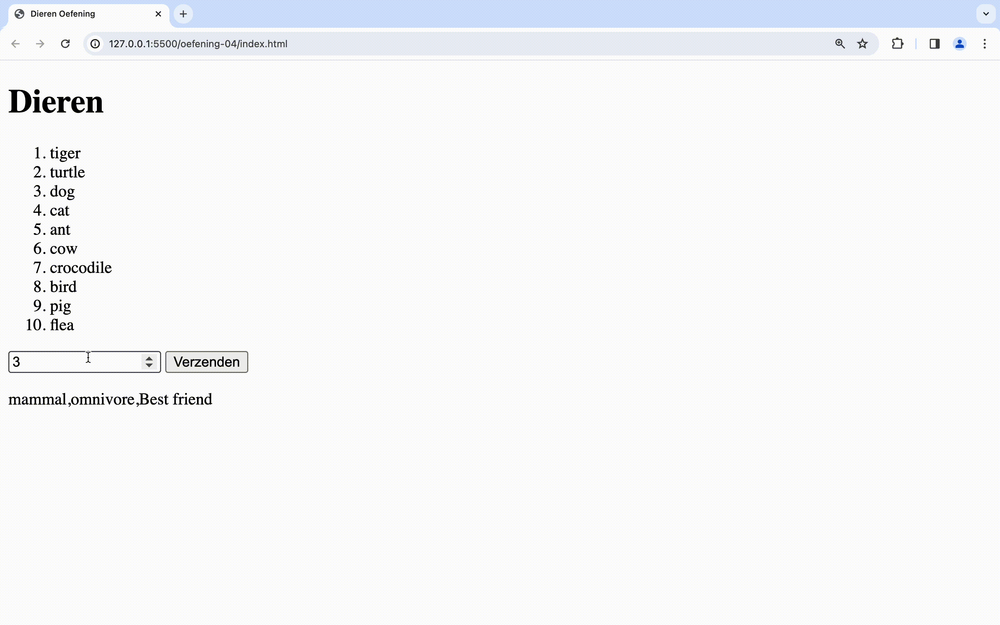

# oefeningen

## oefening 1: recept

**leerdoelen**

* objecten aanmaken
* dot notatie gebruiken
* lussen

**functionele analyse**

Het programma berekent de totaalprijs van een gegeven recept.

**technische analyse**

Je maakt een object. Dit bevat een

* naam
* beschrijving
* personen
* ingredienten

de ingredienten bevatten een:

* naam
* hoeveelheid (bv "1 stuk", "1 kg")
* prijs

Maak het object aan met zelfgekozen values en ken deze toe aan aan variabele `spaghetti`.

Print de naam van dit gerecht af (via de dot-notatie) gevolgd door de totaalprijs van alle ingredienten.

**voorbeeldinteractie**

<figure><figcaption></figcaption></figure>

## oefening 2: persoon

**leerdoelen**

* objecten aanmaken
* dot-notatie gebruiken
* gebruik/uitlezen van JSON
* schrijven van functies

**functionele analyse**

Lees een json-bestand in en print daar enkele waardes van op het scherm

**technische analyse**

Maak een **person.json** bestand aan met volgende data:

```
{
  "firstname": "Jurgen",
  "lastname": "Vervoort",
  "age": 27,
  "city": "Heist-op-den-Berg",
  "street": "Bergstraat",
  "number": "17c",
  "postal": 2220,
  "hobbies": ["voetbal", "tafeltennis", "vissen"]
}
```

1. Lees het _person.json_ bestand in
2. Maak een eerste functie _printFullName()_ dat het ingelezen object als parameter ontvangt en de volledige naam van de persoon uitprint.
3. Maak een tweede functie _printHobbies()_ dat het ingelezen object als parameter ontvangt en de hobby's van de persoon oplijst.

**voorbeeldinteractie**

<figure><figcaption></figcaption></figure>

## oefening 3: todo's

**leerdoelen**

* objecten aanmaken
* dot-notatie gebruiken
* gebruik/uitlezen van JSON
* schrijven van functies
* werken met arrays van objecten

**voorbereiding**


Download dit bestand en plaats het in de assets-map van deze oefening


**functionele analyse**

Lees todos.json uit en haal er enkel de reeds voltooide todo's uit.

**technische analyse**

1. Maak een array van Todos door het bestand todos.json uit te lezen.
2. Schrijf een functie _getCompleted()_ dat als parameter je array ontvangt. Zorg ervoor dat de functie een array teruggeeft met _enkel de voltooide_ todo's.
3. Toon de voltooide todo's op de website in een lijst.

**voorbeeldinteractie**

<figure><figcaption></figcaption></figure>

## oefening 4: dieren

**leerdoelen**

* objecten aanmaken
* dot-notatie gebruiken
* gebruik/uitlezen van JSON
* werken met gebruikersinteractie
* werken met arrays van objecten

**voorbereiding**


Download dit bestand en plaats het in de assets-map van deze oefening


**functionele analyse**

Toon de gebruiker een lijst van dieren. Nadat de gebruiker een dier kiest wordt wat info betreffende dat gekozen dier weergegeven.

**technische analyse**

Maak een array van dieren `animalData` door het bestand dieren.json in te lezen d.m.v. `import`.

Maak een functie _getAnimalsList() dat de animal\[] als parameter ontvangt en een string\[] van alle dierennamen teruggeeft._

Nu kan je de gebruiker laten kiezen uit 1 van de dieren. Gebruik de arraypositie om de info op te vragen van het gekozen dier.

**voorbeeldinteractie**

<figure><figcaption></figcaption></figure>
