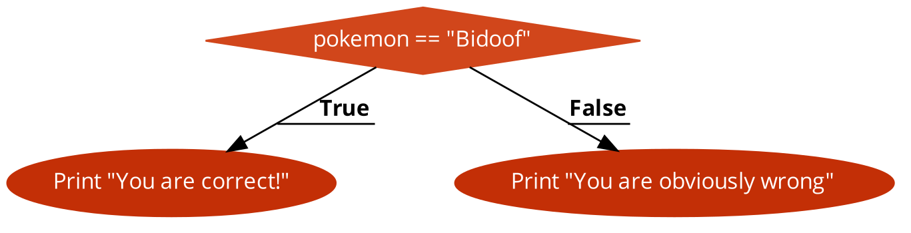
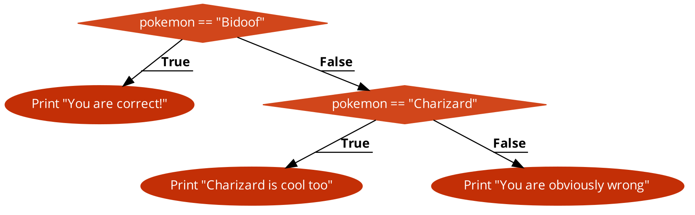

# if en switch

Soms moeten we verschillende acties nemen in een programma, afhankelijk van verschillende condities.

### if

De `if` uitdrukking is één van de meest elementaire uitdrukkingen in een programmeertaal en laat ons toe 'vertakkingen' in onze programmaflow in te bouwen. Ze laat toe om "als dit waar is doe dan dat"-beslissingen te maken.

Het `if (...)` statement evalueert de conditie tussen de haakjes, als het resultaat `true` is dan voert het de blok code uit.

```js
// de gebruiker moet in een veld ingeven wat de beste pokemon is
let pokemon = document.getElementById('pokemon').value;

if (pokemon === "Bidoof") {
    console.log("You are right!");
}
```

Er wordt hier nagekeken of de pokemon variabele gelijk is aan de string `Bidoof`. Deze conditie kan veel complexer zijn dan dat en kan vele logische operatoren en variabelen gebruiken.

### else

Een `if` statement staat vaak niet alleen in de code en wordt vaak vergezeld door een `else`statement. Deze dient om code uit te voeren indien de eerste conditie niet voldaan wordt.

```js
// de gebruiker moet in een veld ingeven wat de beste pokemon is
let pokemon = document.getElementById('pokemon').value;

if (pokemon === "Bidoof") {
    console.log("You are right!");
} else {
    console.log("You are obviously wrong! Bidoof is the best!");
}
```

De flow chart voor dit stuk code is als volgt:



### else if

heb je meer dan 1 conditie die je wil nakijken en bepaalde code uitvoeren als deze condities geldig zijn dan gebruiken we de `else if` statement

```js
// de gebruiker moet in een veld ingeven wat de beste pokemon is
let pokemon = document.getElementById('pokemon').value;

if (pokemon === "Bidoof") {
    console.log("You are right!");
} else if (pokemon === "Charizard") {
    console.log("Ok charizard is cool too!");
} else {
    console.log("You are obviously wrong! Bidoof is the best!");
}
```



### switch

Het `switch` statement kan meerdere `if` checks vervangen met 1 constructie. Het vereenvoudigt code als we veel condities hebben waaraan de invoer kan voldoen.

De syntax voor de switch blok ziet er als volgt uit

```js
switch (x) {
    case 'value1': // if (x === 'value1')
        // handles value1
        break;
    case 'value2': // if (x === 'value2')
        // handles value2
        break;
    case 'value3': // if (x === 'value3')
        // handles value3
        break;
    default:
        // handles everything else
        break;
}
```

eigenlijk is dit een andere manier om het volgende te schrijven

```js
if (x === 'value1) {
    // handles value1
} else if (x === 'value2') {
    // handles value2
} else if (x === 'value3') {
    // handles value3
} else {
    // handles everything else
}
```

* Dus de waarde van x wordt eerst vergeleken met de waarde van de eerste case, en dan verder met de waarde van de volgende case, enzovoort
* Als er een gelijkheid gevonden wordt zal de `switch` statement de code beginnen uitvoeren die bij de case staat.
* Als er geen match is dan wordt de code uitgevoerd die achter `default` staat.

Het voorbeeld van de Pokemon kan je dan als volgt schrijven

```js
// de gebruiker moet in een veld ingeven wat de beste pokemon is
let pokemon = document.getElementById('pokemon').value;

switch (pokemon) {
    case "Bidoof":
        console.log("You are right");
        break;
    case "Charizard":
        console.log("Ok charizard is cool too");
        break;
    default:
        console.log("You are obviously wrong! Bidoof is the best!");
        break;
}
```

Je vraagt je waarschijnlijk af waarom er onder elke `case` een `break` staat. Als deze er niet staat dan zal niet alleen de code uitgevoerd worden van de bijbehorende `case` maar ook van die daar onder (en die daar onder, ...)

```
What is the best Pokemon? Bidoof
You are right
Ok charizard is cool too
You are obviously wrong! Bidoof is the best!
```

Je vraagt je waarschijnlijk af waarom je dit kan nodig hebben. Het wordt gebruikt om cases te gaan groeperen. Als je dezelfde code wil uitvoeren bij verschillende cases kan je dit op de volgende manier doen

```js
// de gebruiker moet in een veld ingeven wat de beste pokemon is
let pokemon = document.getElementById('pokemon').value;

switch (pokemon) {
    case "Bidoof":
    case "Mewtwo":
    case "Mew":
        console.log("You are right");
        break;
    case "Charizard":
        console.log("Ok charizard is cool too");
        break;
    default:
        console.log("You are obviously wrong! Bidoof is the best!");
        break;
}
```

Nu zullen bij het antwoord Bidoof, Mewtwo en Mew dezelfde code uitgevoerd worden. Er zal `You are right` op het scherm verschijnen. Op het moment we `break` tegenkomen wordt de switch beëindigd.

### conditional operator ?

Soms willen we een waarde toekennen aan een variabele die afhangt van een bepaalde conditie. Bijvoorbeeld:

```js
// de gebruiker moet in een veld een leeftijd ingeven
let age = document.getElementById('age').value;

let accessAllowed;

if (age > 18) {
  accessAllowed = true;
} else {
  accessAllowed = false;
}
  
console.log(accessAllowed);
```

De conditional of vraagteken operator kan deze code korter maken.

```js
let result = condition ? value1 : value2;
```

Je moet het bovenstaande op de volgende manier interpreteren. Als de conditie `true` is dan zal de waarde van `result` op `value1`worden gezet. Als de conditie false is dan zal de waarde van `result` op `value`gezet worden.

We kunnen dan bovenstaande code vereenvoudigen:

```js
// de gebruiker moet in een veld een leeftijd ingeven
let age = document.getElementById('age').value;

let accessAllowed = (age > 18) ? true : false;
console.log(accessAllowed);
```

Het is mogelijk om ook meerdere conditional operators te gebruiken in 1 lijn code.

```js
// de gebruiker moet in een veld de nummer van een pokemon ingeven
let pokeId = document.getElementById('pokemon').value;

let generation = (pokeId <= 151) ? "generation 1" : (pokeId <= 256) ? "generation 2" : (pokeId <= 386) ? "generation 3" : "Unknown";

console.log(generation);
```

Je merkt op dat deze code al snel heel complex aan het worden is om snel te lezen. Daarom moet je altijd een afweging maken tussen leesbaarheid van je code en hoe compact ze is. Om duidelijk te maken wat de bovenstaande code doet zullen we het even herschrijven als een `if`statement

```js
// de gebruiker moet in een veld de nummer van een pokemon ingeven
let pokeId = document.getElementById('pokemon').value;

let generation;

if (pokeId <= 151) {
    generation = "generation 1";
} else if (pokeId <= 256) { 
    generation = "generation 2";
} else if (pokeId <= 386) {
    generation = "generation 3";
} else {
    generation = "Unknown";
}

console.log(generation);
```
