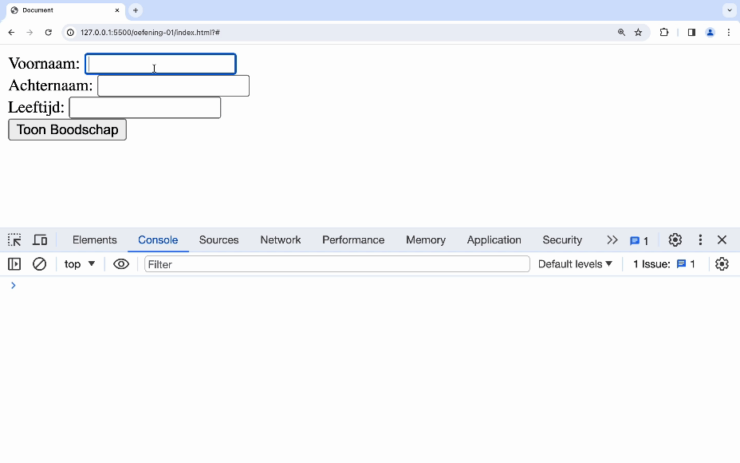
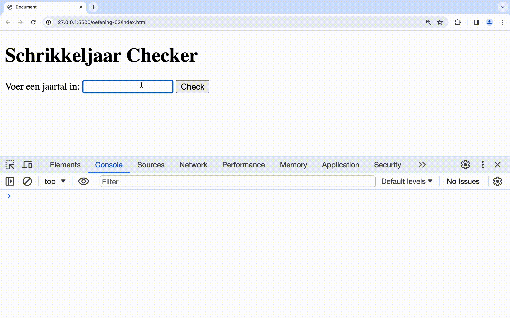
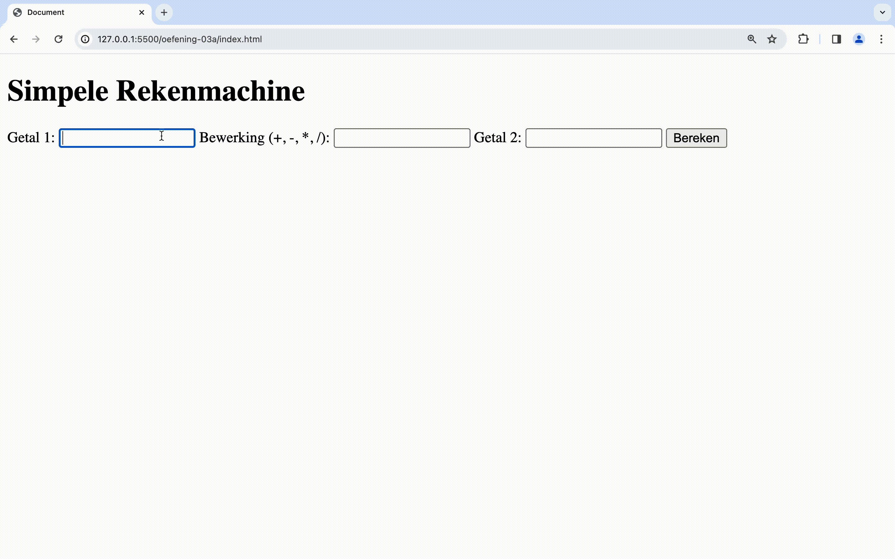

# oefeningen


Als een oefening bestaat uit een deel "a" en een deel "b" mag je dit in één map maken.


## oefening 1a: lees informatie uit

**leerdoelen:**

* input lezen
* string interpolatie

**functionele analyse:**

Het programma leest naam, achternaam en leeftijd in uit DOM-elementen en drukt deze in 1 boodschap af.

**technische analyse:**

Schrijf een JavaScript programma dat:

* 3 waarden voor variables inleest (voor voornaam, achternaam en leeftijd) vanuit 3 input-elementen.
* De waarden worden ingelezen als de gebruiker het formulier waarin de input-elementen staan, probeert te verzenden.
* 1 variable die de zin bevat "U bent Voornaam Achternaam en u bent leeftijd jaar oud" gebruik makend van de 3 vorige variables en waar voornaam/achternaam/leeftijd vervangen zijn door de waarden van de 3 variables, waarbij de voornaam en achternaam met een hoofdletter begint en de rest in kleine letters wordt weergegeven
* deze laatste variable plaats je op je scherm met gebruik van een `<label>`

**voorbeeldinteractie**

<figure><figcaption></figcaption></figure>

## oefening 1b: lees gevalideerde informatie uit

**leerdoelen:**

* input lezen
* string interpolatie
* beslissingen

**functionele analyse:**

Het programma leest naam, achternaam en leeftijd in en drukt deze in 1 boodschap af nadat de input is geverifieerd.

**technische analyse:**

Schrijf JavaScript die:

* 3 variables inleest: voornaam, achternaam en leeftijd. Geen enkele van deze variabelen mag leeg zijn. De leeftijd moet liggen tussen 12 en 60 jaar. De input komt uit HTML-elementen.
* Als de naam of achternaam niet is ingevuld, dan wordt de melding gegeven “vul zowel voornaam als achternaam in !”. Indien de leeftijd niet tussen 12 en 60 jaar is, dan wordt de melding gegeven “u behoort niet tot de gezochte leeftijdsklasse !”.
* 1 variable die de zin bevat "U bent Voornaam Achternaam en u bent leeftijd jaar oud" gebruik makend van de 3 vorige variables en waar voornaam/achternaam/leeftijd vervangen zijn door de waarden van de 3 variables, waarbij de voornaam en achternaam met een hoofdletter begint en de rest in kleine letters wordt weergegeven
* deze laatste variable alleen print op je scherm met gebruik van `<label>` indien alle voorwaarden zoals hierboven gedefinieerd wel voldaan zijn

**voorbeeldinteractie**

<figure><figcaption></figcaption></figure>

## oefening 2: schrikkeljaar

**leerdoelen**

* beslissingen

**functionele analyse**

De website bevat een jaartal en jouw programma toont of het al dan niet een schrikkeljaar is.

**technische analyse**

* De gebruiker geeft in een formulier een jaartal in. Jij geeft terug of het een schrikkeljaar is of niet.
* Zet volgende flowchart om in code: .png>)
* Hint: Een schrikkeljaar is deelbaar door 4, behalve als het ook deelbaar is door 100, tenzij het wél deelbaar is door 400.

**voorbeeldinteractie**

<figure><figcaption></figcaption></figure>

## oefening 3a: simpele rekenmachine

**leerdoelen**

* beslissingen
* geneste if

**functionele analyse**

In deze oefening bouw je een simpele rekenmachine, die twee getallen kan optellen, aftrekken, vermenigvuldigen of delen. Je plaatst de 2 getallen in 2 input-elementen. Ook de bewerking staat in een input-element.

Je doet dit door middel van **if**-statements.

**technische analyse**

Delen door 0 kan niet; test dit voor je de deling uitvoert.

Bij invoer van een ander teken dan +, - , \*, / toon je een foutmelding.

**voorbeeldinteractie**

<figure><figcaption></figcaption></figure>

## oefening 3b: simpele rekenmachine

**leerdoelen**

* beslissingen
* switch

**functionele analyse**

In deze oefening bouw je een simpele rekenmachine, die twee getallen kan optellen, aftrekken, vermenigvuldigen of delen. Je plaatst de 2 getallen in 2 HTML-elementen. Ook de bewerking staat in een HTML-element.

Je doet dit door middel van **switch**.

**technische analyse**

Delen door 0 kan niet; test dit voor je de deling uitvoert.

Bij invoer van een ander teken dan +, - , \*, / toon je een foutmelding.

**voorbeeldinteractie**

<figure><figcaption>
er is geen verschil tussen de voorbeeldinteractie van oefeningen 3a en 3b!
</figcaption></figure>
