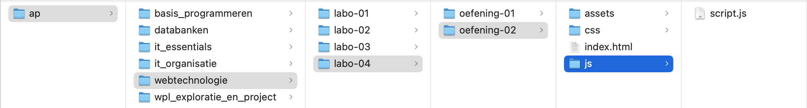

# oefeningen

## structuur van je oefeningen

Om je oefeningen ordelijk te houden, gaan we enkele afspraken maken over een aantal zaken.

1. Maak voor elk labo een aparte map
2. Maak in die map per oefening een nieuwe map
3. Daarin maak je 1 index.html-bestand, 1 css-map, 1 js-map en 1 assets-map aan
4. In de mappen voor CSS, JS en assets komen de nodige bestanden

<figure><figcaption>
voorbeeld mappenstructuur
</figcaption></figure>

## oefening 1: Leaflet-map

**leerdoelen**

* een JS-bibliotheek gebruiken
* een interactieve kaart toevoegen aan website

**functionele analyse** Een interactieve kaart toevoegen aan de oefen-website van AP.

**technische analyse**

* HTML: In het `aside`-element voorzie je een `div`-element met id `apMap`. Zorg dat er in het `div`-element een kaart wordt getoond met behulp van Leaflet.js.
* CSS: Maak het bestand map.css aan en zet deze in de css-map.
  * De hoogte van de map is 20vh.
  * De breedte van de map staat op automatisch.
* JS: Maak het bestand mapScript.js aan en plaats deze in een js-map.
  * In dit script plaats je de code om de kaart in de id `apMap` te tekenen, zodat de AP-Hogeschool met adres Ellermanstraat 33 gecentreerd staat.
  * Ga op zoek naar de geografische coördinaten van onze school.
  * De map heeft een zoom-level van 15, met een maximum zoom van 19.
* JS: Voeg aan de kaart een marker toe door gebruik te maken van icon-ap.png (zie Digitap).
  * De afmetingen van de marker zijn \[36, 20].
  * Het ankerpunt van de marker is \[0, 20].

**voorbeeldinteractie**

<figure><figcaption></figcaption></figure>

voorbeeld oefening 1
