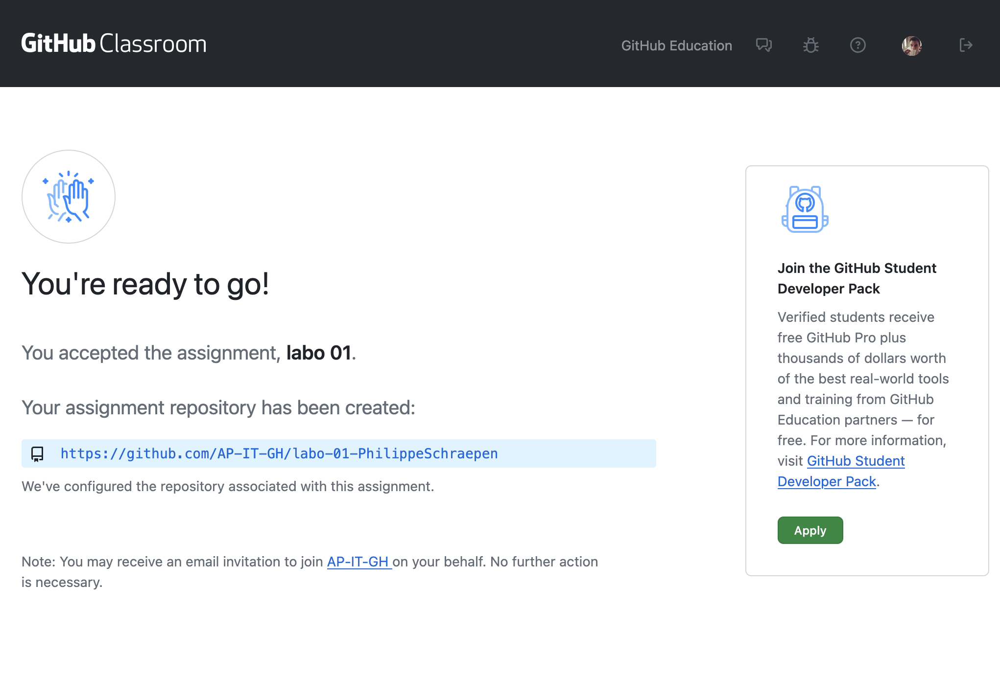

# Hoe werken we in de labo's?

## Stap 1: Start via GitHub Classroom
Voor elk labo krijg je een **GitHub Classroom-link**.  
In deze cursus vind je bovenaan iedere labo-opdracht een link om je **eigen repository** voor dat labo aan te maken.

👉 Deze repo is **privé**: enkel jij en de lectoren hebben toegang.  
👉 We hebben de repo al **voorbereid met startbestanden**, zodat jij meteen kan beginnen.

Klik op de link en volg de stappen om je repo aan te maken.  
Na afloop krijg je een scherm zoals hieronder:

  
*GitHub Classroom nadat je jouw repo hebt aangemaakt. Kopieer de URL om jouw repository te clonen.*

---

## Stap 2: Voor je start
- Installeer **Visual Studio Code** en de nodige extensies (zie hoofdstuk [IDE](/ide.md)).
- Maak op je computer een mapje (bv. `webtechnologie`).
- Clone je GitHub Classroom-repo in dit mapje:

```bash
git clone <repo-url>
```

> 💡 **Tip:** In de cursus IT Essentials vind je meer uitleg bij [Git > Remote Repositories en Samenwerken](https://apwt.gitbook.io/it-essentials/git/collaborating).

---

## Stap 3: Tijdens het labo
Open je labo en volg dit stappenplan:

1. Open **Visual Studio Code** en selecteer de map van het labo (de map die je gecloned hebt).
2. Start de **Live Server-extensie** via de knop *Go Live*.
3. Open het HTML-bestand in je browser.
   > Meestal vind je dit op `http://localhost:5500` (het poortnummer kan verschillen).
4. Volg de instructies van de oefening.
5. Maak **regelmatig commits** en **push** je werk naar GitHub:

```bash
    git add .
    git commit -m "Beschrijving van je wijzigingen"
    git push origin main
```


---

## Verwachtingen
- Maak **regelmatig commits** (bv. na elke oefening of belangrijke wijziging).
- Gebruik **duidelijke commit messages**.
  > Voorbeeld: `Oefening 3 afgewerkt` is beter dan `update`.
- Push je werk **op tijd**.

> **Veelgemaakte fout:** Vergeet niet `git add .` te doen **voor** je een commit maakt.

---

## Handige weetjes
- Je kan je repo altijd opnieuw **clonen** op een andere computer.
- Je vooruitgang is zichtbaar in de **commit history**.
- Bij vragen of problemen: contacteer de lector of gebruik het afgesproken communicatiekanaal.

---

## Waarom werken we met GitHub Classroom?
- Je leert al doende werken met **git**.
- Je oefeningen staan veilig online als **back-up**.
- De lectoren kunnen je werk makkelijk **nakijken** bij vragen of problemen.
- Je ziet je **evolutie** in de commit history.