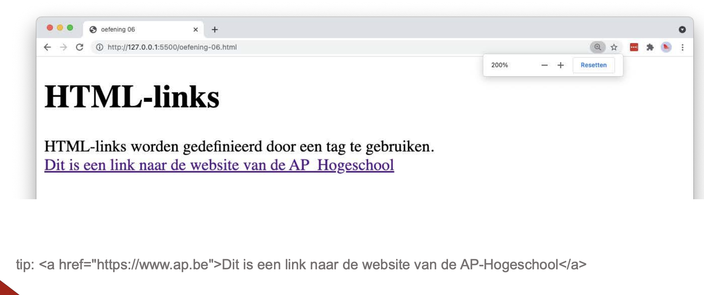
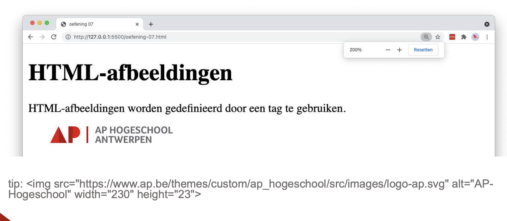
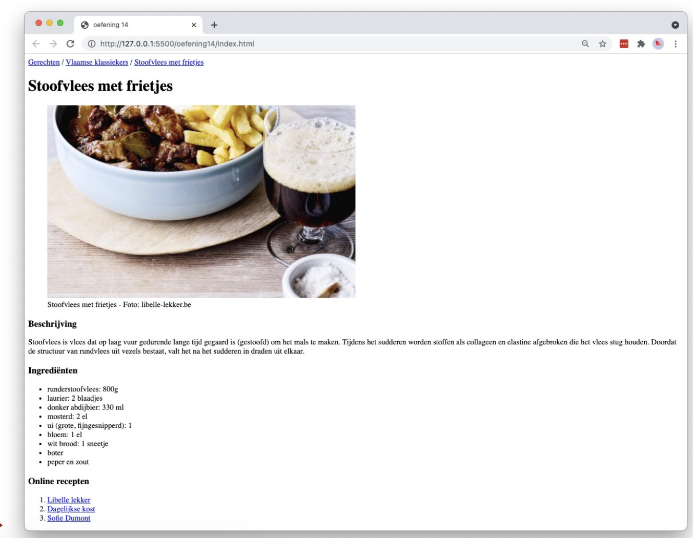

# Oefeningen labo 2

* Zorg dat Visual Studio Code en alle nodige extensies zijn geïnstalleerd (zie hoofdstuk [IDE](/ide.md))
* open Visual Studio Code.
* zet de volgende oefeningen om naar HTML5
* zet de naam van de oefening in de _head_ en in de _title_
* bewaar elke oefening als index.html (belangrijk).
* Klik op Go-live (Live server extensie)
* open het HTML-bestand in een browser (bezoek de URL _localhost:5500_)

> Maak voor deze oefeningen gebruik van de volgende content (= tekst en afbeeldingen):
> 
> [labo-2-bijlagen.zip](labo-2-bijlagen.zip)

## Verwijzingen (_links_)

### oefening 1

### oefening 2

### oefening 3

## Lijsten

### oefening 4

### oefening 5

### oefening 6

### oefening 7

### oefening 8

## Afbeeldingen

### oefening 9

### oefening 10
Kopieer oefening 9, en zorg dat er een link over de afbeelding heen ligt naar de website van AP (https://ap.be).

### oefening 11
Kopieer oefening 5 en voeg een afbeelding toe op onderstaande manier.

### oefening 12

### oefening 13

### oefening 14

### oefening 15

