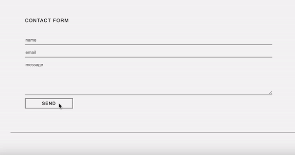
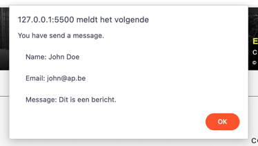
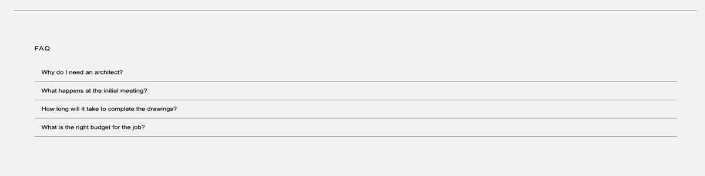

# Oefeningen labo 19 - Herhaling

Zorg dat je de volgende folder structuur volgt:

```
webtechnologie/
├─ labo-x/
│  ├─ oefening-01/
│  │  ├─ index.html
│  │  ├─ assets/
│  │  │  ├─ image-1.jpg 
│  │  │  ├─ data.json 
│  │  ├─ css/
│  │  │  ├─ reset.css
│  │  │  ├─ style.css
│  │  ├─ js/
│  │  │  ├─ script.js
│  ├─ oefening-02/
│  ├─ oefening-n/
├─ labo-y/
├─ labo-z/      
```

- Gebruik steeds JS modules om globale variabelen te vermijden (`<script type="module" src="./path/to/script.js" defer></script>`)
- Zet je Javascript file steeds in strict mode (`"use strict"`);
- Volg de [Coding Guidelines](https://apwt.gitbook.io/webtechnologie/coding-guidelines)

Voor deze oefeningen vertrek je vanuit het volgende startproject:


    De startbestanden


<figure><figcaption>Het startbestand</figcaption></figure>

## Oefening 1 - Formuliervalidatie

Je zal het formulier afhandelen in JavaScript.

**functionele analyse**

* Zorg dat een error-bericht wordt getoont wanneer een veld niet ingevuld is.
* Zorg dat een success-bericht wordt getoont wanneer alle velden juist ingevuld zijn met daarin de waardes van het name, email en message veld.

**technische analyse**

* Maak een map aan genaamd js met daarin een bestand form.js.
* Koppel het bestand form.js aan de index.html.
* Geef het form-element een id en haal het op in je form.js met querySelector.
* Voeg een submit-eventlistener toe aan form.
* Haal de 3 velden op en kijk na of ze zijn ingevuld.
* niet ingevuld: geef een foutmelding
* ingevuld: geef een succesmelding
* Toon de ingevulde waarden aan de gebruiker via een `alert`.

**voorbeeldinteractie**





## Oefening 2 - Frequently Asked Questions sectie (FAQ)

**functionele analyse**

* Maak een inklapbare FAQ met behulp van JavaScript.
* Voeg HTML toe zoals visueel weergegeven in de voorbeeldinteractie.
* Elk inklapbaar element bestaat uit:
* een button met class `collapsible`
* een p-element met class `context`

**technische analyse**

* Haal in faq.js alle elementen op met de klasse 'collapsible' en gebruik hierbij querySelectorAll.
* Loop over de array van elementen.
* Voeg voor elk element een 'click' eventlistener toe.
* Als er op een ingeklapt element wordt geklikt, wordt de inhoud zichtbaar.
* Als er op een opengeklapt element wordt geklikt, wordt de inhoud onzichtbaar.

**voorbeeldinteractie**



## Oefening 3 - Social media icons

**functionele analyse**

* Plaats de social media icons op het scherm vanuit JavaScript
* Voeg HTML toe zoals visueel weergegeven in de voorbeeldinteractie.
* Elk social media icon bestaat uit:
  * een li-element
  * een a-element met een juiste link
  * een img-element met een juist icoon

**technische analyse**

* Maak een `socials.js`-bestand aan en plaats hierin de volgende arrays:
```javascript
    const socialPlatforms = ["youtube", "instagram", "facebook", "twitter"];
    const socialLinks = ["https://www.youtube.com", "https://www.instagram.com/", "https://www.facebook.com/", "https://twitter.com/"];
```

* Selecteer de ul#socials en voeg hier per social media de nodige elementen aan toe
```javascript
    <li>
     <a href="https://www.youtube.com" target="_blank">
        
     </a>
    </li>
 ```

**voorbeeldinteractie**


