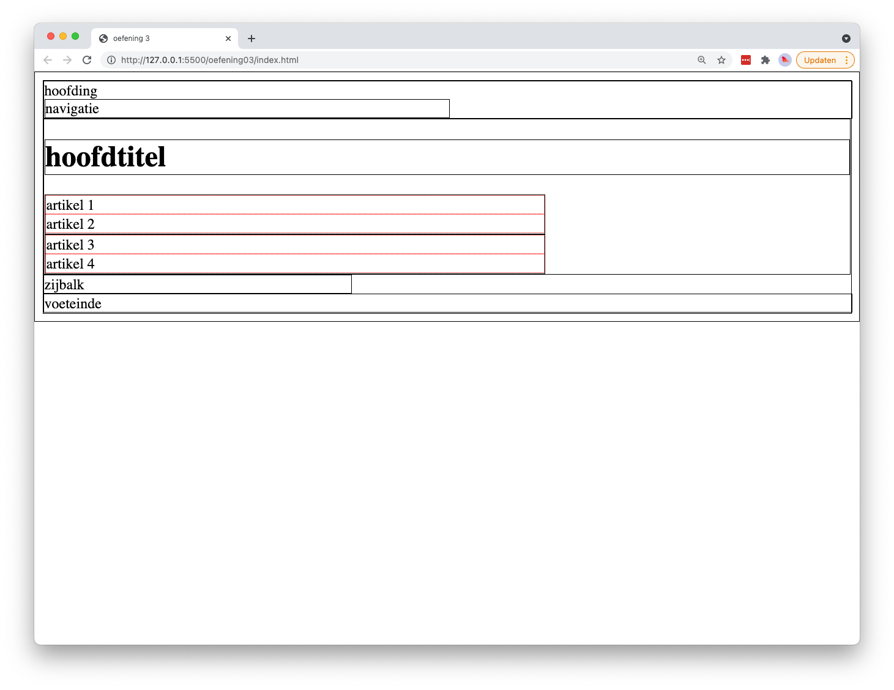
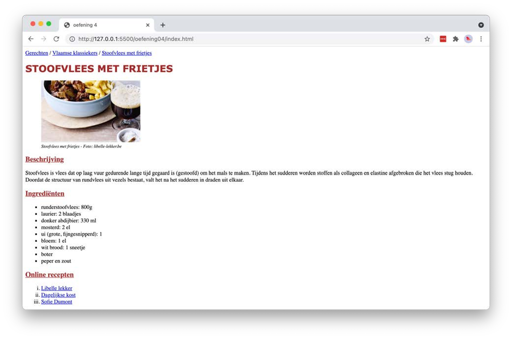
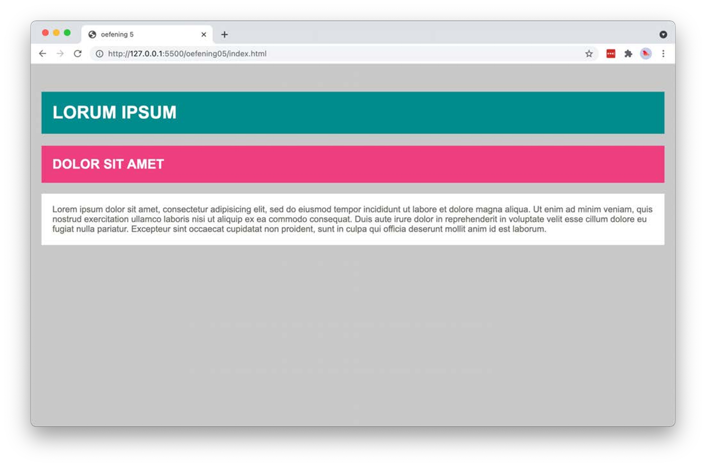

# Oefeningen labo 3

Zorg dat je de volgende folder structuur volgt:

```
webtechnologie/
├─ labo-01/
│  ├─ oefening-01/
│  │  ├─ index.html
│  │  ├─ images/
│  │  │  ├─ image-1.jpg 
│  │  │  ├─ image-n.jpg 
│  │  ├─ css/
│  │  │  ├─ style.css
│  ├─ oefening-02/
│  ├─ oefening-n/
├─ labo-02/
├─ labo-n/      
```

## oefening 1
* maak een nieuwe map “oefening-01” met daarin index.html
* maak een nieuwe map “css” in de map “oefening-01” met daarin style.css (css/style.css)
* plaats hierin een titel en een paragraaf met wat _"lorem ipsum"_ dummytekst
* verander de achtergrondkleur van het body-element naar rood
* zet het lettertype voor de titel op ‘Arial’
* de kleur van de paragraaftekst zet je op blauw


## oefening 2
* maak index.html in een nieuwe map “oefening-02”
* plaats een titel, ondertitel, 2 paragrafen en een afbeelding (images/placeholder.png)
* maak style.css in een nieuwe map css, in “oefening-02”
  * maak de titel 2.4rem groot
  * maak de ondertitel 1.8rem groot
  * zet beide titels in het rood en het vet
  * onderlijn enkel de ondertitel
  * zet de paragrafen op 1.2rem
  * geef de afbeelding een gestipte rode rand


## oefening 3

* index.html
  * gebruik de elementen voor een basis HTML5-website (header, nav, footer, section, article en aside)
  * geef elk element een logische classname (volg de [coding guidelines](coding-guidelines.md))

* css/style.css
  * plaats een zwarte, dunne kader rond elk element
  * laat de header en footer de volledige breedte innemen
  * de hoofdinhoud (section) neemt 62% in en de zijbalk (aside) 38%
  * de navigatie (nav) is de helft van de header
  * de article-elementen krijgen een gestipte rode kader



## oefening 4

Deze oefening is een vervolg op [Labo 2 - oefening 15](../LW1/labo2/oefeningen.md#oefening-15). Maak een nieuwe file index.html en kopieer hierin de HTML van oefening 15.

* style.css
  * alle teksten in body maken we standaard 14px
  * h1 staat in het lettertype ‘Verdana’, 24px, vet en bruin (brown) zijn en wordt automatisch in hoofdletters geplaatst
  * de ondertitels worden 18px, onderlijnd en bruin (brown)
  * de tekst bij de afbeelding is cursief en 11px groot
  * de afbeelding mag maximaal 250px breed zijn



## oefening 5

Maak het volgende design na. De kleuren mogen afwijken.


## oefening 6

Maak het volgende design na. De kleuren mogen afwijken, maar ze moeten wel van blauw naar rood gaan.


## oefening 7

Maak het volgende design na.


## oefening 8

Maak het volgende design na.


### body
*  lettertype Arial, Helvetica, sans-serif met een grootte van 1rem
* lijn de tekst uit, zowel links als rechts
*  titels worden gecentreerd en in hoofdletters gezet header
* zwarte achtergrondkleur en een witte tekstkleur
*  grootte lettertype van 2.5rem
*  padding zowel boven als onder van 60px

### header
* zwarte achtergrondkleur en een witte tekstkleur
* grootte lettertype van 2.5rem
* padding zowel boven als onder van 60px

### nav
* rode achtergrondkleur
* font grootte van 1.5rem
* padding zowel boven als onder van 30px
* border radius op de onderste hoeken van 10px
* geef links een witte kleur
### section
* padding zowel boven als onder van 60px
* padding zowel links als rechts van 30px

### footer
* achtergrondkleur #ccc
* font-grootte van 1rem
* padding zowel boven als onder van 60px
* padding zowel links als rechts van 30px
* zwarte rand van 5px met korte lijntjes (dashed)

## oefening 9

Maak het volgende design na.


### body
* lettertype Arial, Helvetica, sans-serif met een grootte van 1rem
* de tekst wordt gecentreerd
* titels worden in het vet gezet

### alle cirkels
* alle cirkels hebben een hoogte en breedte van 200px
* alle cirkels hebben een border radius van 50%
* alle cirkels hebben een zwarte rand van 10px
* alle cirkels hebben hun marge op automatisch staan (margin: auto)

### rode cirkel
* achtergrondkleur is rood 
* rand is doorlopend (solid)
### groene cirkel
* achtergrondkleur is groen 
* rand is dubbel (double)
### blauwe cirkel
* achtergrondkleur is blauw 
* rand is gestippeld (dashed)

## oefening 10
Probeer de volgende interactieve oefening om CSS selectors te oefenen: https://flukeout.github.io/