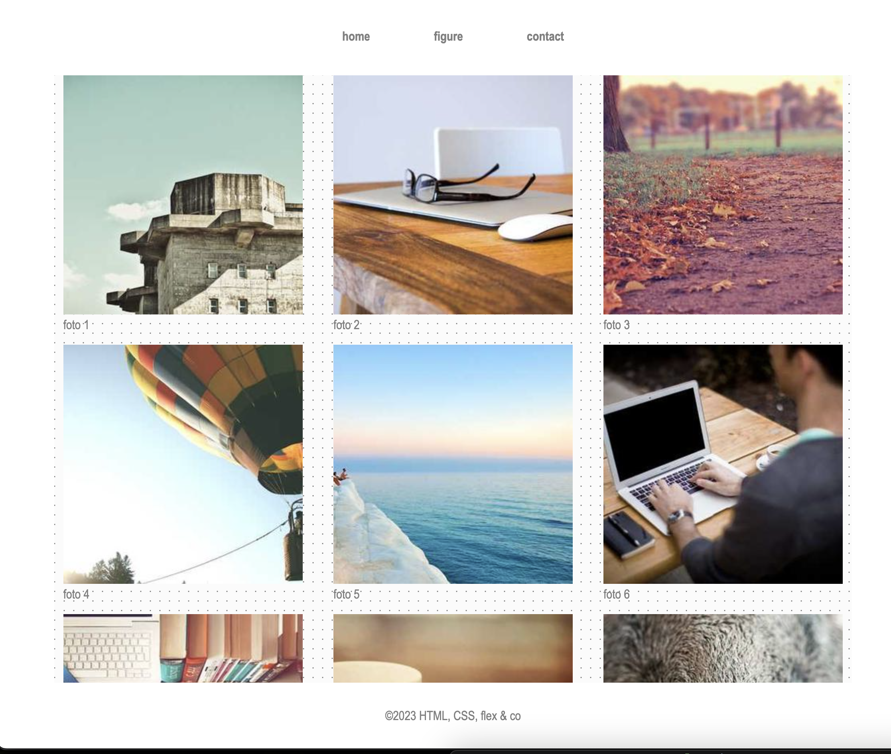
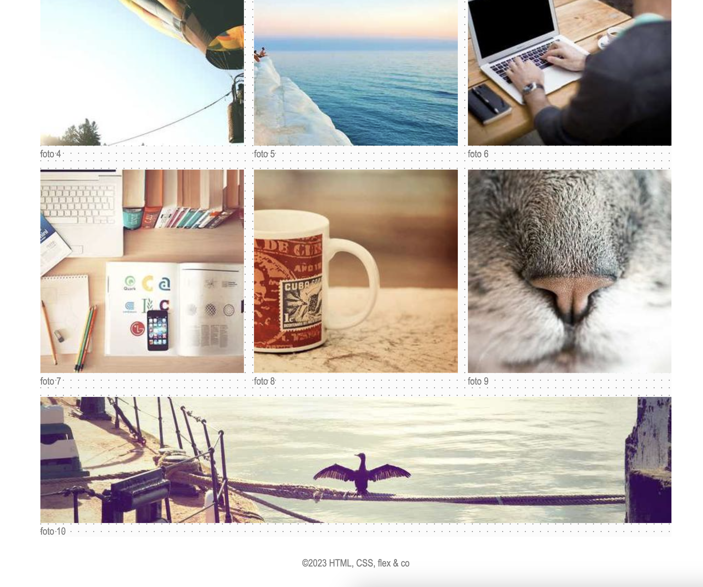
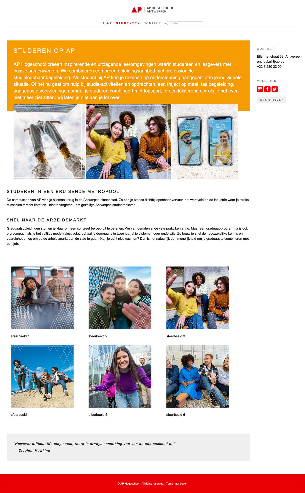
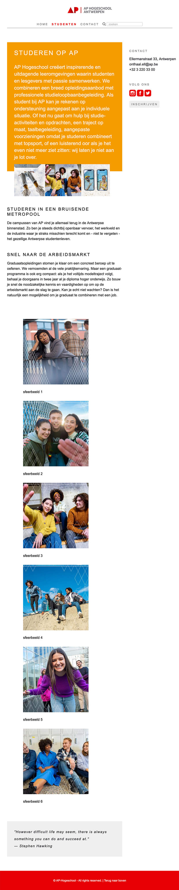

# Oefeningen labo 7

Voor deze oefeningen vertrek je telkens met een gelinkt reset.css bestand op basis van [The New CSS Reset](https://elad2412.github.io/the-new-css-reset/).

Zorg dat je de volgende folder structuur volgt:

```
webtechnologie/
├─ labo-01/
│  ├─ oefening-01/
│  │  ├─ index.html
│  │  ├─ images/
│  │  │  ├─ image-1.jpg 
│  │  │  ├─ image-n.jpg 
│  │  ├─ css/
│  │  │  ├─ style.css
│  ├─ oefening-02/
│  ├─ oefening-n/
├─ labo-02/
├─ labo-n/      
```

## oefening 1

Maak de preview van het flex-box model na.

* de body heeft een maximum breedte van 1000px en staat gecentreerd (gebruik `margin: 0 auto`)
* een main met daarin een section en 6 artikels (`article`)
* breedte van een flex-item is `350px`. Gebruik hiervoor flex-basis.
* zorg voor een gap van `20px`
* gebruik https://picsum.photos voor de foto. Zorg voor foto's van 1000x500px.
* lees meer heeft een link naar `#`
* font-family: Arial,...&#x20;
* nav staat ook in een flex
* kleur van links nav: `darkgray` en hoofdletters met css&#x20;
* achtergrondkleur van de section: `rgb (240, 240, 240)`

> **TIP**: Centreer de body door de linker en rechter marge op auto te zetten.

<figure><figcaption><p>oefening 1: desktop</p></figcaption></figure>

<figure><figcaption><p>oefening 1: tablet</p></figcaption></figure>

<figure><figcaption><p>oefening 1: mobile</p></figcaption></figure>

## oefening 2

Maak de preview van het flex-box model na.

* de body heeft een max-width van 1000px en staat gecentreerd (gebruik `margin: 0 auto`)
* zowel nav als main staan in een flex
* een `main` met daarin 8 paragrafen met een klasse `.item`
* main heeft een achtergrondkleur `lightgrey` en een achtergrondafbeelding die wordt herhaald ([link](css/natuurlijke-volgorde/flex/oefeningen.md#assets-oefening-3))
* het derde .item heeft een achtergrondkleur `rgba(139, 211, 146, 0.5)` en de eerste letter heeft een grote van `200%`
* de kleur van de links is `grey`
* lees meer heeft een link naar `#`&#x20;
* de breedte van de flex-items is automatisch.
* zorg dat er telkens twee flex-items langs elkaar komen te staan
* zorg voor een afstand van 20px tussen de flex-items.

> **TIP**: Bij de berekening van de breedte van een container wordt geen rekening gehouden met de (flex-)gap. Gebruik daarom voor deze oefening padding (op voorwaarde dat box-sizing op border-box staat, maar css reset doet dit al voor je) 

<figure><figcaption>oefening 2</figcaption></figure>

#### assets oefening 2


De achtergrondafbeelding die je gaat herhalen


### oefening 3

Maak de preview van het flex-box model na.&#x20;

* de body heeft een max-width van 1000px en staat gecentreerd (gebruik `margin: 0 auto`) 
* het lettertype over de gehele pagina is `Franklin Gothic Medium`,...&#x20; 
* voorzie een `main` met daarin 10 figures met met daarin telkens een afbeelding
* gebruik [Picsum.photos](https://picsum.photos) voor de foto's. Zorg voor foto's van 300x300px.
* geef de img een breedte van 100% van het figure element. 
* voorzie elke figure van een figcaption (foto 1, foto 2, foto 3, ...)

* zet nav en main in een flexbox.
* zorg dat elk flex-item een flex-basis van 30% heeft.
* zorg dat er 1rem ruimte tussen elk flex-item zit

* zet © om naar een HTML-entiteit in de footer 
* de footer is [sticky](https://developer.mozilla.org/en-US/docs/Web/CSS/Layout_cookbook/Sticky_footers) en heeft een witte achtergrond en een padding van `2rem`
* de main heeft een herhalende achtergrond afbeelding ([link naar assets](css/natuurlijke-volgorde/flex/oefeningen.md#assets-oefening-3))

<figure><figcaption><p>oefening 3</p></figcaption></figure>

#### assets oefening 3



### oefening 3b

* Kopieer voorgaande oefening
* Zorg er nu voor dat de laatste image de volledige breedte van de main inneemt (gebruik `flex-grow`)
* Zorg dat de laatste image breed genoeg is (1000px) maar niet te hoog (bv. 200px)

<figure><figcaption><p>oefening 3b</p></figcaption></figure>

### oefening 4

Vertrek voor deze oefening vanuit de volgende bestanden:


Maak een extra pagina `studenten.html` aan

* de pagina heeft structureel dezelfde opmaak als `index.html`
* tussen section `info` en de quote komt een section `portfolio`
* plaats in de section `portfolio` 6 afbeeldingen met bijhorende tekst (gebruik `display: flex`)
* elke figure heeft een afbeelding (breedte 432px) met alt en een `figcaption`&#x20;
* de te gebruiken afbeeldingen en teksten staan onderaan bij de assets ([link](css/natuurlijke-volgorde/flex/oefeningen.md#assets-oefening-4))
* op de figure staat een link naar “#”
* zet de nav met de menu-items in een flex

<figure><figcaption><p>oefening 4: desktop</p></figcaption></figure>

<figure><figcaption><p>oefening 4: tablet</p></figcaption></figure>

<figure><figcaption><p>oefening 4: mobiel</p></figcaption></figure>


#### assets oefening 4 <a href="#assets-oefening-4" id="assets-oefening-4"></a>

















