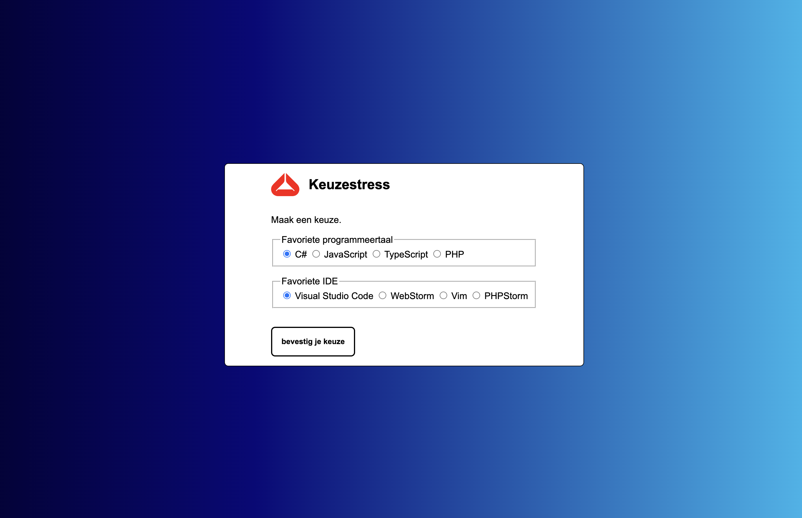
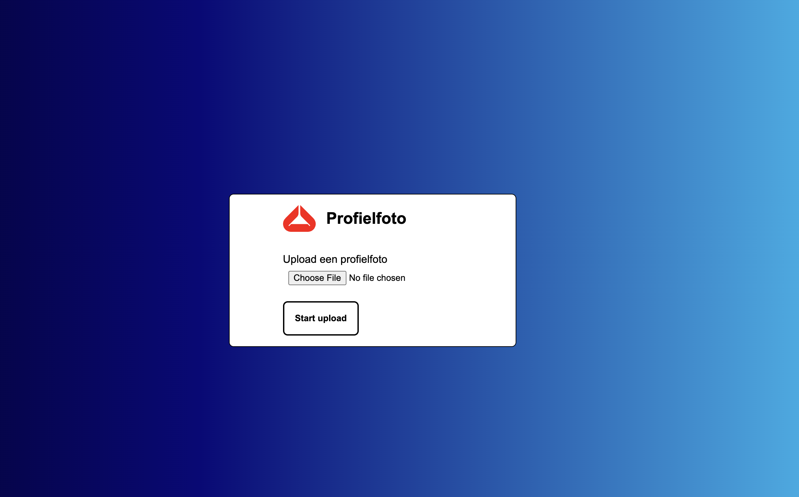
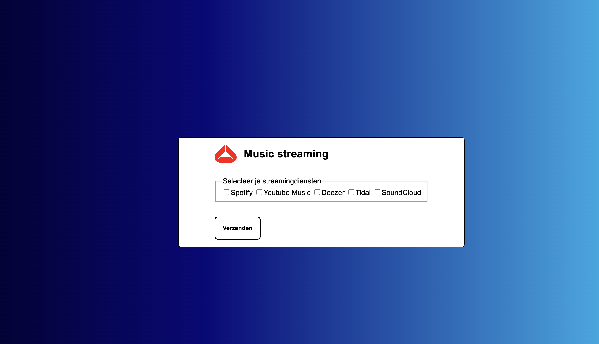
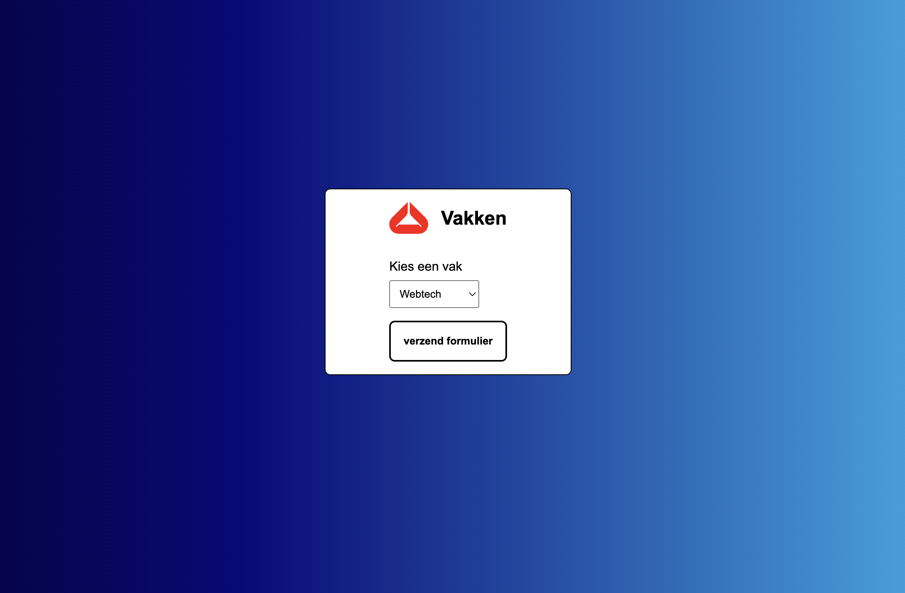

# oefeningen

- Zorg dat de body minstens 100vh hoog is.
- Voorzie de achtergrond van de body van een leuk gradient. Gebruik hiervoor een CSS gradient generator tool zoals [cssgradient.io](https://cssgradient.io/).
- Zorg dat de body children in het midden (verticaal + horizontaal) van de webpagina gecentreerd staan. Gebruik hiervoor CSS Grid

### oefening 1

Maak een formulier aan om de gebruiker een gebruikersnaam en wachtwoord in te laten geven. Baseer je op onderstaand voorbeeld.

- Zorg dat de inputs van het juiste type zijn. 
- Voorzie elk type input van een label en zorg dat de twee gelinkt zijn.
- Zet een container rond de header en het form en zorg ervoor dat deze een witte achtergrondkleur krijgt. Voorzie hierop ook een padding van 1rem verticaal en 5rem horizontaal.
- Zorg dat de labels en de inputs de volledige breedte innemen.
  > **TIP** - inputs en labels zijn _by default_ inline elementen. Pas dit aan met css.
- Geef elke input een gepaste placeholder value
- Geef het formulier een header met een logo en een titeltje. Je kunt [LogoIpsum](https://logoipsum.com/) gebruiken om een willekeurig logootje te linken. Zorg er voor dat deze verticaal uitgelijnd zijn.
-  
- Zorg ervoor dat de button en de inputs een mooie opmaak krijgen:
  - Voorzie een padding van 0.5rem
  - Voorzie een 2px volle zwarte border met een border-radius van 7px.
  - Wanneer de gebruiker over de input of button hovert en wanneer de focus in de input staat moet de input een paarse outline krijgen. Zorg voor dezelfde border-radius als de gewone border.

<figure><figcaption>Het beoogde resultaat oefening 1</figcaption></figure>

### oefening 2

Kopieer je oplossing van oefening 1 en pas het formulier vervolgens aan.
- Zorg dat de labels en inputs terug inline elementen worden.
- Zorg dat de gebruiker uit een lijst keuzerondjes (_radiobuttons_) zijn favoriete programmeertaal en IDE kan aanduiden.
- Zorg voor één fieldset en legend per vraag.
- Zorg dat de radio-buttons per vraag gelinkt zijn aan elkaar (gebruik unieke `name` attributes per vraag). De gebruiker moet maar 1 antwoord per vraag kunnen aanduiden.
- Zorg dat telkens het eerste resultaat _by default_ aangeduid is.

<figure><figcaption>Het beoogde resultaat oefening 2</figcaption></figure>


  Bekijk de video


### oefening 3

Kopieer je oplossing van oefening 1 en pas het formulier aan naar volgend voorbeeld.

<figure><figcaption>Het beoogde resultaat oefening 3</figcaption></figure>

### oefening 4

Kopieer je oplossing van oefening 1 en pas het formulier aan naar volgend voorbeeld.

<figure><figcaption>Het beoogde resultaat oefening 4</figcaption></figure>

### oefening 5

Kopieer je oplossing van oefening 1 en pas het formulier aan naar volgend voorbeeld.

<figure><figcaption>Het beoogde resultaat oefening 5</figcaption></figure>

### oefening 6

Maak het volgende formulier aan om op de website van AP te tonen die we hebben nagemaakt. Start hiervoor van het bestaande ontwerp uit het vorige labo.

* Pas de menu in de index.html aan en link naar de nieuwe pagina.&#x20;
* Voeg een zoek-functie toe in de menu met search (in een form).

Het formulier heeft 2 fieldsets en telkens een legend

* gegevens
* vraag
* vraag is gericht aan:
    * keuze: maak hier een keuze, secretariaat, graduaat IT, stuvo

<figure><figcaption></figcaption></figure>

**bijlagen:**


