# Oefeningen labo 15

Zorg dat je de volgende folder structuur volgt:

```
webtechnologie/
├─ labo-x/
│  ├─ oefening-01/
│  │  ├─ index.html
│  │  ├─ assets/
│  │  │  ├─ image-1.jpg 
│  │  │  ├─ image-n.jpg 
│  │  ├─ css/
│  │  │  ├─ reset.css
│  │  │  ├─ style.css
│  │  ├─ js/
│  │  │  ├─ script.js
│  ├─ oefening-02/
│  ├─ oefening-n/
├─ labo-y/
├─ labo-z/      
```

- Gebruik steeds JS modules om globale variabelen te vermijden (`<script type="module" src="./path/to/script.js" defer></script>`)
- Zet je Javascript file steeds in strict mode (`"use strict"`);
- Volg de [Coding Guidelines](https://apwt.gitbook.io/webtechnologie/coding-guidelines)

## Oefeningen arrays

### oefening 1: hello world!

**leerdoelen**

* een eigen JS-script kunnen uitvoeren in de browser
* console.log gebruiken

**functionele analyse** Het script gaat in de console van de browser de tekst `Hello world!` uitlezen.

**technische analyse** Maak een script.js-bestand aan. Koppel dit bestand aan jouw HTML-pagina (index.html) door middel van het `<script>`-element.

Maak een variabele aan met daarin de tekst "Hello world!".

Gebruik een `console.log`-statement om de inhoud van de variabele uit te lezen in de console van de browser.

**voorbeeldinteractie**

<figure><figcaption></figcaption></figure>

voorbeeldinteractie oefening 1

### oefening 2: teksten uitlezen

**Leerdoelen**

* console.log gebruiken
* string expressies

**functionele analyse** Het programma laat de informatie van de programmeur (jouw eigen informatie) zien in de console.

**technische analyse** Plaats jouw naam, leeftijd, e-mailadres en klasgroep in een variabele.

Gebruik vier `console.log`-statements om de informatie van de programmeur te laten zien in de console.

Tip: Gebruik string-manipulatie om de voorvoegsels (de woorden naam, leeftijd, e-mail en klasgroep) voor de variabele te plaatsen.

**voorbeeldinteractie**

<figure>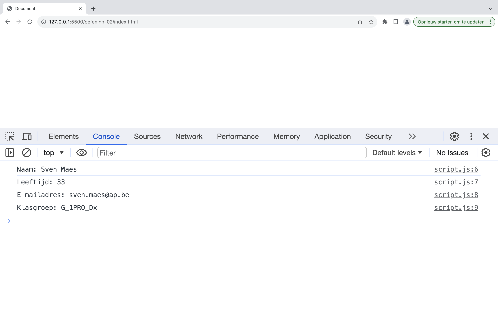<figcaption></figcaption></figure>

voorbeeldinteractie oefening 2

### oefening 3: getallen uitlezen

**Leerdoelen**

* console.log gebruiken
* getallen gebruiken

**functionele analyse** Het programma laat de berekende leeftijd van de programmeur (jouw eigen informatie) zien in de console.

**technische analyse** Plaats jouw **geboortejaar** in een variabele.

Bereken jouw leeftijd o.b.v. het jaartal van dit jaar en de inhoud van de variabele.

Lees enkel het resulaat uit met 1 `console.log`-statement.

**voorbeeldinteractie**

<figure>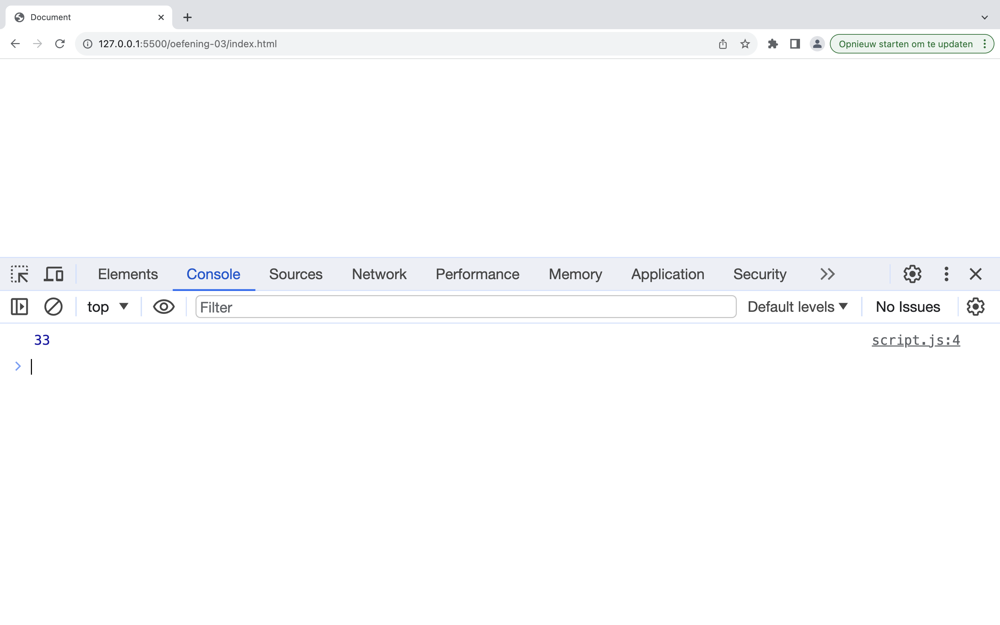<figcaption></figcaption></figure>

voorbeeldinteractie oefening 3: getallen krijgen een kleur in de console

### oefening 4: bmi berekenen

**leerdoelen**

* werken met variabelen
* expressies toevoegen
* console.log gebruiken

**functionele analyse** BMI berekenen aan de hand van hoogte en gewicht

**technische analyse** Maak een variabele `myWeight` en `myLength` waar je het gewicht in kg en de lengte in meter bijhoudt. Maak vervolgens een variabele `myBmi` die de bmi op de volgende manier berekend:


Je kan een getal afronden door [Number.toFixed()](https://developer.mozilla.org/en-US/docs/Web/JavaScript/Reference/Global_Objects/Number/toFixed) te gebruiken (bv. result.toFixed(2)).

**voorbeeldinteractie**

<figure>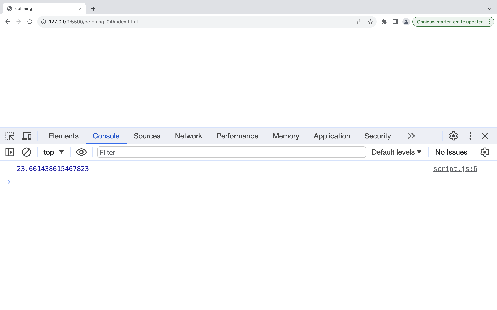<figcaption></figcaption></figure>

voorbeeldinteractie oefening 1: BMI tonen

### oefening 5: bmi-namen

**leerdoelen**

* variabelen
* expressies
* string expressies
* console.log

**functionele analyse** BMI berekenen aan de hand van hoogte en gewicht voor twee personen

**technische analyse** Pas de oefening aan over bmi zodat er een gewicht en een lengte variabele bestaat voor twee verschillende personen. Maak ook een variabele aan die de naam van de persoon bevat.

Toon de naam van de persoon met zijn bij behorende bmi op het scherm.

**voorbeeldinteractie**

<figure>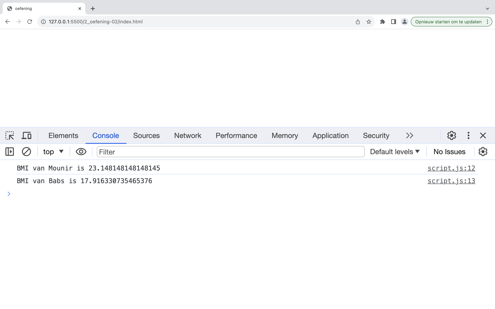<figcaption></figcaption></figure>

voorbeeldinteractie oefening 2: meerdere BMI's tonen

### oefening 6: bmi-namen uitbreiding

**leerdoelen**

* `Number.toFixed()` gebruiken

**functionele analyse** Het programma rond het BMI af tot een geheel getal

**technische analyse** Kopieer jouw oplossing van de vorige oefening.

Zorg ervoor dat de BMI deze keer afgrond is door `Number.toFixed()` te gebruiken.

**voorbeeldinteractie**

<figure>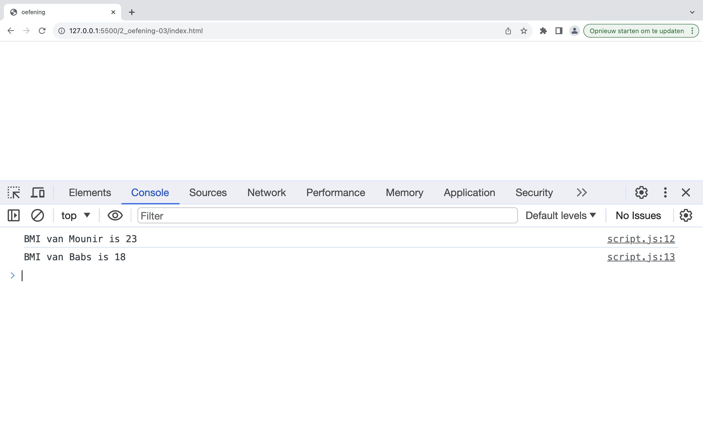<figcaption>voorbeeldinteractie oefening 3: afgeronde BMI's tonen</figcaption></figure>

### oefening 7: interest

**leerdoelen**

* string-interpolatie
* machtsverheffing

**functionele analyse** Je programma toont hoe veel je huidig bezit waard zal zijn over een vast aantal jaar, indien je een vaste rentevoet toepast.

**technische analyse** In je programma hou je je startbezit bij, de rentevoet en het aantal jaren. Je mag deze getallen in je code zetten.

De rentevoet bepaalt met welke hoeveelheid je bezit op een jaar stijgt. Bijvoorbeeld, als je rentevoet 2% is en je startbedrag is 100 euro:

* na één jaar bezit je 102 euro (er is 2% van 100 bij gekomen)
* na twee jaar bezit je 104,04 euro (er is 2% van 102 bij gekomen)
* enzovoort

Rond het eindbedrag af naar een geheel getal.



Eind saldo = Inleg \* ( 1 + rente)^looptijd



**voorbeeldinteractie**

<figure>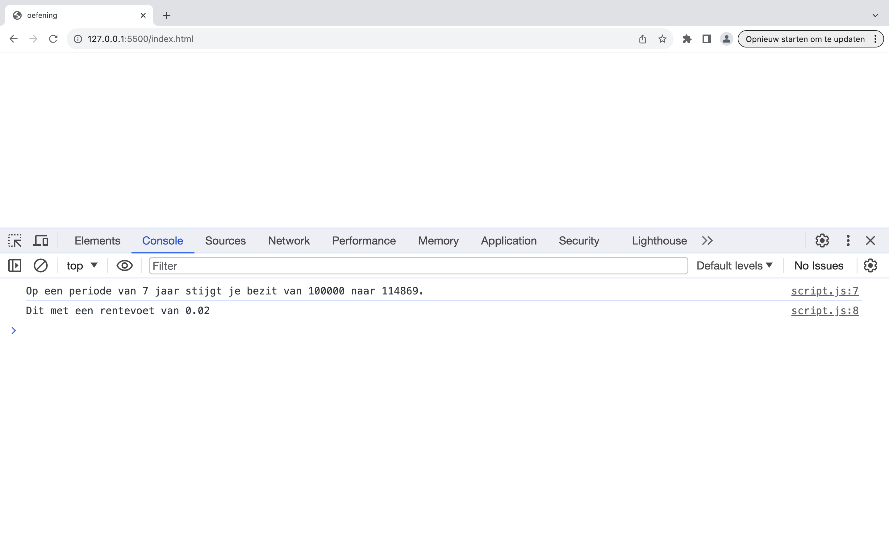<figcaption>voorbeeldinteractie oefening 4: interest berekenen</figcaption></figure>

### oefening 8: uren

**leerdoelen**

* gebruik maken van modulo

**functionele analyse** Je programma werkt als de kleine wijzer van een klok.

**technische analyse** In je programma maak je twee variabelen: één voor het huidige uur, één voor het aantal uur dat je hierbij wil optellen. Je hoeft hierbij de systeemklok niet te raadplegen. Vul gewoon een uur naar keuze in.

Je programma toont dan hoe laat het zal zijn als je de som maakt.

Let op: de klok telt maar 24 uur. Wat doe je als je hierboven gaat?

**voorbeeldinteractie**

<figure>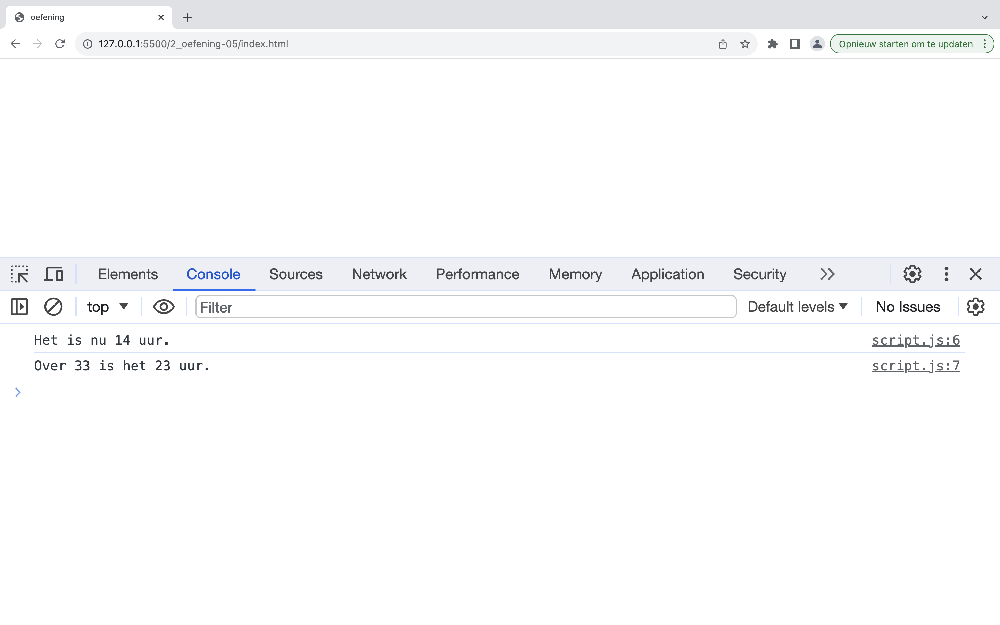<figcaption>voorbeeldinteractie oefening 5: uren berekenen</figcaption></figure>

### oefening 9: wisselgeld

**Leerdoelen**

* const gebruiken
* Math.ceil gebruiken
* expressies
* string-interpolatie

**functionele analyse** Je programma geeft weer hoeveel briefjes van 50 euro je nodig hebt om een bepaald bedrag te kunnen betalen. Het geeft ook weer wat het wisselgeld dan is.

**technische Analyse** Maak een constante `amountToPay` aan dat het te betalen bedrag bevat.

Bereken het aantal briefjes dat nodig is door het te betalen bedrag te delen door 50 en dit naar boven af te ronden. Zet het resultaat in een nieuwe constante `amountOf50s`.


Zoek even op het internet op hoe je getallen naar boven en naar beneden afrondt!


Bereken het wisselgeld en plaats het in een 3de constante `change`.

Print deze waarden af gebruikmakende van string concatinatie of string interpolatie.

**voorbeeldinteractie**

<figure>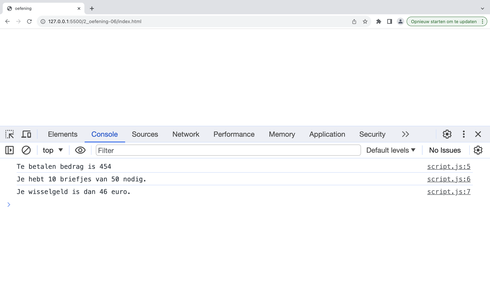<figcaption>voorbeeldinteractie oefening 6: wisselgeld berekenen</figcaption></figure>

### oefening 10: lotto

**leerdoelen**

* functionaliteit van strings (substring, replaceAll)

**functionele analyse** Haal de lotto getallen uit een tekst en geef ze op een overzichtelijke manier weer (gescheiden door een pipe-symbool |).

```javascript
let text =
  "De winnende lottonummers van deze week: 05,09,13,18,27,44. Proficiat aan alle deelnemers.";
```

**technische analyse**  Haal alle lottonummers uit bovenstaande tekst en zet ze in de varabele `lottoNumbers`.

Vervang de komma's door het pipe-symbool | en zet deze output in de variabele `formattedLottoNumbers`. Log vervolgens deze variabele.

**voorbeeldinteractie**

<figure><figcaption>voorbeeldinteractie oefening 10: lotto</figcaption></figure>

### oefening 11: name-from-mail

**leerdoelen**

* functionaliteit van strings (substring, indexOf, replace, toUpperCase)
* string-interpolatie

**Functionele analyse** Het programma toont het gedeelte van de e-mailadres dat de naam voorstelt.

**technische analyse** Het e-mailadres kan je in een variabele `email` plaatsen.

We veronderstellen dat de variabele een juist e-mailadres bevat. Het e-mailadres zal zich altijd in het ap.be domein bevinden.

**voorbeeldinteractie**

<figure>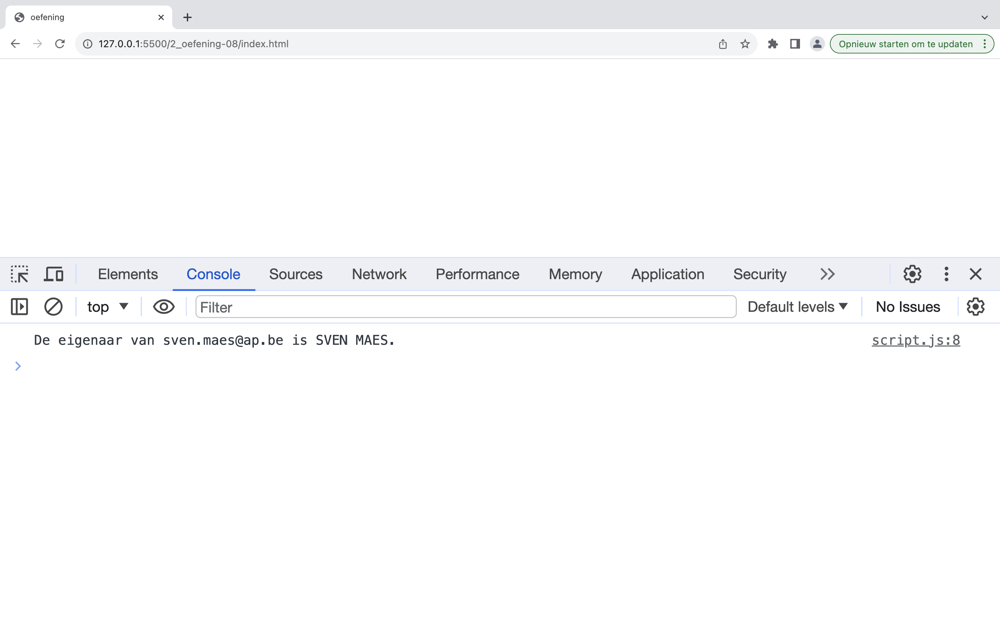<figcaption>voorbeeldinteractie oefening 8: e-mailadres</figcaption></figure>

### oefening 12: short-name

**leerdoelen**

* functionaliteit van strings (indexOf, replace)
* string-interpolatie

**functionele analyse** Je programma toont je voor en achternaam. Je voornaam moet afgekapt worden zodat enkel de eerste letter zichtbaar is. Achter deze letter moet een punt komen.

Voor en achternaam moeten getoond met in het begin een hoofdletter.

**technische analyse** Je voorziet twee variabelen voor voor- en achternaam. Daarna zorg je ervoor dat je enkel de eerste letter van de voornaam zichtbaar is.

Let er op dat de variabelen ook zonder hoofdletters kunnen ingegeven worden.

Je kan deze string opbouwen aan de hand van string interpolatie.

**voorbeeldinteractie**

<figure>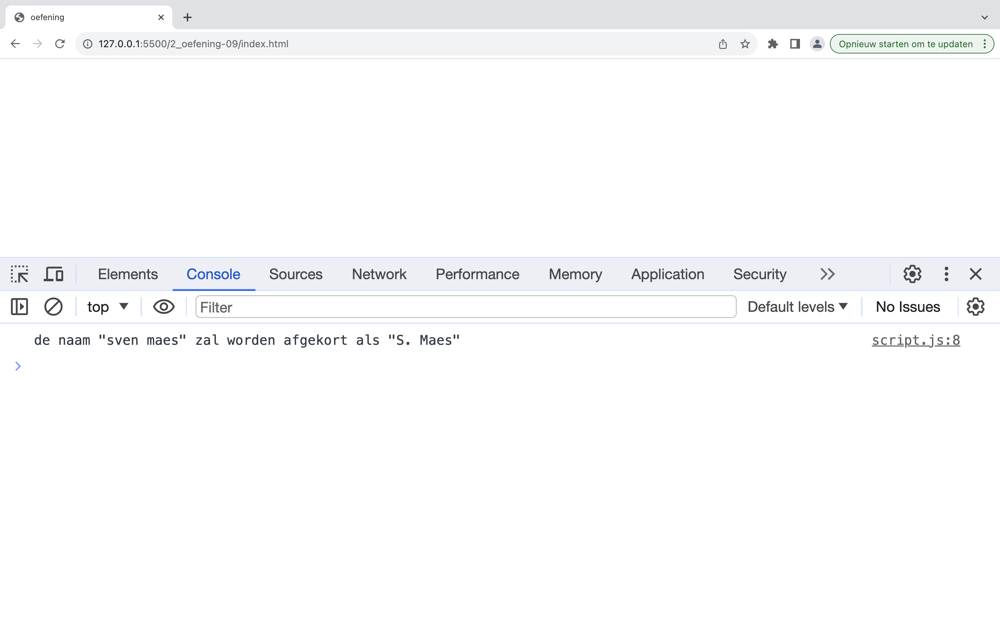<figcaption>voorbeeldinteractie oefening 9: naam</figcaption></figure>

### oefening 13: color-blind

**leerdoelen**

* functionaliteit van strings (replace)
* string-interpolatie

**functionele analyse** Je programma moet een tekst aanpassen wetende dat de schrijver van deze tekst een bepaalde vorm van kleuren blindheid heeft.

**technische analyse** De tekst waarvan de kleuren fout zijn kan je in een variabele `colorBlindText` plaatsen. Deze tekst is altijd lowercase.

De volgende kleuren worden foutief geschreven:

* blue -> red
* yellow -> green

Gelukkig wordt de fout maar in 1 richting gemaakt. De kleuren `red` en `yellow` worden wel correct aanzien.

Je mag er vanuit gaan dat elke kleur maar 1 keer voorkomt in de tekst.

**voorbeeldinteractie**

<figure>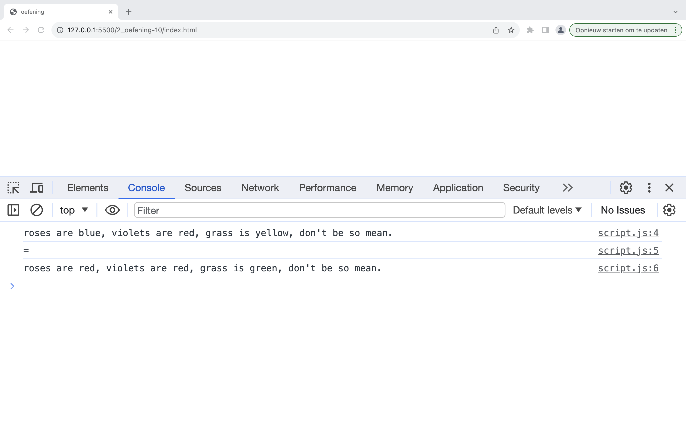<figcaption>voorbeeldinteractie oefening 10: colorblind</figcaption></figure>

### oefening 14: text-box

**leerdoelen**

* functionaliteit strings (replace)
* escapen van bepaalde karakters

**functionele analyse** Je programma toont een stuk tekst in je console in een tekstvak

**technische analyse** Je plaatst het stuk tekst in een variabele genaamd `text`.

Maak met de karakters \ / - en \_ een tekstvak.

Het stuk tekst moet altijd in het tekstvak passen. Je kan de lengte opvragen van de variabele tekst en er voor zorgen dat de - en \_ karakters herhaald worden.

Zorg ervoor dat je maar 1 console.log statement gebruikt. Je zal dus moeten gebruik maken van newlines.

**voorbeeldinteractie**

<figure>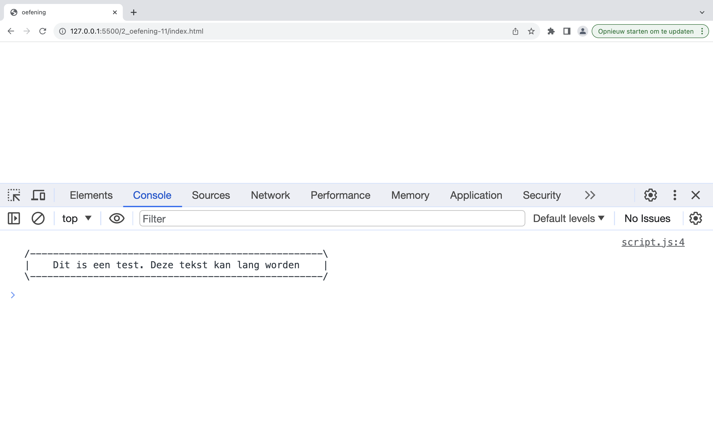<figcaption>voorbeeldinteractie oefening 11: text-box</figcaption></figure>

### oefening 15 (extra): color-blind

**leerdoelen**

* functionaliteit strings (replace, meerdere keren replace)
* escapen van karakters

**functionele analyse** De color-blind applicatie dient uitgebreid te worden zodat de foutieve kleur meerdere keren kan vervangen worden. De fout wordt nu wel ook in omgekeerde richting gemaakt.

**technische analyse** We kunnen de applicatie van color-blind overnemen en uitbreiden. We moeten er nu voor zorgen dat de kleuren meerdere keren worden vervangen.

De volgende kleuren worden foutief geschreven:

* blue -> red
* yellow -> green maar ook:
* red -> blue
* green -> yellow

Om te voorkomen dat een bepaalde kleur die al omgezet werd terug wordt omgezet naar het origineel vervangen we de kleur met de kleur in hoofdletters.

**voorbeeldinteractie**

```
roses are blue, violets are red, strawberries are blue and we always define variables with let
=
roses are red, violets are blue, strawberries are red and we always define variables with let.
```

### oefening 16 (extra) - Caesar rotation

**leerdoelen**

* functionaliteit strings (replace, meerdere keren replace)

**functionele analyse** We willen een programma maken dat geheimschrift decodeert dat gemaakt is aan de hand van de de Caesar-rotatie (rot13). De tekst is in **lowercase**.

**technische analyse** Je voorziet een variabele voor de inputString. Je zorgt dat de vertaling gebeurd volgens het volgende schema. Wij gebruiken hier wel alleen kleine letters.

<figure><figcaption></figcaption></figure>

Caesar-rotation

<figure><figcaption>
voorbeeldinteractie oefening 14: Caesar-rotation
</figcaption></figure>

## Oefeningen functies

Schrijf de volgende functies om aan te tonen dat je alle concepten onder de knie hebt:

* Schrijf een functie zonder argumenten die een getal teruggeeft.
* Schrijf een functie zonder argumenten die een string teruggeeft.
* Schrijf een functie zonder argumenten die een boolean teruggeeft.
* Schrijf een functie zonder argumenten die een string afprint in de console.
* Schrijf een functie met twee argumenten (twee getallen) die een getal op het scherm afprint. Het getal dat wordt getoond moet iets doen met deze twee getallen.

### oefening 1: text-box-functie

**leerdoelen**

* input lezen
* schrijven van eigen functies

**functionele analyse**

Je programma toont een stuk tekst in je console in een tekstvak

**technische analyse**

Je kan de code van **text-box** hergebruiken van de oefening uit [labo 13](../../LW7/labo13/oefeningen.md#oefening-14-text-box).

Je maakt een functie `printTextBox` met een string als parameter. De functie toont de tekst in het tekstvak.

Je roept de functie een aantal keer aan met verschillende parameters.

**voorbeeldinteractie**

<figure><figcaption></figcaption></figure>

### oefening 2: name-from-email-functie

**leerdoelen**

* input lezen
* lussen
* schrijven van eigen functies

**functionele analyse**

Het programma toont het gedeelte van de e-mailadres dat de naam voorstelt.

**technische analyse**

Je kan de code van **name-from-mail** hergebruiken uit [labo 13](../../LW7/labo13/oefeningen.md#oefening-13-color-blind)..

Je maakt een functie `nameFromEmail` met 1 parameter die een email adres bevat. Deze functie geeft de voor en de achternaam terug in hoofdletters.

Je vraagt de gebruiker op een interactieve manier achter zijn email adres.

Je blijft een email adres vragen totdat deze een lege string ingeeft.

**voorbeeldinteractie**

<figure><figcaption></figcaption></figure>

### oefening 3: maaltafel-functie

**leerdoelen**

* gebruiken van lussen
* schrijven van eigen functies

**functionele analyse**

Je programma print de maaltafels van 1 tot en met 10 af (met 10 iteraties)

**technische analyse**

Je kan de code van _maaltafel_ hergebruiken van het onderdeel for-while.

Je maakt een functie `printMaaltafel` met 2 parameters: getal en iteraties. Deze functie print de maaltafel af van het gegeven getal en iteraties. De functie geeft niets terug en print enkel deze maaltafel af.

Zorg ervoor dat je voor de getallen 1 tot en met 10 de maaltafel afprint.

Je kan de getallen mooi oplijnen aan de hand van het  karakter. Zorg voor een 3de optionele parameter `separator` waarmee je de separator mee kan geven. Zorg voor een default  waarde voor deze separator als deze niet opgegeven wordt

**voorbeeldinteractie**

<figure><figcaption></figcaption></figure>

### oefening 4: schrikkeljaar-functie

**leerdoelen**

* gebruiken van lussen
* schrijven van eigen functies

**functionele analyse**

Je programma toont een overzicht van alle schrikkeljaren tussen 1950 en het huidge jaartal.

**technische analyse**

Je kan de code die nakijkt of een jaartal een schrikkeljaar is hergebruiken uit het onderdeel beslissingen.

Je maakt een functie `isLeapYear` die 1 parameter aanvaardt met het jaartal en de functie geeft true terug als het een schrikkeljaar is en false als het geen schrikkeljaar is. Reminder: een schrikkeljaar is elk veelvoud van 400, alsook elk ander getal dat een veelvoud is van 4 maar niet van 100.

Je gebruikt een lus om voor de jaartallen tussen 1950 en dit jaar te berekenen of het een schrikkeljaar is of niet. Je print het jaar af als het een schrikkeljaar is.

Je kan het huidige jaar verkrijgen met de volgende code

```js
new Date().getFullYear();
```

**voorbeeldinteractie**

<figure><figcaption></figcaption></figure>

### oefening 5: array-sum

**leerdoelen**

* gebruiken van lussen
* schrijven van eigen functies
* arrays

**functionele analyse**

Je programma berekent de som van een array

**technische analyse**

Je maakt een functie `sum` die een array inneemt als parameter.

Print in deze functie eerst de array af met `console.log`;

Deze functie zal een `for` lus bevatten die de som berekent van de getallen in de array.

Deze functie geeft de som van de getallen in de array terug.

**voorbeeldinteractie**

<figure><figcaption></figcaption></figure>
