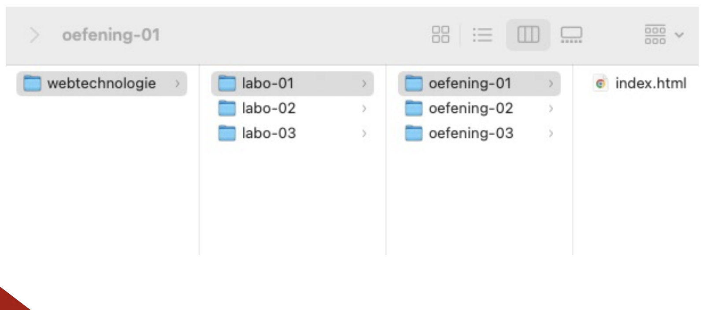
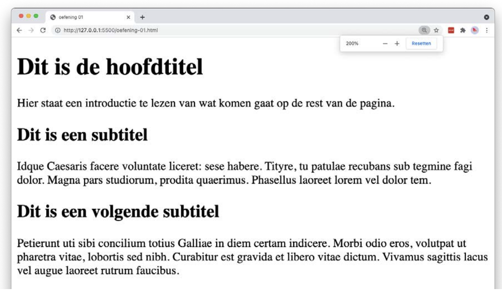
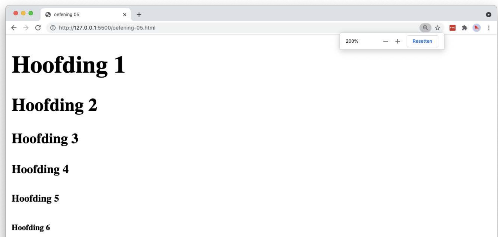
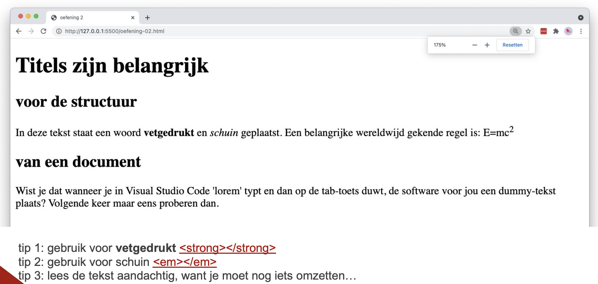
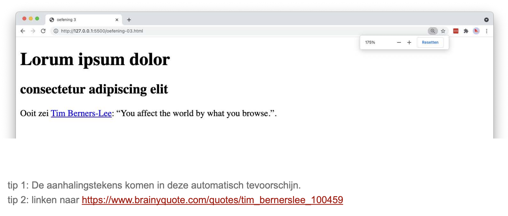
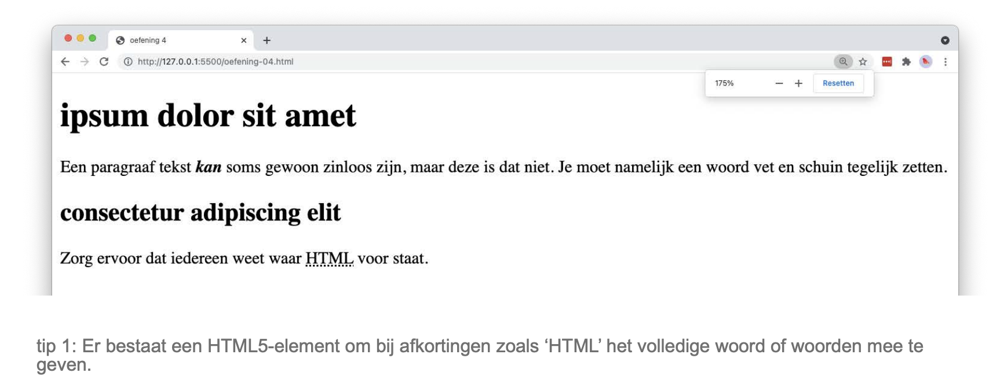
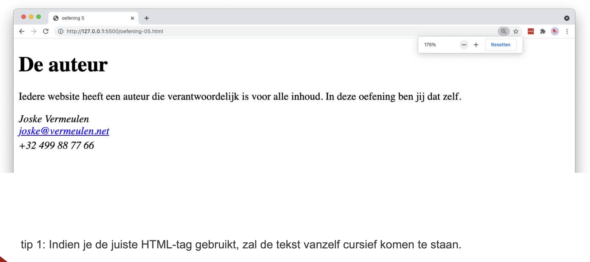

# Oefeningen labo 1

* Zorg dat Visual Studio Code en alle nodige extensies zijn geïnstalleerd (zie hoofdstuk [IDE](/ide.md))
* open Visual Studio Code.

* maak ergens op je computer een mapje "webtechnologie" aan met daaronder een mapje per labo zoals in onderstaande afbeelding.

* zet de volgende oefeningen om naar HTML5
* zet de naam van de oefening in de _head_ en in de _title_
* bewaar elke oefening als index.html (belangrijk).
* Klik op Go-live (Live server extensie)
* open het HTML-bestand in een browser (bezoek de URL _localhost:5500_)

## HTML basis

### oefening 1

### oefening 2

### oefening 3

### oefening 4

### oefening 5

### oefening 6
