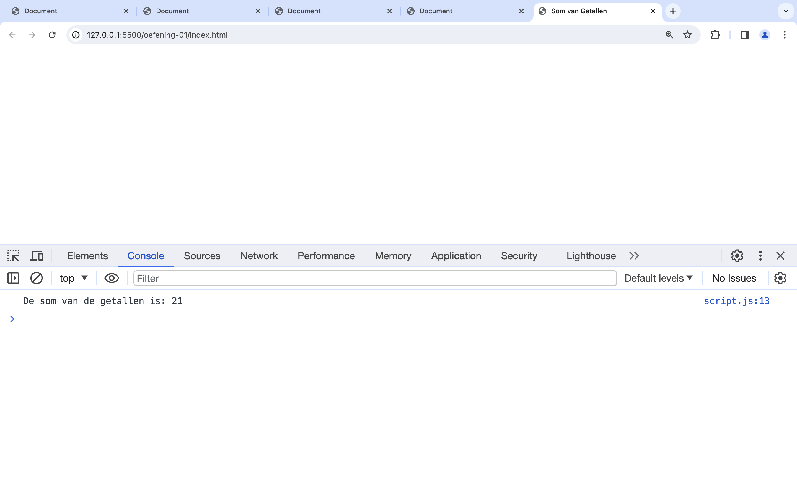
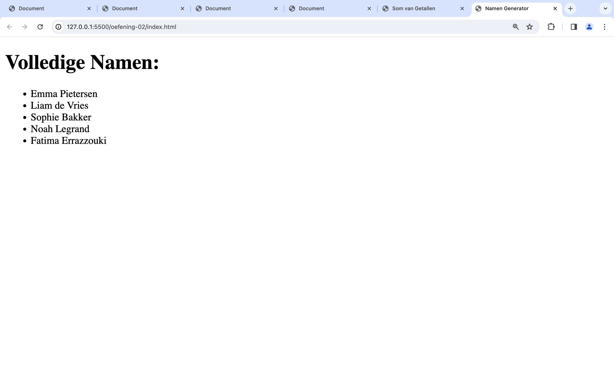
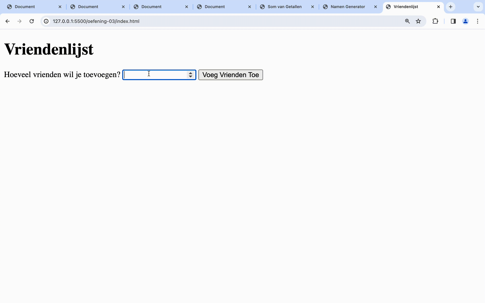
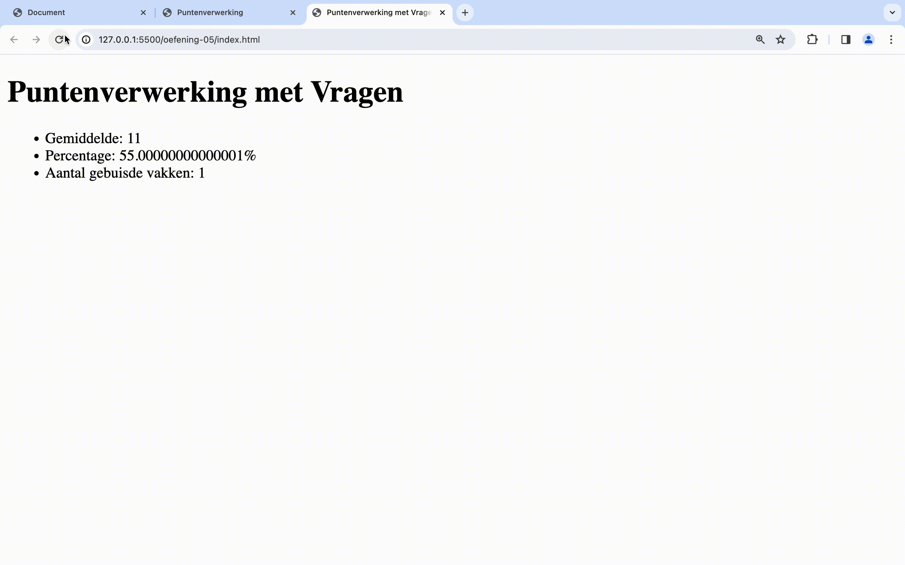

# Oefeningen labo 15

Zorg dat je de volgende folder structuur volgt:

```
webtechnologie/
├─ labo-x/
│  ├─ oefening-01/
│  │  ├─ index.html
│  │  ├─ assets/
│  │  │  ├─ image-1.jpg 
│  │  │  ├─ image-n.jpg 
│  │  ├─ css/
│  │  │  ├─ reset.css
│  │  │  ├─ style.css
│  │  ├─ js/
│  │  │  ├─ script.js
│  ├─ oefening-02/
│  ├─ oefening-n/
├─ labo-y/
├─ labo-z/      
```

- Gebruik steeds JS modules om globale variabelen te vermijden (`<script type="module" src="./path/to/script.js" defer></script>`)
- Zet je Javascript file steeds in strict mode (`"use strict"`);
- Volg de [Coding Guidelines](https://apwt.gitbook.io/webtechnologie/coding-guidelines)

## Oefeningen arrays

### oefening 1: som

**leerdoelen**

* werken met arrays
* lengte van arrays opvragen
* arrays doorlopen met een for-loop

**functionele analyse**

Je programma geeft de som van een rij getallen terug.

**technische analyse**

Je begint met een `array` te maken van de getallen 1, 2, 3, 4, 5 en 6. Je maakt een variabele `som` en kent er de waarde 0 aan toe.

Vervolgens maak je een lus die van 0 tot het aantal getallen in de array itereert. Elke iteratie tel je het huidige getal op bij een variabele som.

De som print je af op in de console.

**voorbeeldinteractie**

<figure><figcaption></figcaption></figure>

### oefening 2: namen

**leerdoelen**

* werken met arrays
* lengte van arrays opvragen
* arrays doorlopen met een for-loop

**functionele analyse**

Je programma genereert op basis van 2 arrays een lijst van voor- en achternamen.

**technische analyse**

Maak 2 string-arrays aan. De eerste geef je 5 voornamen, de andere 5 achternamen.

Controleer dat de lengte van beide arrays gelijk is. Zo niet print je een foutboodschap.

Gebruik een for-loop om door de lijst van namen te loopen.

Toon vervolgens een lijst uit met voor- en achternamen op de scherm van de browser.

**voorbeeldinteractie**

<figure><figcaption></figcaption></figure>

### oefening 3: vrienden

**leerdoelen**

* werken met gebruikersinteractie
* werken met for-loop
* toevoegen van elementen in een array

**functionele analyse**

Je programma vraagt hoeveel vrienden er moeten worden ingevoerd. Op basis daarvan kan je daarna je vrienden toevoegen aan een lijst. Nadien wordt de lijst uitgeprint (laatste ingave eerst).

**technische analyse**

Vraag de gebruiker hoeveel namen er moeten worden ingegeven. Maak hiervoor gebruik van input-veld.

Vraag dan X aantal keer de naam van de vriend dat je wenst toe te voegen. **Hint**: je kan voor deze oefening `prompt()` gebruiken om de gebruiker te vragen achter de namen.

Voeg de vrienden toe aan een array van vrienden.

Toon vervolgens de lijst met vrienden in een lijst.

**voorbeeldinteractie**

<figure><figcaption></figcaption></figure>

### oefening 4: punten

**leerdoelen**

* werken met for-of-loop
* werken met arrays
* wiskundige bewerkingen

**functionele analyse**

Je programma verwerkt een puntenlijst aan resultaten en print het gemiddelde, het percentage en het aantal gebuisde vakken uit.

**technische analyse**

Gebruik voor deze oefening volgende array:

```
const grades = [16,12,16,7,17,14,9,8,18,12];
```

Gebruik een for-of-loop om door de grades te loopen.

Bereken het gemiddelde, het percentage en het aantal gebuisde vakken.

Toon deze waardes op het scherm in een lijst.

**voorbeeldinteractie**

<figure><figcaption></figcaption></figure>

### oefening 5: punten met vragen

**leerdoelen**

* gebruiken van do while loop
* werken met arrays
* input vragen

**functionele analyse**

Je breidt de punten oefening uit zodat de gebruiker zelf de punten kan ingeven.

**technische analyse**

Schrijf eerst een do while loop om de punten te vragen. Op de moment dat de gebruiker geen getal meer ingeeft dan worden dezelfde waarden getoond aan de gebruiker als in de vorige oefening.

**voorbeeldinteractie**

<figure><figcaption></figcaption></figure>

### oefening 6: pokémon team

**leerdoelen**

* gebruiken van loops
* werken met arrays
* zoeken in arrays

**functionele analyse**

Je programma maakt het mogelijk om de gebruiker een team van pokémon samen te stellen.

**technische analyse**

Gegeven is de volgende array van 20 pokemon:

```
let pokemon = [
    "Bulbasaur",
    "Ivysaur",
    "Venusaur",
    "Charmander",
    "Charmeleon",
    "Charizard",
    "Squirtle",
    "Wartortle",
    "Blastoise",
    "Caterpie",
    "Metapod",
    "Butterfree",
    "Weedle",
    "Kakuna",
    "Beedrill",
    "Pidgey",
    "Pidgeotto",
    "Pidgeot",
    "Rattata",
    "Raticate",
    "Spearow",
];
```

* Maak een array `team`. Deze array bevat de pokémon van de gebruiker van het programma.
* Gebruik een lus om de pokémon in een genummerde lijst te tonen aan de gebruiker.

```
1. Bulbasaur
2. Ivysaur
3. Venusaur
4. Charmander
5. Charmeleon
...
```

* Vraag daarna aan de gebruiker welke pokémon er moet toegevoegd worden aan het team. Dit doe je aan de hand van de index van de pokemon. Dit doe je tot de gebruiker STOP ingeeft. Je kan dit doen aan de hand van een `do while` loop.

```
Welke pokemon wil je in je team? [1-21]: 4
Welke pokemon wil je in je team? [1-21]: 3
Welke pokemon wil je in je team? [1-21]: STOP
```

* Als de gebruiker een pokémon ingeeft die al in het team zet dan krijgt hij hiervan een melding en wordt de pokémon niet toegevoegd:

```
Welke pokemon wil je in je team? [1-20]: 4
Welke pokemon wil je in je team? [1-20]: 3
Welke pokemon wil je in je team? [1-20]: 4
Deze pokemon zit al in je team
Welke pokemon wil je in je team? [1-20]: 2
Welke pokemon wil je in je team? [1-20]: STOP
```

* Als de pokémon niet bekend is (dus het ingegeven nummer groter is dan de lengte van de array) wordt er ook een melding gegeven:

```
Welke pokemon wil je in je team? [1-21]: 22
Deze pokemon ken ik niet
Welke pokemon wil je in je team? [1-21]: 4
```

* Als je STOP hebt ingegeven dan wordt het team van de gebruiker op het scherm getoond:

```
Welke pokemon wil je in je team? [0-20]: 1
Welke pokemon wil je in je team? [0-20]: 2
Welke pokemon wil je in je team? [0-20]: 3
Welke pokemon wil je in je team? [0-20]: 4
Welke pokemon wil je in je team? [0-20]: 5
Welke pokemon wil je in je team? [0-20]: 6
Welke pokemon wil je in je team? [0-20]: STOP
Jouw team van pokemon is: 
1. Ivysaur
2. Venusaur
3. Charmander
4. Charmeleon
5. Charizard
6. Squirtle
```

**voorbeeld interactie**

<figure><figcaption></figcaption></figure>

### oefening 7: twee dimensionale som

**leerdoelen**

* twee dimensionale arrays

**functionele analyse**

We gaan de som berekenen van alle waarden van een tabel (of tweedimensionale array).

**technische analyse**

We beginnen met de volgende twee dimensionele array:

```
let spreadsheet = [
    [100, 104, 105],
    [144, 110, 109],
    [105, 107, 111]
];
```

* Maak een variabele `sumRow1` en ken de som van de drie elementen van de eerste rij hieraan toe.
* Print de som uit op het scherm.
* Doe hetzelfde voor de andere rijen.

**voorbeeldinteractie**

<figure><figcaption></figcaption></figure>

## Oefeningen functies

Schrijf de volgende functies om aan te tonen dat je alle concepten onder de knie hebt:

* Schrijf een functie zonder argumenten die een getal teruggeeft.
* Schrijf een functie zonder argumenten die een string teruggeeft.
* Schrijf een functie zonder argumenten die een boolean teruggeeft.
* Schrijf een functie zonder argumenten die een string afprint in de console.
* Schrijf een functie met twee argumenten (twee getallen) die een getal op het scherm afprint. Het getal dat wordt getoond moet iets doen met deze twee getallen.

## oefening 1: text-box-functie

**leerdoelen**

* input lezen
* schrijven van eigen functies

**functionele analyse**

Je programma toont een stuk tekst in je console in een tekstvak

**technische analyse**

Je kan de code van **text-box** hergebruiken van de oefening uit [labo 13](../../LW7/labo13/oefeningen.md#oefening-14-text-box).

Je maakt een functie `printTextBox` met een string als parameter. De functie toont de tekst in het tekstvak.

Je roept de functie een aantal keer aan met verschillende parameters.

**voorbeeldinteractie**

<figure><figcaption></figcaption></figure>

## oefening 2: name-from-email-functie

**leerdoelen**

* input lezen
* lussen
* schrijven van eigen functies

**functionele analyse**

Het programma toont het gedeelte van de e-mailadres dat de naam voorstelt.

**technische analyse**

Je kan de code van **name-from-mail** hergebruiken uit [labo 13](../../LW7/labo13/oefeningen.md#oefening-13-color-blind)..

Je maakt een functie `nameFromEmail` met 1 parameter die een email adres bevat. Deze functie geeft de voor en de achternaam terug in hoofdletters.

Je vraagt de gebruiker op een interactieve manier achter zijn email adres.

Je blijft een email adres vragen totdat deze een lege string ingeeft.

**voorbeeldinteractie**

<figure><figcaption></figcaption></figure>

## oefening 3: maaltafel-functie

**leerdoelen**

* gebruiken van lussen
* schrijven van eigen functies

**functionele analyse**

Je programma print de maaltafels van 1 tot en met 10 af (met 10 iteraties)

**technische analyse**

Je kan de code van _maaltafel_ hergebruiken van het onderdeel for-while.

Je maakt een functie `printMaaltafel` met 2 parameters: getal en iteraties. Deze functie print de maaltafel af van het gegeven getal en iteraties. De functie geeft niets terug en print enkel deze maaltafel af.

Zorg ervoor dat je voor de getallen 1 tot en met 10 de maaltafel afprint.

Je kan de getallen mooi oplijnen aan de hand van het  karakter. Zorg voor een 3de optionele parameter `separator` waarmee je de separator mee kan geven. Zorg voor een default  waarde voor deze separator als deze niet opgegeven wordt

**voorbeeldinteractie**

<figure><figcaption></figcaption></figure>

## oefening 4: schrikkeljaar-functie

**leerdoelen**

* gebruiken van lussen
* schrijven van eigen functies

**functionele analyse**

Je programma toont een overzicht van alle schrikkeljaren tussen 1950 en het huidge jaartal.

**technische analyse**

Je kan de code die nakijkt of een jaartal een schrikkeljaar is hergebruiken uit het onderdeel beslissingen.

Je maakt een functie `isLeapYear` die 1 parameter aanvaardt met het jaartal en de functie geeft true terug als het een schrikkeljaar is en false als het geen schrikkeljaar is. Reminder: een schrikkeljaar is elk veelvoud van 400, alsook elk ander getal dat een veelvoud is van 4 maar niet van 100.

Je gebruikt een lus om voor de jaartallen tussen 1950 en dit jaar te berekenen of het een schrikkeljaar is of niet. Je print het jaar af als het een schrikkeljaar is.

Je kan het huidige jaar verkrijgen met de volgende code

```js
new Date().getFullYear();
```

**voorbeeldinteractie**

<figure><figcaption></figcaption></figure>

## oefening 5: array-sum

**leerdoelen**

* gebruiken van lussen
* schrijven van eigen functies
* arrays

**functionele analyse**

Je programma berekent de som van een array

**technische analyse**

Je maakt een functie `sum` die een array inneemt als parameter.

Print in deze functie eerst de array af met `console.log`;

Deze functie zal een `for` lus bevatten die de som berekent van de getallen in de array.

Deze functie geeft de som van de getallen in de array terug.

**voorbeeldinteractie**

<figure><figcaption></figcaption></figure>
