# Oefeningen labo 2

* Zorg dat Visual Studio Code en alle nodige extensies zijn geïnstalleerd (zie hoofdstuk [IDE](/ide.md))
* open Visual Studio Code.
* zet de volgende oefeningen om naar HTML5
* zet de naam van de oefening in de _head_ en in de _title_
* bewaar elke oefening als index.html (belangrijk).
* Klik op Go-live (Live server extensie)
* open het HTML-bestand in een browser (bezoek de URL _localhost:5500_)

> Maak voor oefeningen 1 tot en met 15 gebruik van de volgende _content_ 
> [labo-2-bijlagen.zip](labo-2-bijlagen.zip)

## Verwijzingen (_links_)

De volgende oefeningen kan je enkel maken als je de theorie hebt doorgenomen t.e.m. het onderdeel Verwijzingen!

### oefening 1
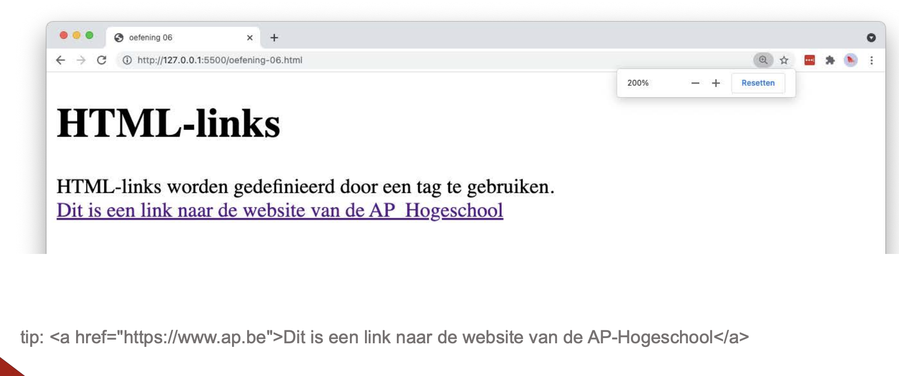

### oefening 2
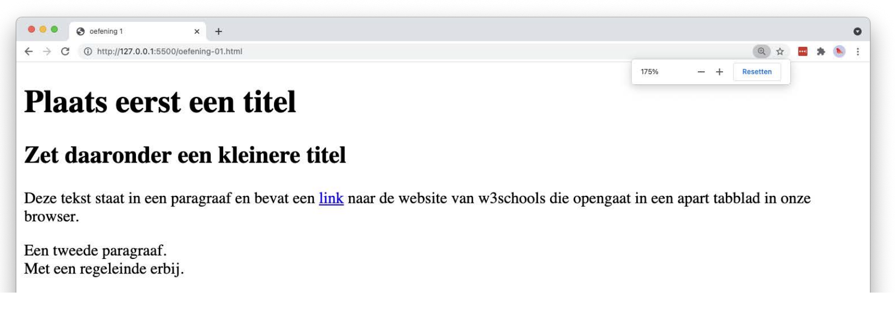

### oefening 3
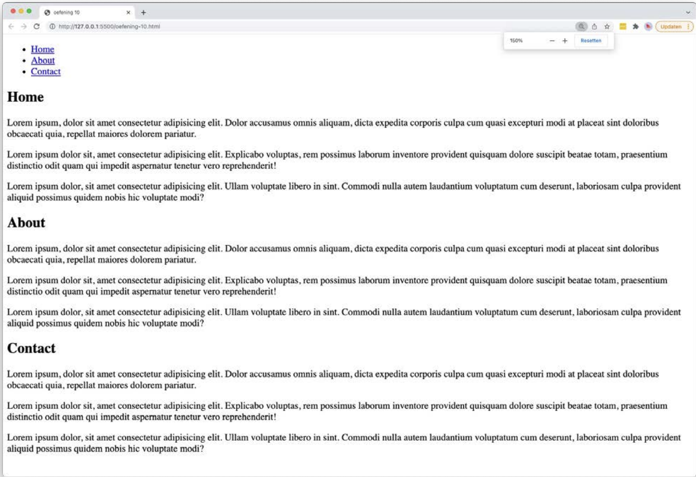

## Lijsten

### oefening 4
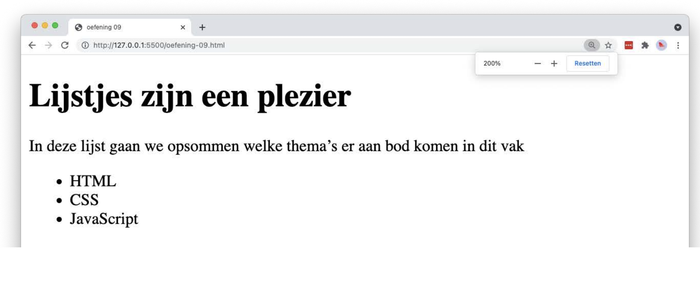

### oefening 5
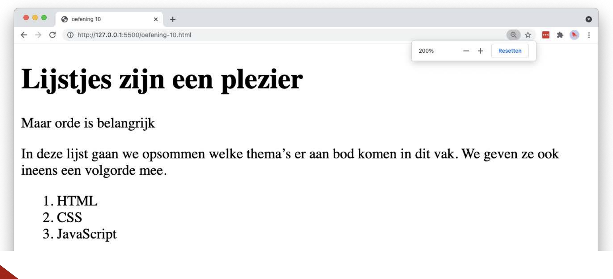

### oefening 6
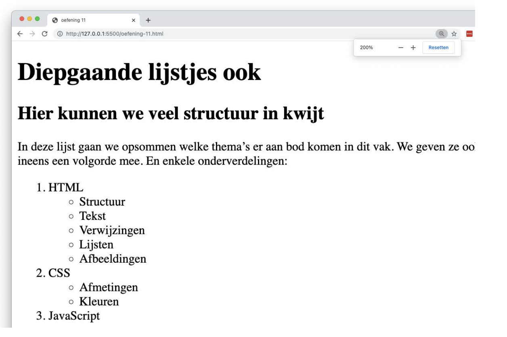

### oefening 7
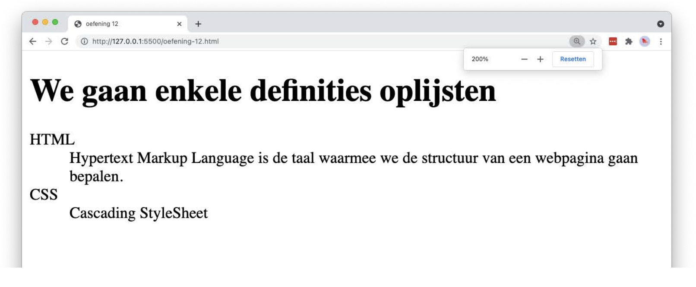

### oefening 8
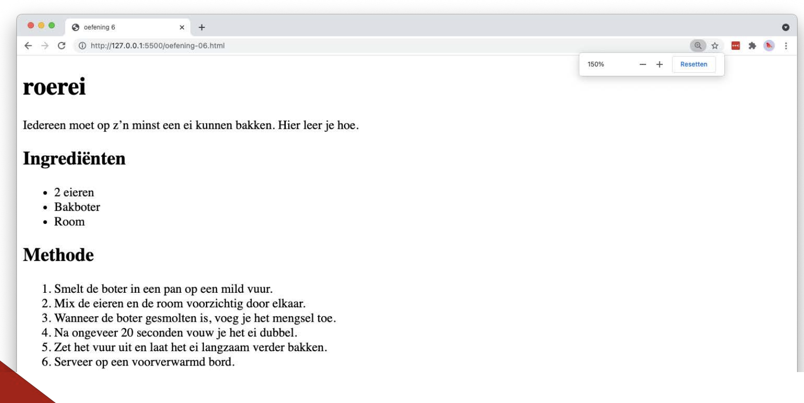

## Afbeeldingen

De volgende oefeningen kan je enkel maken als je de theorie hebt doorgenomen t.e.m. het onderdeel Media > Afbeeldingen!

### oefening 9
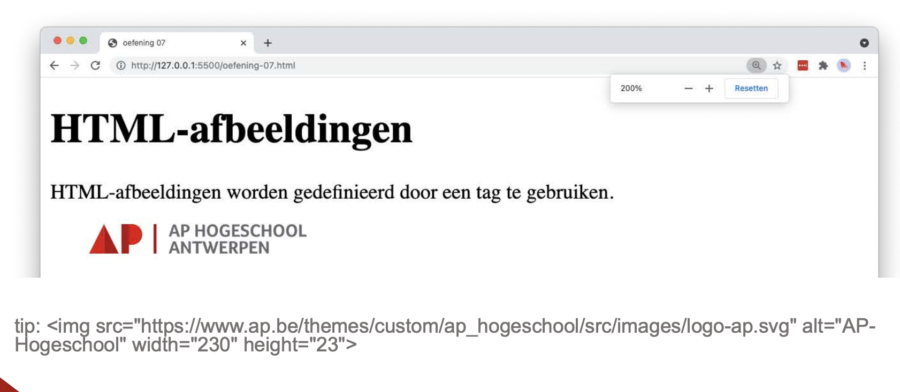

### oefening 10
Kopieer oefening 9, en zorg dat er een link over de afbeelding heen ligt naar de website van AP (https://ap.be).

### oefening 11
Kopieer oefening 8 en voeg een afbeelding toe op onderstaande manier.

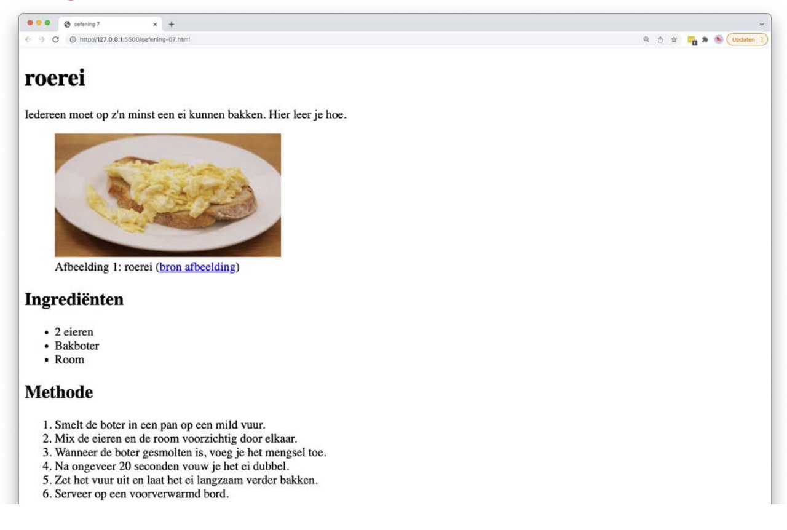

### oefening 12
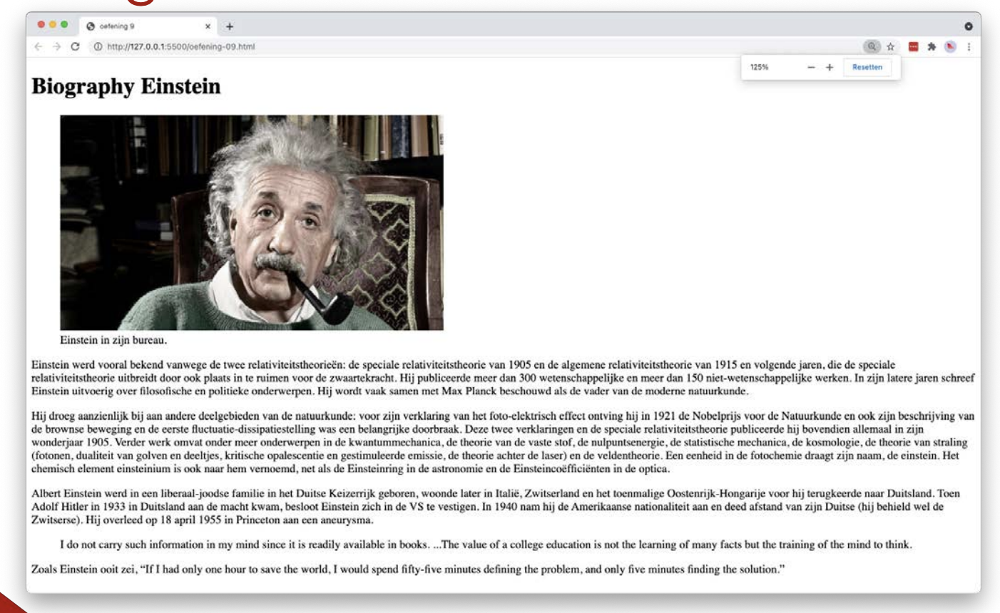

### oefening 13
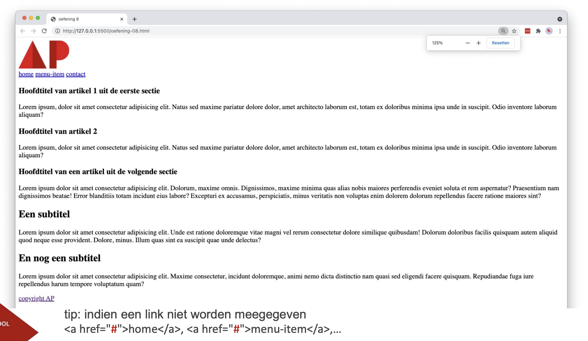

### oefening 14
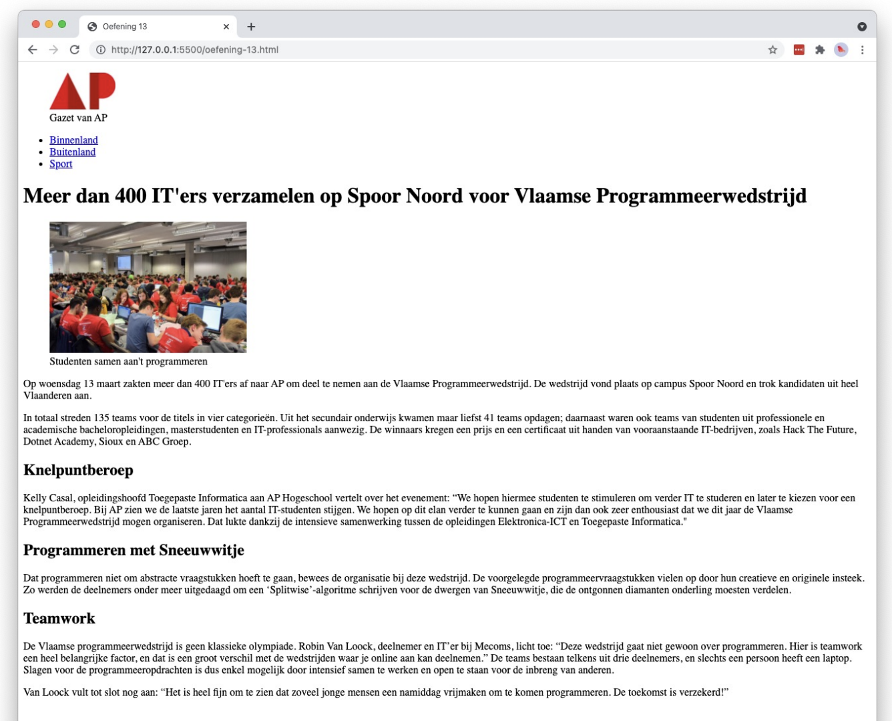

### oefening 15
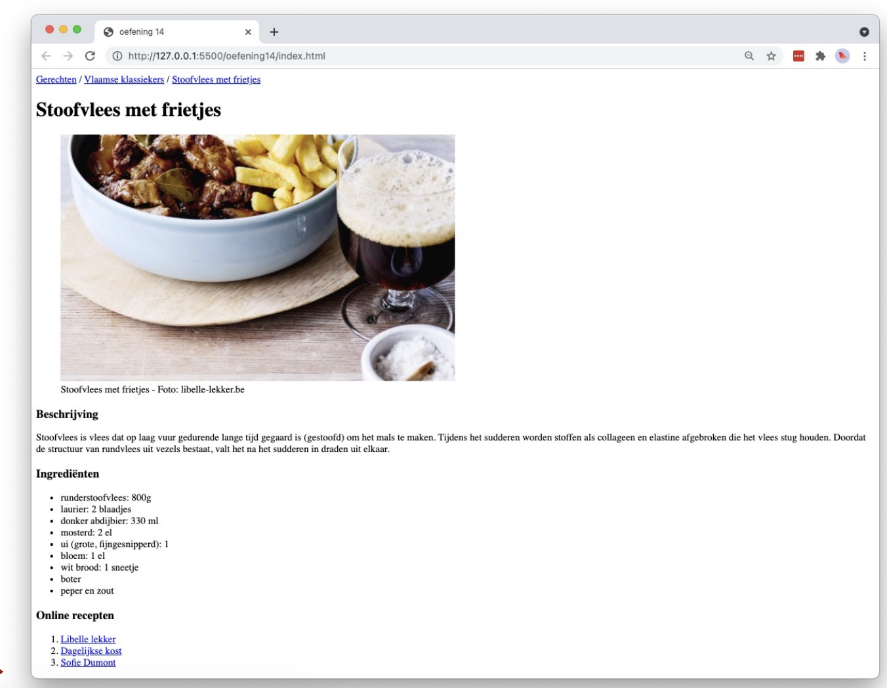

## Oefening 16 - Geïntegreerde oefening

Dit is één grote oefening die gericht is op het begrijpen en toepassen van de juiste semantiek binnen HTML5. Zorg ervoor dat je de semantische elementen op de juiste manier gebruikt om de structuur en betekenis van je webpagina correct te definiëren.

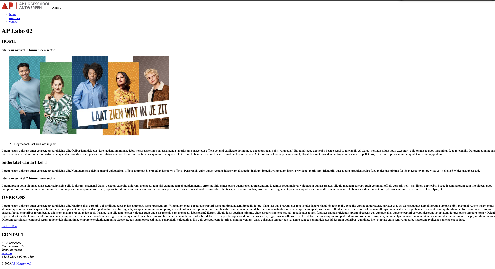

> Om deze oefening te kunnen maken heb je de volgende bijlage nodig:
> [herhalingsoefening-bijlage.zip](herhalingsoefening-bijlage.zip)

### 1. basisstructuur van de HTML-pagina
* Maak een nieuwe HTML5-pagina “index.html” met de juiste doctype-declaratie en een `<head>`-sectie.
* Voeg een paginatitel toe in de `<title>`-tag in het `<head>`-gedeelte.
* Maak een <body>-element aan voor de inhoud van de pagina

### 2. header & navigatie (nav)
* Binnen de <body>-sectie, voeg je een <header>-element toe met een titel die de naam van je webpagina vertegenwoordigt.
* Voeg een navigatiemenu toe met ten minste drie links naar verschillende secties op je pagina. Gebruik hiervoor `<nav>` en `<ul>` met `<li>`-elementen.

### 3. hoofdinhoud (main)
* Voeg een `<main>`-element toe aan je pagina.
* Binnen het `<main>`-element, schrijf de hoofdinhoud van je webpagina met behulp van relevante semantische HTML5- elementen, zoals `<article>`, `<section>`, `<h1>`, `<h2>`, `
`, en eventueel `<figure>` met `<figcaption>` voor afbeeldingen

### 4. zijbalk (aside)
Voeg een zijbalk toe en gebruik hiervoor een `<aside>`-element. Zet in de zijbalk contactinfomatie en maak hierbij gebruik van het `<address>`-element met de volgende gegevens:
* adres: [Voeg een fictief adres in]
* telefoonnummer: [Voeg een telefoonnummer in]
* e-mail: link naar het e-mailadres "lector@ap.be", waarbij het emailadres zelf als klikbare link wordt weergegeven.

### 5. footer
Voeg een `<footer>`-element toe onderaan je pagina. Plaats hierin volgende informatie:
* een voettekst met een copyright-teken jaar AP-Hogeschool
* op de tekst “AP-Hogeschool” plaats je een link naar de website van de school die zal openen in een nieuw venster

### 6. afbeeldingen en multimedia
Voeg afbeeldingen en multimedia toe aan:
* in de header een logo
* in de hoofdinhoud van je pagina gebruik je `<figure>` en `<figcaption>` voor afbeeldingen en `<audio>` of `<video>` voor multimedia-inhoud

> maak gebruik van rechtenvrije afbeeldingen en/of van AI

### 7. aanvullende semantische elementen
Gebruik minstens 2 andere relevante semantische elementen zoals speciale karakters, `<abbr>` voor afkortingen, `<blockquote>`, `<q>` enzovoort, om de betekenis van je inhoud te verduidelijken.