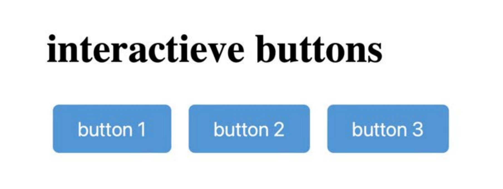
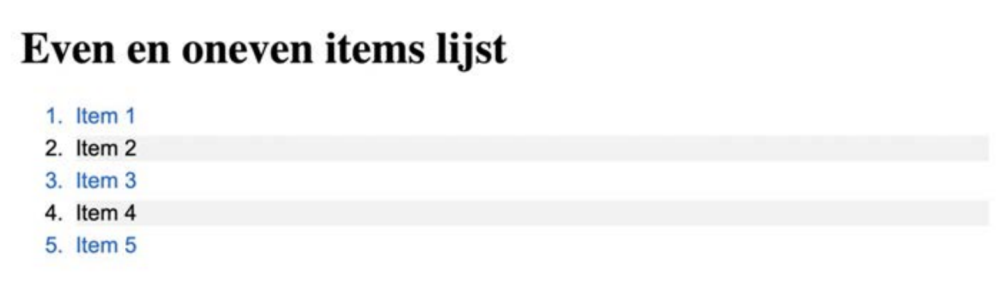

# Oefeningen labo 4

Voor deze oefeningen vertrek je telkens met een gelinkt reset.css bestand op basis van [The New CSS Reset](https://elad2412.github.io/the-new-css-reset/).

Zorg dat je de volgende folder structuur volgt:

```
webtechnologie/
├─ labo-01/
│  ├─ oefening-01/
│  │  ├─ index.html
│  │  ├─ images/
│  │  │  ├─ image-1.jpg 
│  │  │  ├─ image-n.jpg 
│  │  ├─ css/
│  │  │  ├─ reset.css
│  │  │  ├─ style.css
│  ├─ oefening-02/
│  ├─ oefening-n/
├─ labo-02/
├─ labo-n/      
```

## Pseudo selectors

### oefening 1



Je maakt een eenvoudige webpagina met een HTML-bestand en een apart CSS-bestand. Je past stijlen toe op drie knoppen zodat ze op verschillende manieren reageren op interactie.

**HTML Pagina aanmaken**

* Maak een nieuw project aan en voeg een bestand `index.html` toe.
* Voeg de basisstructuur van een HTML-pagina toe met een `<head>` en `<body>`-sectie.
* Voeg een titel toe aan de pagina: "Interactieve knoppen".
* Voeg drie knoppen toe binnen de `<body>`-sectie en geef ze een unieke `id`:

**CSS bestand aanmaken**
* Voeg een leeg bestand `style.css` toe in de css map en link deze aan de html pagina.
* Definieer de basisstijl voor de knoppen:

```css
button {
    padding: 10px 20px;
    font-size: 16px;
    border: 2px solid #333;
    background-color: #f0f0f0;
    color: #333;
    cursor: pointer;
    transition: all 0.3s ease;
}
```

**Hover effect toevoegen**

Wanneer de gebruiker met de muis over de eerste knop beweegt:

- Verandert de achtergrondkleur.
- Verandert de tekstkleur.
- Wordt een rand toegevoegd.
- Wordt een lichte schaduw toegevoegd

> **TIP**: gebruik de `box-shadow` css property voor de schaduw

**Active effect toevoegen**

Wanneer de gebruiker op de tweede knop klikt (en ingedrukt houdt):

- Verschuift de knop iets naar beneden.
- Wordt de achtergrondkleur of tekstkleur veranderd.

> **TIP** - gebruik CSS property `transform: translateY(2px)` voor de transformatie.

**Focus effect toevoegen**

Wanneer de derde knop de focus krijgt (bijvoorbeeld via de tab-toets) wordt een duidelijke outline toegevoegd.

> **TIP**: Gebruik de `outline` css property voor de rand te maken

## oefening 2



**HTML Pagina aanmaken**

* Maak een nieuw project aan en voeg een bestand `index.html` toe.
* Voeg de basisstructuur van een HTML-pagina toe met een `<head>` en `<body>`-sectie.
* Voeg een titel toe aan de pagina: bv. "Even en oneven items lijst".
* Maak een genummerde lijst in de <body>-sectie
* Voeg ten minste 5 genummerde items (<li>) toe aan de lijst
* Geef ze elk een uniek ID.

**CSS Toevoegen**

* Maak een bestand `style.css` in de map css
* Geef de genummerde lijst en de items de volgende eigenschappen om de lijst leesbaar te maken:
    * lettertype,
    * marge,
    * padding,
    * ...
* Gebruik de `:even` en `:odd` pseudo-klassen om verschillende stijlen toe te passen op even en oneven genummerde items in de lijst. Bv:
    * Gebruik voor even genummerde items een andere
      achtergrondkleur.
    * Gebruik voor oneven genummerde items een andere tekstkleur.

## Tabellen

### oefening 3

Bouw de volgende tabel in HTML en CSS. Zorg ervoor dat de koppen van de tabel de dagen aangeven en dat de rijen de informatie over de producten en inkomsten bevatten. De eerste kolom bevat eveneens een legende van de rij.

Gebruik hierbij het `<th>`-element voor de koppen en het `<td>`-element voor de data. Geef de even rijen een andere achtergrond kleur dan de oneven (lightgray / gray) en zorg voor voldoende padding.

<figure><figcaption><p>Een tabel met data</p></figcaption></figure>

### oefening 4

Bouw je lessenrooster voor de eerste drie dagen van de week week na, waarbij bepaalde vakken meerdere uren in beslag nemen. Gebruik het `colspan`-attribuut om aan te geven dat een vak bijvoorbeeld twee of drie uren achter elkaar in beslag neemt.

* Voorzie de table van een caption
* Schrijf op de bovenste rij de uren van de dag (09:00 tem 18:00) in een `th`)
* Schrijf in de eerste kolom de dagen van de week (in een `th)`
* Voeg je eigen vakken toe (bv. webtechnologie, databases, programmeren) voor minstens de eerste 3 dagen van de week.
* Voorzie elk vak van een eigen achtergrondkleurtje (gebruik een `class`) en zorg ervoor dat de tekst voldoende contrast heeft om leesbaar te zijn tegen de achtergrond. (bv. witte tekst op rode achtergrond, zwarte tekst op licht-roze achtergrond)
* Zorg dat elke `td` en `th` een min-width krijgt van 120px. Op die manier staat elk blokje mooi uitgelijnd met het begin van elk uur.

> **TIP** - De CSS van de `tr`'s kun je overnemen van de eerste oefening.

<figure><figcaption><p>Een lessenrooster</p></figcaption></figure>

### oefening 5

Bouw een fictief overzicht van de bezetting van een klaslokaal na met een HTML table en CSS.

* Gebruik het `rowspan` attribuut om aan te geven dat een lokaal meerdere uren aan een stuk bezet is door dezelfde groep.
* Voorzie alle `td` een randje om duidelijk te maken waar die juist start en eindigt
* Voorzie de table van een caption

<figure><figcaption><p>Overzicht van de bezetting van een klaslokaal</p></figcaption></figure>

>**TIP** - Hergebruik de CSS van oefening 2, maar voeg een extra border toe voor alle `td`