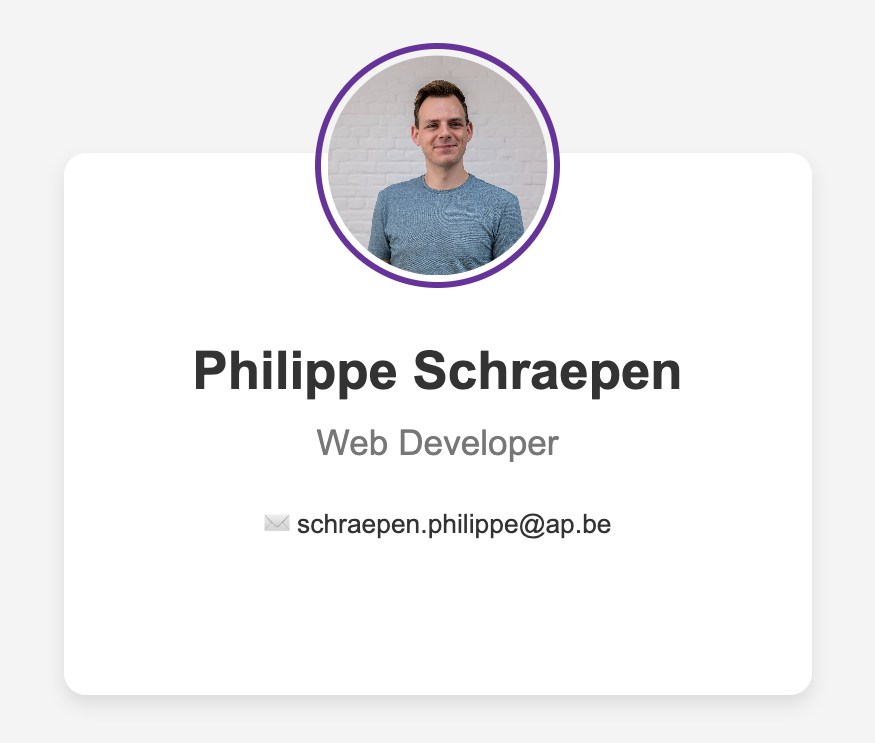
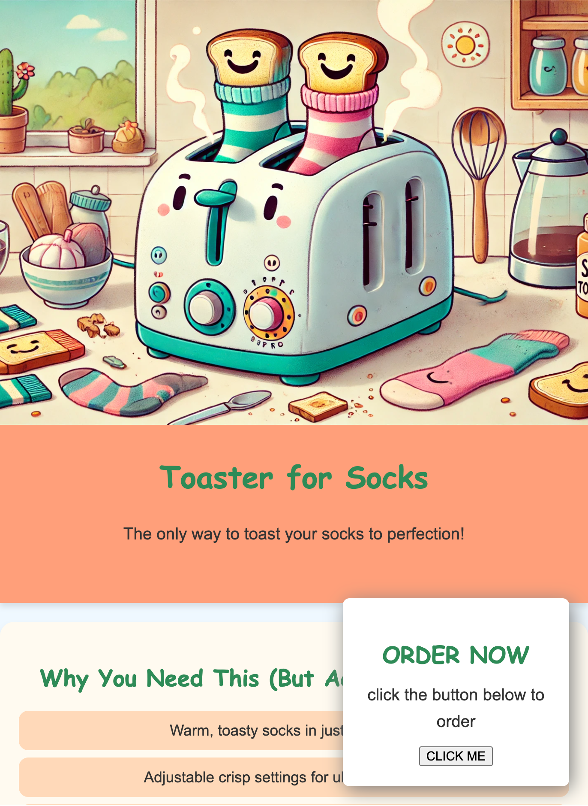
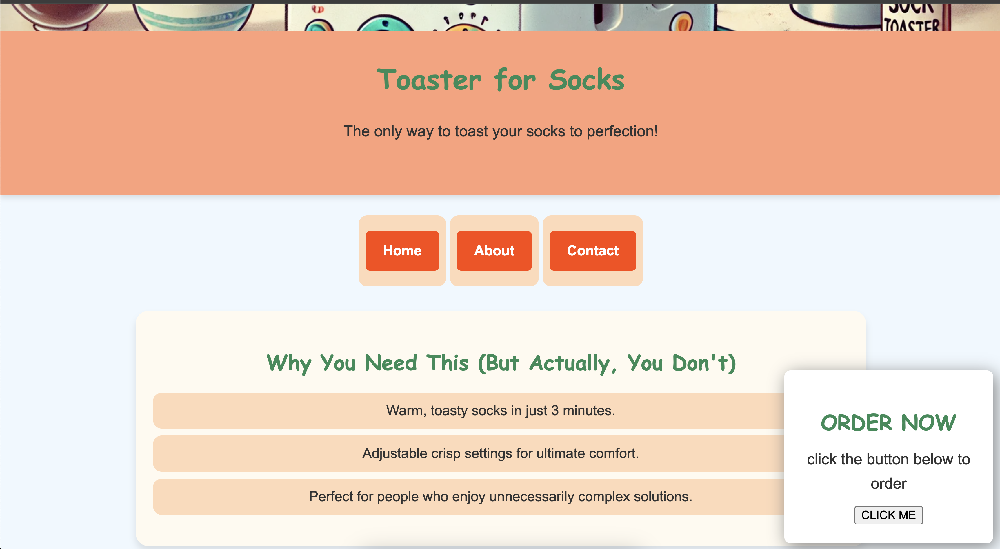
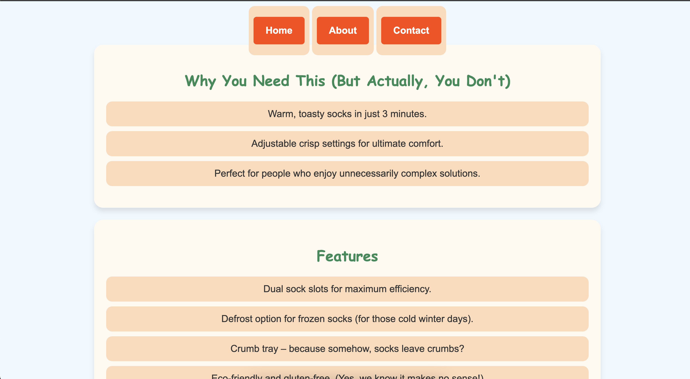
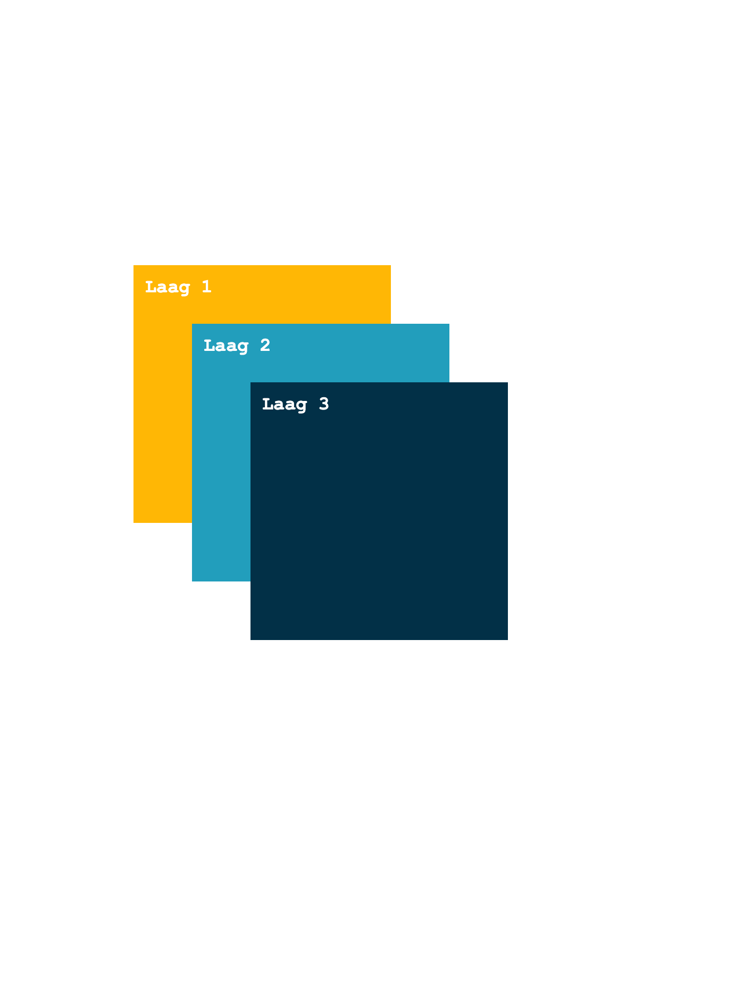
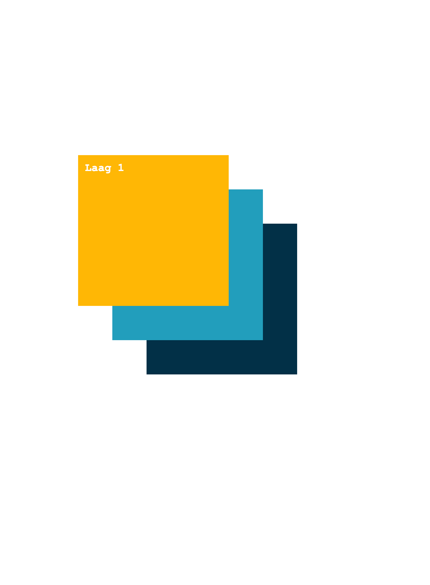

# Oefeningen labo 6

Voor deze oefeningen vertrek je telkens met een gelinkt reset.css bestand op basis van [The New CSS Reset](https://elad2412.github.io/the-new-css-reset/).

Zorg dat je de volgende folder structuur volgt:

```
webtechnologie/
├─ labo-01/
│  ├─ oefening-01/
│  │  ├─ index.html
│  │  ├─ images/
│  │  │  ├─ image-1.jpg 
│  │  │  ├─ image-n.jpg 
│  │  ├─ css/
│  │  │  ├─ reset.css
│  │  │  ├─ style.css
│  ├─ oefening-02/
│  ├─ oefening-n/
├─ labo-02/
├─ labo-n/      
```

## Position

### oefening 1

Bouw onderstaand digitaal visitekaartje na. Gebruik `position: relative` om de afbeelding over de bovenste rand te duwen. Achteraf duw je je naam, titel en e-mailadres ook op dezelfde manier wat mee omhoog zodat alles mooi uitgelijnd is.




### oefening 2

Vertrek vanuit het volgende bestand.


    De startbestanden


Jij moet enkel nog voor de positionering van de `<aside>` zorgen. Zorg dat de `<aside>` in de rechterbenedenhoek gepositioneerd wordt, en let daarbij op de kleine afstand tot de rand. Gebruik hiervoor de CSS propterty `position: absolute.`




### oefening 3

Vertrek vanuit je oplossing van oefening 2 (kopieer deze naar een nieuwe folder).

Zoals je in oefening 2 zult zien zal het `<aside>` element niet automatisch herpositioneren wanneer je naar beneden scrolt. Verander `position: absolute` in `position: fixed` om de container mee te laten scrollen.




### oefening 4

Kopieer oefening 3, en verwijder nu de aside (ook de bijhorende css).

Zorg er voor dat wanneer de gebruiker scrollt, het nav-element blijft plakken tegen de bovenkant van de viewport. Gebruik daarvoor `position: sticky`.



### oefening 5

<figure><figcaption><p>Stap 1</p></figcaption></figure>

**Stap 1** - Bouw bovenstaande afbeelding na in HTML en CSS. Gebruik `position: absolute` om de drie lagen over elkaar te leggen. Pas voor elke laag de positie een beetje aan zodat alle lagen zichtbaar zijn.

**Stap 2** - Vervolgens Het is jou taak om de volgorde van de drie lagen om te keren (dus: bovenaan komt laag 1, in het midden laag 2, en onderaan laag 3) zonder dat je de volgorde van de HTML of CSS aanpast. Gebruik hiervoor de CSS property `z-index.`

<figure><figcaption><p>Stap 2</p></figcaption></figure>