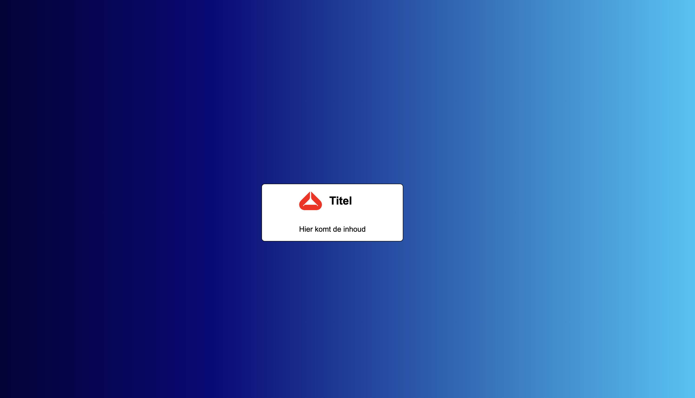
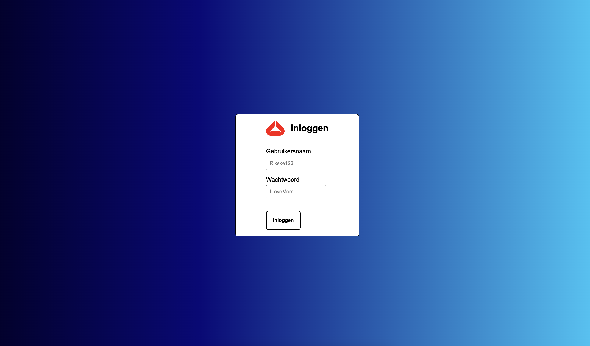
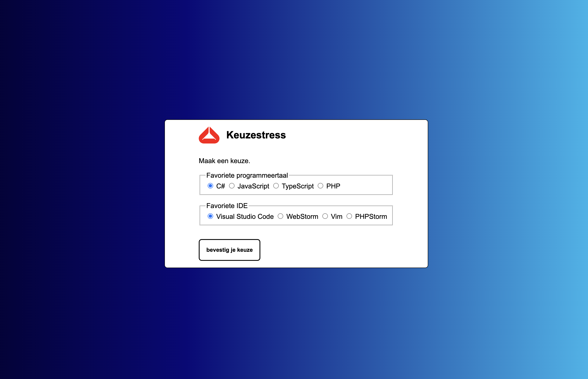
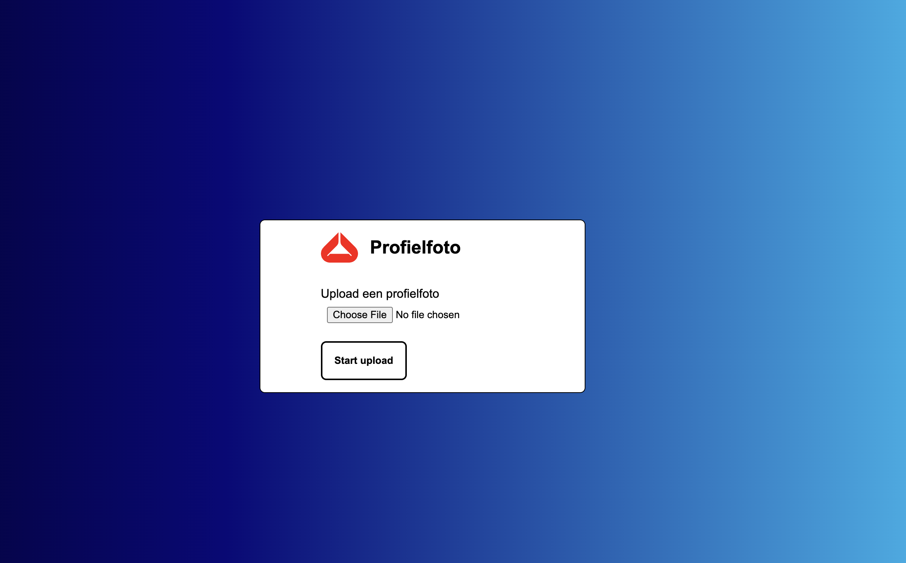
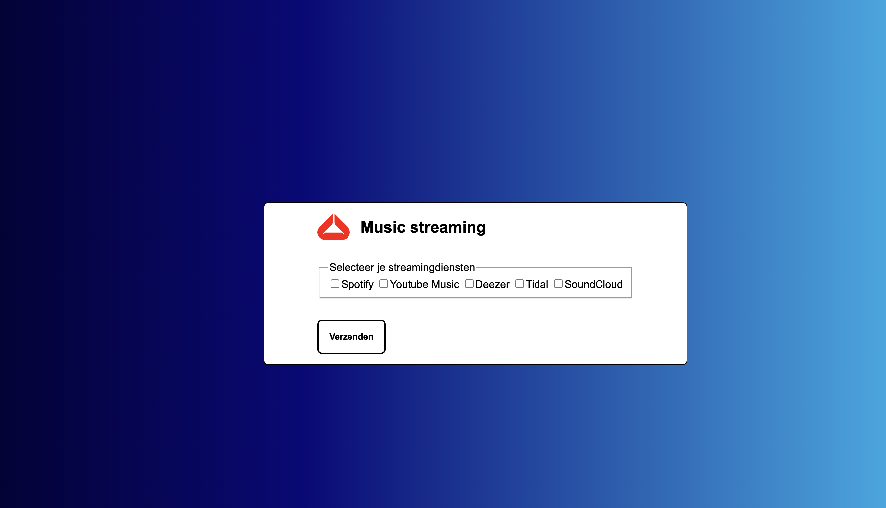
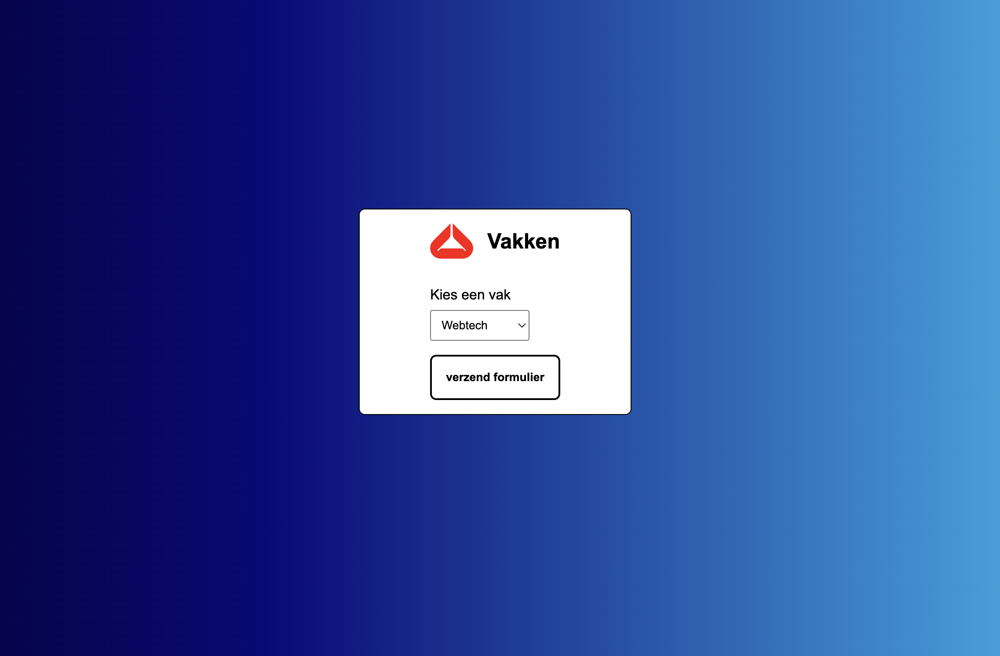

# Oefeningen labo 9

Zorg dat je de volgende folder structuur volgt:

```
webtechnologie/
├─ labo-01/
│  ├─ oefening-01/
│  │  ├─ index.html
│  │  ├─ images/
│  │  │  ├─ image-1.jpg 
│  │  │  ├─ image-n.jpg 
│  │  ├─ css/
│  │  │  ├─ reset.css
│  │  │  ├─ style.css
│  │  ├─ js/
│  │  │  ├─ script.js
│  ├─ oefening-02/
│  ├─ oefening-n/
├─ labo-02/
├─ labo-n/      
```


## Algemene opzet

- Zorg ervoor dat de body minimaal 100vh hoog is.
- Voorzie de achtergrond van de body van een leuk gradient. Gebruik hiervoor een CSS gradient generator tool zoals [cssgradient.io](https://cssgradient.io/).
- Zorg ervoor dat de body children zowel verticaal als horizontaal in het midden van de webpagina gecentreerd staan. Gebruik hiervoor CSS Grid.

<figure><figcaption>De basis van de oefeningen. Deze opmaak kun je vervolgens kopiëren naar elke oefening.</figcaption></figure>

## Oefening 1

Maak een formulier waarin de gebruiker een gebruikersnaam en wachtwoord kan invoeren. Baseer je op het onderstaande voorbeeld.

- Zorg ervoor dat de inputs van het juiste type zijn.
- Voorzie elk type input van een label en zorg ervoor dat deze gelinkt zijn.
- Zet een container rond de header en het formulier en zorg ervoor dat deze een witte achtergrondkleur krijgt. Voorzie hierop ook een padding van 1rem verticaal en 5rem horizontaal.
- Zorg ervoor dat de labels en de inputs de volledige breedte innemen.
  > **TIP** - inputs en labels zijn _by default_ inline-elementen. Pas dit aan met CSS.
- Geef elke input een gepaste placeholder value.
- Geef het formulier een header met een logo en een titeltje. Je kunt [LogoIpsum](https://logoipsum.com/) gebruiken om een willekeurig logootje te linken. Zorg ervoor dat deze verticaal uitgelijnd zijn.
- Zorg ervoor dat de button en de inputs een mooie opmaak krijgen:
  - Voorzie een padding van 0.5rem.
  - Voorzie een 2px volle zwarte border met een border-radius van 7px.
  - Wanneer de gebruiker over de input of button hovert en wanneer de focus in de input staat, moet de input een paarse outline krijgen. Zorg voor dezelfde border-radius als de gewone border.

<figure><figcaption>Het beoogde resultaat oefening 1</figcaption></figure>

## Oefening 2

Kopieer je oplossing van oefening 1 en pas het formulier vervolgens aan.
- Zorg ervoor dat de labels en inputs terug inline-elementen worden.
- Zorg ervoor dat de gebruiker uit een lijst met keuzerondjes (_radiobuttons_) zijn favoriete programmeertaal en IDE kan aanduiden.
- Zorg voor één `fieldset` en `legend` per vraag.
- Zorg ervoor dat de radio-buttons per vraag gelinkt zijn aan elkaar (gebruik unieke `name`-attributen per vraag). De gebruiker moet maar 1 antwoord per vraag kunnen aanduiden.
- Zorg ervoor dat telkens het eerste resultaat _by default_ is aangeduid.

<figure><figcaption>Het beoogde resultaat oefening 2</figcaption></figure>


Bekijk de video


## Oefening 3

Kopieer je oplossing van oefening 1 en pas het formulier aan naar het volgende voorbeeld.

<figure><figcaption>Het beoogde resultaat oefening 3</figcaption></figure>

## Oefening 4

Kopieer je oplossing van oefening 1 en pas het formulier aan naar het volgende voorbeeld.

<figure><figcaption>Het beoogde resultaat oefening 4</figcaption></figure>

## Oefening 5

Kopieer je oplossing van oefening 1 en pas het formulier aan naar het volgende voorbeeld.

<figure><figcaption>Het beoogde resultaat oefening 5</figcaption></figure>

## Oefening 6

Maak het volgende formulier aan om op de website van AP te tonen die we hebben nagemaakt. Start hiervoor van het bestaande ontwerp uit het vorige labo.

- Pas het menu in de `index.html` aan en link naar de nieuwe pagina.
- Voeg een zoekfunctie toe in het menu met een zoekformulier.

Het formulier heeft 2 `fieldset`s en telkens een `legend`.

- Gegevens
- Vraag
- De vraag is gericht aan:
  - Keuze: maak hier een keuze, secretariaat, graduaat IT, stuvo

<figure><figcaption></figcaption></figure>

**Bijlagen:**


