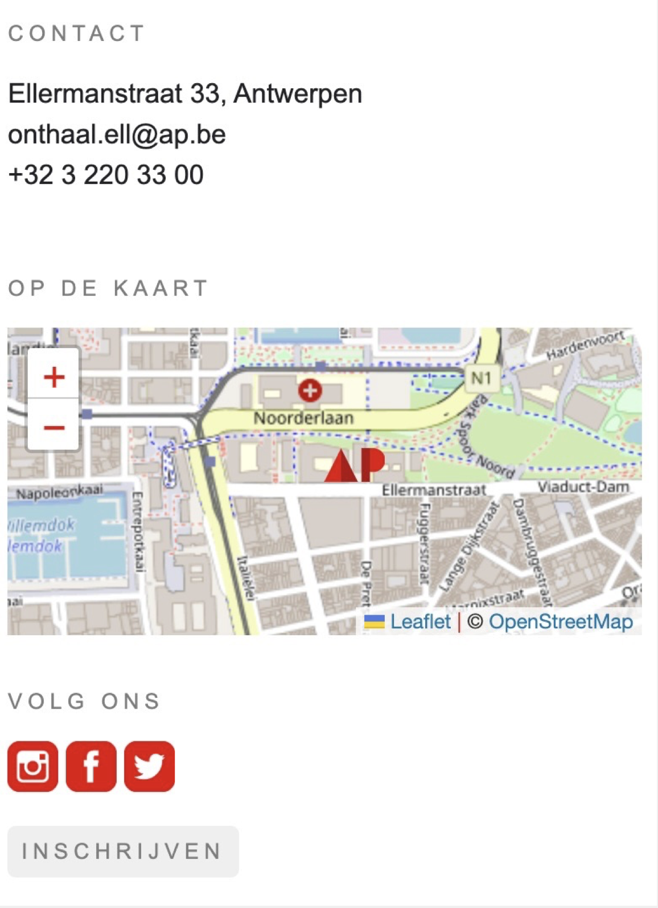

# Oefeningen labo 7

Zorg dat je de volgende folder structuur volgt:

```
webtechnologie/
├─ labo-01/
│  ├─ oefening-01/
│  │  ├─ index.html
│  │  ├─ images/
│  │  │  ├─ image-1.jpg 
│  │  │  ├─ image-n.jpg 
│  │  ├─ css/
│  │  │  ├─ reset.css
│  │  │  ├─ style.css
│  │  ├─ js/
│  │  │  ├─ script.js
│  ├─ oefening-02/
│  ├─ oefening-n/
├─ labo-02/
├─ labo-n/      
```

## oefening 1: Leaflet-map

Je vertrekt vanuit de oplossing van oefening 3 van labo 8 ([hier te vinden](../../LW4/oplossingen.md)).

**leerdoelen**

* een JS-bibliotheek gebruiken
* een interactieve kaart toevoegen aan website

**functionele analyse** Een interactieve kaart toevoegen aan de oefen-website van AP.

**technische analyse**

* HTML: In het `aside`-element voorzie je een `div`-element met id `apMap`. Zorg dat er in het `div`-element een kaart wordt getoond met behulp van Leaflet.js.
* CSS: Maak het bestand map.css aan en zet deze in de css-map.
    * De hoogte van de map is 20vh.
    * De breedte van de map staat op automatisch.
* JS: Maak het bestand mapScript.js aan en plaats deze in een js-map.
    * In dit script plaats je de code om de kaart in de id `apMap` te tekenen, zodat de AP-Hogeschool met adres Ellermanstraat 33 gecentreerd staat.
    * Ga op zoek naar de geografische coördinaten van onze school.
    * De map heeft een zoom-level van 15, met een maximum zoom van 19.
* JS: Voeg aan de kaart een marker toe door gebruik te maken het onderstaand icoontje.
    * De afmetingen van de marker zijn \[36, 20].
    * Het ankerpunt van de marker is \[0, 20].


  Icoon marker



**voorbeeldinteractie**

<figure><figcaption>voorbeeld oefening 1</figcaption></figure>


