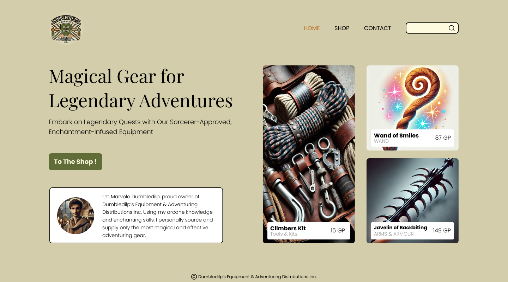

# Projectopdracht - webshop

## Algemene Info

Je opdracht bestaat uit het maken van een **fictieve webshop** met minstens 6 producten of diensten die binnen jouw interesseveld vallen. De webshop moet worden geschreven in **HTML5**, **CSS3** en **JavaScript**.

De opdracht is opgedeeld in **7 deelopdrachten**:

1. [Concept & content](deelopdracht-1-concept-content.md)
2. [Opbouw mobiele website met HTML en CSS](./deelopdracht-2-opbouw-html-css.md)
3. Responsive design + formulier
4. Leaflet
5. Functionaliteit winkelmandje & wishlist
6. Dynamische inhoud
7. Presentatie

## Wireframes

De wireframes van de webshop zijn terug te vinden op [deze Figma Community Page](https://www.figma.com/community/file/1467109776669525336/webtechnologie-projectopdracht-s2-2024-2025).

- Klik "Open in Figma", en maak een account aan.
- Deze Figma file bestaat uit 3 pagina's:

  - Mobile
  - Desktop
  - ~~Components~~ (enkel nuttig voor de ontwerper aka. de lector)

Bekijk de wireframes steeds op Figma, gezien ze nog geüpdatet kunnen worden doorheen het semester.

## Presentatie

Aan het einde van het semester presenteer je jouw webshop en de bijbehorende code aan je medestudenten en lector. De presentatie zal plaatsvinden in de laatste twee lessen van het semester.

## Mobile-First

We werken volgens het **mobile-first** principe. Dit betekent dat je de website in eerste instantie optimaliseert voor **smartphones**. In een latere fase (deelopdracht 3) zal je ook optimalisaties toevoegen voor **tablets, laptops en desktops**.

## Copywriting Tips

- Alle teksten voor je webshop moeten **in het Nederlands** worden geschreven.
- Vermijd schrijffouten. Gebruik spellingscorrectie.
- **Kopieer geen teksten** van het internet waar copyright op rust. Zorg ervoor dat je originele teksten gebruikt.
- **AI Tools**: Maak gerust gebruik van AI, zoals **ChatGPT**, om teksten te genereren of inspiratie op te doen.
- Houdt teksten beknopt en helder.
- Laat je tekst op het laatste eens nalezen door een andere persoon.

## Afbeelding Tips

### Rechtenvrije Afbeeldingen

- Gebruik **enkel rechtenvrije afbeeldingen** die je zelf hebt gemaakt of die beschikbaar zijn via platforms met een vrije licentie, zoals:

  - [Unsplash](https://unsplash.com/)
  - [Pexels](https://www.pexels.com/)
  - [Pixabay](https://pixabay.com/)
- **Tip:** Kun je geen perfecte afbeelding vinden voor je product? Kies dan voor een meer generieke afbeelding die het idee van je product goed weergeeft. Bijv. voor een webshop die voetbalschoenen verkoopt, kun je zoeken naar generieke, rechtenvrije foto's van voetbalschoenen.
- Afbeeldingen gegenereerd met AI kunnen ook, maar probeer origineel te zijn.

### Bronvermelding

- Voeg altijd een **bronvermelding** toe bij rechtenvrije afbeeldingen, bijvoorbeeld in de `figcaption` van de afbeelding. Dit is een vriendelijke geste naar de fotograaf en maakt het gemakkelijk voor de lectoren om de bron te verifiëren.
- Zorg ervoor dat elke afbeelding een **duidelijke bestandsnaam** heeft, bijv. `product-zaadjes-lavendel.jpg`.
- Zorg voor een goede organisatie van foto's in een mappenstructuur.

### Afbeelding Resizing & Aspect-Ratio's

- Gebruik gratis tools zoals:

  - [Canva](https://www.canva.com/nl_nl/)
  - [Adobe Express](https://www.adobe.com/express/feature/image/resize)
  - [Imagy.app](https://imagy.app/)

  om je afbeeldingen bij te snijden naar de juiste afmetingen en **aspect-ratio's**.
- Voor productfoto's: ga voor vierkante images van 500x500px.

## Coding Guidelines

Zorg ervoor dat alle code die je schrijft voldoet aan de [Coding Guidelines](../coding-guidelines.md). Volg deze richtlijnen zorgvuldig om een consistente en professionele webshop te bouwen.

