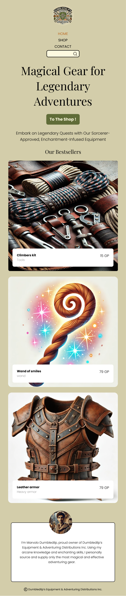

# Deelopdracht 2 - Opbouw mobiele website met HTML en CSS

<figure>
  
  <figcaption>Tijdens deze deelopdracht werk je je webshop uit op een mobiel apparaat</figcaption>
</figure>

In deze deelopdracht ga je **mobiele** webpagina's bouwen. Zorg ervoor dat je browservenster is ingesteld als een gangbaar smartphone scherm en voer de stappen in dit document uit. Volg hierbij altijd de [wireframes](algemeen.md#wireframes), maar pas deze ontwerpen aan op basis van de styleguide die je hebt geschreven tijdens [deelopdracht 1](deelopdracht-1-concept-content.md).

## Mappenstructuur & bestanden

Maak de volgende mappenstructuur aan:

```
- projectopdracht-webtechnologie-\<je naam\>/
  index.html
  shop.html
  contact.html
  product-naam.html
  - css/
    general.css
    home.css
    reset.css
    shop.css
    product.css
    contact.css
  - assets/
    - images/
      foto-1.jpg
      foto-2.jpg
      foto-3.jpg
  - js/
 ``` 
Maak de volgende HTML-pagina's aan:

- `index.html`
- `shop.html`
- `product-<naam>.html` (minimaal 6 pagina's)
- `contact.html`

Voorzie 1 CSS-bestand voor de algemene opmaak (`general.css`) en aparte CSS-bestanden voor pagina-specifieke opmaak (`home.css`, `shop.css`, `product.css`, `contact.css`).

Maak ook een `reset.css` aan, gebaseerd op [reset.css](https://github.com/elad2412/the-new-css-reset).

Link elke HTML-pagina met de juiste CSS-bestanden. `index.html` zal bijvoorbeeld 3 `<link>`-tags hebben: `reset.css`, `general.css` en `home.css`.

> **TIP**: Houd de volgorde van de CSS-bestanden aan: eerst `reset.css`, daarna `general.css` en vervolgens de pagina-specifieke CSS-bestanden.

## Development algemene features

Elke pagina moet de volgende elementen bevatten, die op elke pagina hetzelfde zijn:

- Typografie: Lettertype, font-size, headings (h1, h2, h3, etc.)
- Een header met een logo
- Navigatie in de header met links naar de andere pagina's *
- Een footer
- ...

\* negeer het inputveldje in de navigatie, deze maakt deel uit van deelopdracht 4. 

Volg hierbij het ontwerp op Figma, maar pas deze aan aan jou eigen styleguide uit deelopdracht 1.

> **TIP**: 
> - Bouw de algemene features eerst op één pagina (bijvoorbeeld `index.html`). Wanneer deze klaar zijn kopieer je de HTML naar de andere .html-bestanden. Door `global.css` in elk .html-bestanden te linken, zal de styling overal hetzelfde zijn, wat veel tijd bespaart en zorgt voor uniformiteit.
> - Zorg ervoor dat je op elke pagina de juiste semantische elementen gebruikt (header, nav, main, aside, section, article, footer, ...) zoals we gezien hebben in de les.

### Pagina-specifieke features

- **index.html**: De homepage van je webshop
  - Naam van de webshop in een H1
  - Algemene uitleg over je webshop zoals je die beschreven hebt in je styleguide document uit deelopdracht 1.
  - Een CTA (call-to-action) knop die linkt naar de shop (tip: style met css de a-tag als een button)
  - Kaartjes met de 3 best verkochte producten (gebruik een `<article>`):
    - Gebruik de CSS property "background-image" om de foto op de achtergrond te plaatsen.
    - Voeg mbhv. flexbox een kadertje toe in het kaartje met de titeltje (tip: gebruik een h2 en style deze als een h3) en de korte beschrijving.
  - Een "bio"-kaartje met:
    - Een professionele foto van jezelf (gebruik position om het cirkeltje wat naar boven te duwen)
    - Een korte uitleg of bio van jezelf

- **shop.html**: De overzichtspagina van alle producten
  - Voorzie een `<aside>` voor de wishlist en voor een shopping-cart. Deze mogen in deze fase wel nog leeg zijn.
  - Een h2 titeltje
  - Voorzie 6 product kaartjes (gebruik een `<article>`) onder elkaar met elk:
    - Een titel (h3)
    - Een korte beschrijving gebaseerd op de productbeschrijving uit deelopdracht 1
    - Een foto van het product (gebruik background-image)
    - Een button om het product toe te voegen aan je winkelmandje (moet nog niet werken) 

- **6 detailpagina's**: Pagina's voor elk van de producten, met:
  - Een titel
  - Een beschrijving
  - Afbeelding in een `figure` met de bronvermelding van de afbeelding in de `figcaption`
  - Een opsomming met minstens 5 productspecificaties
  - Een button om het product toe te voegen aan je wishlist.

- **contact.html**: 
  - Een pagina waar het contactformulier op komt, maar deze hoeft op dit moment nog niet uitgewerkt te worden.
  - Voorzie de pagina met alle algemene features, maar laat de `<main>` voorlopig leeg.
