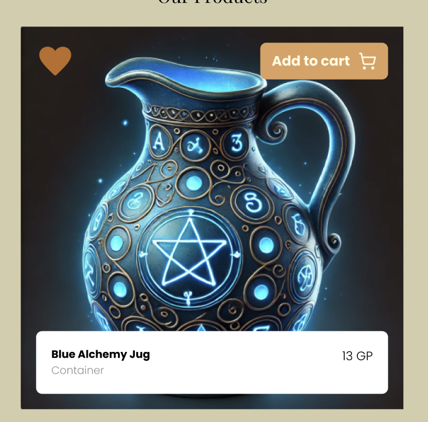
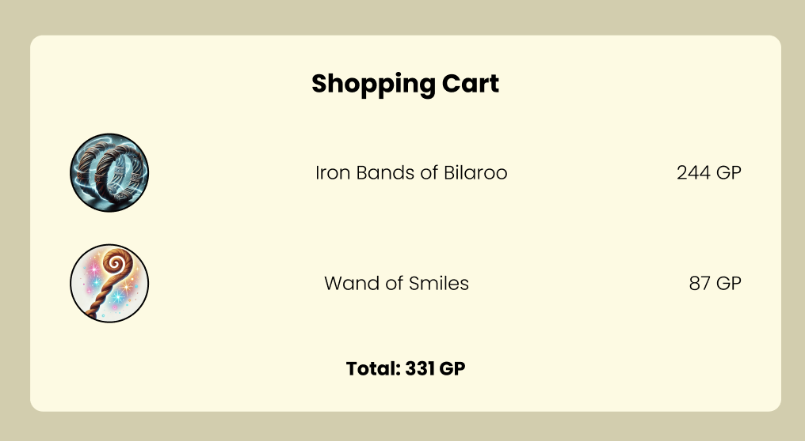
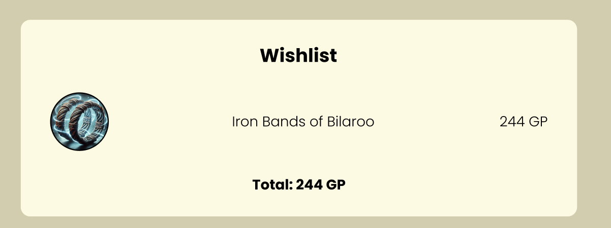

# Deelopdracht 5 - Winkelmandje en Wishlist

In deze opdracht ga je de functionaliteit van de knoppen "Add to Cart" (toevoegen aan winkelmandje) en "Wishlist" (hartje) implementeren, zodat gebruikers items kunnen toevoegen aan hun winkelmandje en verlanglijstje. Je webshop moet een interactief geheel worden waarin de geselecteerde items in de juiste lijsten worden opgeslagen en weergegeven.

Zorg ervoor dat je eerst de basisfunctionaliteit opzet. Pas wanneer alles goed werkt, kun je de extra functies (bonus-features) toevoegen.

---

## Wat moet je doen?

### 1. **Winkelmandje**

Het winkelmandje is de lijst met producten die de gebruiker heeft toegevoegd om te kopen. Hier zijn de vereiste functionaliteiten:

#### Must-have functionaliteiten:
- **Product toevoegen aan winkelmandje**: Wanneer een gebruiker op de "Add to Cart" knop klikt, moet het desbetreffende product (met afbeelding, naam en prijs) worden toegevoegd aan het winkelmandje.
- **Prijs bijwerken**: De totaalprijs van het winkelmandje moet automatisch worden geüpdatet telkens wanneer er een item wordt toegevoegd.
- **Verwijderen van producten**: Er moet een klein ❌-knopje verschijnen naast elk item in het winkelmandje (wanneer de gebruiker over het item hovert). Dit stelt de gebruiker in staat om individuele items uit het winkelmandje te verwijderen. Ook hier moet de totaalprijs automatisch worden aangepast.
- **Aantal van hetzelfde product**: Als een gebruiker hetzelfde item meerdere keren toevoegt aan het winkelmandje, moeten de items worden samengevoegd. De naam van het product moet het aantal weergeven, bijvoorbeeld: "Wand Of Smiles (3)", en de prijs per stuk en totaalprijs moeten correct worden aangepast.

#### Bonus-features:
- **Opsplitsing van de totaalprijs**: Toon de netto-prijs, de BTW (21% van de netto-prijs) en de totaalprijs. De prijs per stuk moet inclusief BTW zijn.
- **Bevestigingsbericht**: Wanneer een gebruiker een product aan het winkelmandje toevoegt, moet er een kort bevestigingsbericht worden getoond. Dit kun je zelf ontwerpen, of gebruik maken van een externe bibliotheek zoals [Toastify](https://apvarun.github.io/toastify-js/#).
- **Leeg winkelmandje**: Voeg een knop toe die de gebruiker in staat stelt om het volledige winkelmandje in één keer leeg te maken.
- **Checkout-knop**: Voeg een checkout-knop toe die een pop-up toont met een betaalpagina (hoeft niet functioneel te zijn).

---

### 2. **Wishlist**

De wishlist is een lijst van producten die de gebruiker graag zou willen kopen, maar nog niet aan het winkelmandje heeft toegevoegd. De wishlist is vooral handig voor gebruikers die willen rondkijken of later kopen. Het is ook waardevol voor marketingdoeleinden.

#### Must-have functionaliteiten:
- **Item toevoegen of verwijderen uit de wishlist**: Wanneer een gebruiker op het hartje-icoon klikt, moet het hartje ingekleurd worden (de toggle functionaliteit). Klikt de gebruiker opnieuw, dan wordt het hartje weer leeg en verdwijnt het item uit de wishlist.
- **Totaalprijs bijwerken**: Wanneer een item aan de wishlist wordt toegevoegd, moet de totaalprijs onderaan de wishlist worden bijgewerkt. Verwijder je een item, dan moet de totaalprijs ook automatisch aangepast worden.

#### Bonus-features:
- **Bevestigingsbericht voor wishlist**: Toon een kort bevestigingsbericht wanneer een item wordt toegevoegd of verwijderd uit de wishlist.
- **Verplaats items van wishlist naar winkelmandje**: Voeg een knop toe die alle producten in de wishlist in één keer toevoegt aan het winkelmandje.

---

### 3. **Algemene Bonus-features**

Wil je jezelf extra uitdagen en indruk maken? Dan kun je de volgende bonus-features implementeren:
- **Opslaan in localStorage**: Zorg ervoor dat de inhoud van het winkelmandje en de wishlist wordt opgeslagen in de browser, zodat de gebruiker zijn of haar keuzes behoudt, zelfs als de pagina opnieuw wordt geladen. Hiervoor kun je gebruik maken van de localstorage functionaliteit van browers. Zoek zelf uit hoe dit werkt.
- **Animaties bij toevoegen of verwijderen**: Voeg subtiele animaties toe bij het toevoegen of verwijderen van items in de wishlist of het winkelmandje om de interactie visueel aantrekkelijker te maken.

Je mag ook altijd zelf extra bonus functionaliteiten verzinnen!

---

## Tips:
- Begin met de basisfunctionaliteit van het winkelmandje en de wishlist.
- Gebruik een **`<table>`** om de wishlist en winkelmand lijsten te structureren.
- Test uitgebreid en regelmatig om te zorgen dat alles goed werkt en de prijzen correct worden berekend.
- Zorg ervoor dat je winkelmandje en wishlist werkt op mobiel én desktop.
